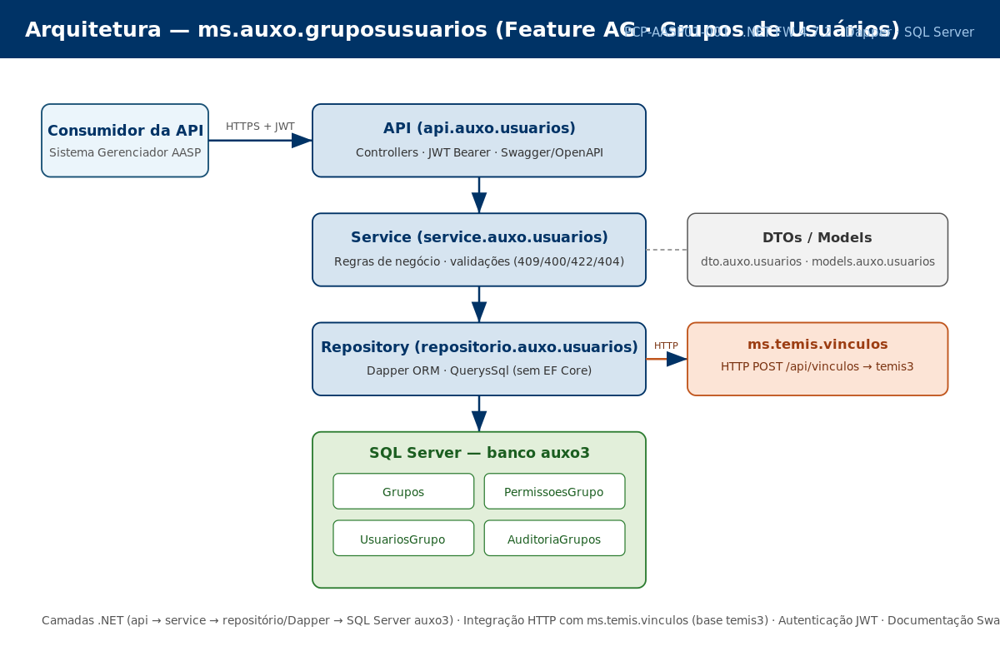

# Documento de Design — AASP Gerenciador · Grupos de Usuários

| Campo | Valor |
|---|---|
| **Documento** | PCP-AASP01-001 |
| **Projeto** | Grupos de Usuários — AASP Gerenciador |
| **Cliente** | AASP — Associação dos Advogados de São Paulo |
| **Versão** | 1.2 |
| **Data** | 26/05/2026 |
| **Gerente de Projeto** | Abraão |
| **Processo MPS-SW** | PCP (evidência de projeto) |

---

## 1. Visão geral da solução

O microsserviço **ms.auxo.gruposusuarios** e uma Web API desenvolvida em .NET 5 com Dapper como ORM e SQL Server (banco principal auxo3) como banco de dados. Os endpoints são expostos pelo controller `GerenciarGruposController` na rota base **`api/gerenciar/grupos`**, utilizando apenas os verbos GET e POST e respondendo num envelope padrão `{ Sucesso, MensagemPublica, RetornaDados, HoraExecucao }` com HTTP 200 (sucesso) ou 400 (erro/validação).

A solução e multi-tenant: toda operação e escopada por **`escritorio_id`** (escritorio). As funcionalidades entregues na Sprint 1 são:

- **CRUD de grupos**: criação, listagem, busca por ID, alteração, exclusão e ativação/desativação de grupos (tabela `grupos_usuarios`).
- **Membros do grupo**: associação de usuários ao grupo pela lista `GrupoDeUsuarios` enviada em `incluirgrupo`/`alterargrupo`, e remoção individual via `removerusuario` (tabela `grupos_usuarios_vinculos`).
- **Função do usuário**: definição do papel do usuário no grupo — `Usuario` (0) ou `Administrador` (1) — via `alterarfuncaodousuario` (tabela `grupos_usuarios_funcao`).

Estão planejadas para sprints futuras (ainda **não implementadas** no código):

- **Auditoria** das operações de escrita — Sprint 2 (AG-23).
- **Integração com ms.temis.vinculos** — Sprint 2 (AG-24).
- **Relatório consolidado** de grupos — Sprint 3 (AG-25).

A API segue o padrão arquitetural do sistema Gerenciador da AASP, utilizando autenticação via JWT Bearer Token e expondo documentação interativa via Swagger/OpenAPI.

---

## 2. Arquitetura da solução



*Figura 1 — Arquitetura em camadas (API → Service → Repositório/Dapper → SQL Server auxo3).*


### 2.1 Stack tecnologico

| Camada | Tecnologia | Justificativa |
|---|---|---|
| Framework de API | ASP.NET Core Web API (.NET 5) | Padrão do projeto Gerenciador AASP; compatibilidade com infraestrutura existente do cliente |
| ORM / Acesso a dados | Dapper 2.x | Ver GDE-AASP01-001 (GDE-001) — consistência com o padrão de acesso a dados do Gerenciador, controle do SQL sobre o schema legado e performance superior ao EF Core em queries complexas |
| Banco de dados principal | SQL Server — banco auxo3 | Banco existente do sistema Gerenciador da AASP |
| Integração externa | HTTP REST — ms.temis.vinculos | *(Planejado — Sprint 2)* Ver ITP-AASP01-001; desacoplamento entre dominios |
| Autenticação | JWT Bearer Token | Padrão do Gerenciador AASP; tokens emitidos pelo serviço de autenticação central |
| Documentação de API | Swagger / OpenAPI (Swashbuckle) | Gerado automaticamente a partir das anotações do código; validado em cada sprint |
| CI/CD | GitLab CI/CD | Padrão Timeware; pipeline automatiza build e testes a cada MR |
| Controle de versão | Git (GitLab) — Git Flow | Padrão Timeware; rastreabilidade completa de mudanças por feature e sprint |

### 2.2 Diagrama de camadas

```
+--------------------------------------------------+
|                Controllers (API)                  |
|  GerenciarGruposController                        |
|  rota base: api/gerenciar/grupos (GET/POST)       |
+--------------------------------------------------+
                       |
+--------------------------------------------------+
|              Services / UseCases                  |
|  GerenciarGruposServices                          |
+--------------------------------------------------+
                       |
+--------------------------------------------------+
|          Repositories (Dapper Queries)            |
|  GerenciarGruposRepositorio                       |
+--------------------------------------------------+
                       |
+--------------------------------------------------+
|             SQL Server -- banco auxo3             |
|  grupos_usuarios                                  |
|  grupos_usuarios_vinculos                         |
|  grupos_usuarios_funcao                           |
+--------------------------------------------------+

  (Planejado — Sprint 2) integracao HTTP REST com
  ms.temis.vinculos; auditoria das operacoes de escrita.
```

**Descrição das camadas:**

- **Controllers**: recebem requisições HTTP, validam o modelo de entrada, delegam ao Service e retornam o envelope padronizado (HTTP 200 em sucesso, 400 em erro/validação). Nenhuma lógica de negocio nos controllers.
- **Services / UseCases**: contem toda a lógica de negocio — validações de dominio (ex.: unicidade de nome de grupo) e orquestração das chamadas ao repositório.
- **Repositories**: encapsulam queries SQL via Dapper, parametrizadas para prevenção de SQL Injection. Sem lógica de negocio.
- **Banco auxo3**: banco principal do sistema Gerenciador. As operações são sempre escopadas por `escritorio_id`.

---

## 3. Modelo de dados (banco auxo3)

### 3.1 Tabela grupos_usuarios (o grupo)

| Campo | Tipo | Restrição | Descrição |
|---|---|---|---|
| id | int | PK, IDENTITY(1,1), NOT NULL | Identificador único do grupo |
| nome | nvarchar | NOT NULL | Nome do grupo; deve ser único por escritorio |
| escritorio_id | int | NOT NULL | Escritorio (tenant) dono do grupo |
| ativo | int | NOT NULL | Estado do grupo (alterado por `ativardesativar`) |
| excluido | int | NOT NULL, DEFAULT 0 | Soft delete: 1 = excluido logicamente |
| data_cadastro | datetime | NOT NULL | Timestamp de criação |
| data_alteracao | datetime | NULL | Timestamp da última alteração (`alterargrupo`) |
| data_exclusao | datetime | NULL | Timestamp da exclusão lógica |

### 3.2 Tabela grupos_usuarios_vinculos (membros do grupo)

| Campo | Tipo | Restrição | Descrição |
|---|---|---|---|
| grupo_id | int | FK -> grupos_usuarios.id | Grupo ao qual o usuário pertence |
| usuario_id | int | NOT NULL | Usuario membro do grupo |
| escritorio_id | int | NOT NULL | Escritorio (tenant) |
| funcao_id | int | NOT NULL | Função do usuário no grupo (ver 3.3) |
| excluido | int | NOT NULL, DEFAULT 0 | Soft delete do vinculo (1 ao remover usuário) |

**Regra:** os membros são enviados na lista `GrupoDeUsuarios: [{ id, funcaoId }]` do payload de `incluirgrupo`/`alterargrupo`. A remoção individual de um membro (`removerusuario`) marca `excluido = 1`.

### 3.3 Tabela grupos_usuarios_funcao (função do usuário)

| Campo | Tipo | Restrição | Descrição |
|---|---|---|---|
| usuario_id | int | NOT NULL | Usuario |
| função | int | NOT NULL | Papel: 0 = Usuario, 1 = Administrador (enum `FuncaoUsuariosEnum`) |
| escritorio_id | int | NOT NULL | Escritorio (tenant) |
| excluido | int | NOT NULL, DEFAULT 0 | Soft delete |

**Regra:** `alterarfuncaodousuario` altera a função (Usuario/Administrador) de um usuário.

### 3.4 Auditoria — *(Planejado — Sprint 2, AG-23)*

A trilha de auditoria das operações de escrita esta planejada para a Sprint 2 e **ainda não foi implementada** no código. O modelo de dados será definido na entrega de AG-23.

---

## 4. Endpoints da API (controller GerenciarGruposController — rota base `api/gerenciar/grupos`)

| Método | Ação | Descrição | Requisito (AG) | Status |
|---|---|---|---|---|
| GET | listargrupo | Listar grupos (paginado) | AG-20 (RF-02) | Implementado Sprint 1 (MR !1) |
| GET | buscargrupoporid | Listar os usuários de um grupo | AG-20 (RF-02) | Implementado Sprint 1 (MR !2) |
| POST | incluirgrupo | Criar grupo com nome e lista de membros; nome duplicado -> 400 "Grupo já existe" | AG-20 (RF-01) | Implementado Sprint 1 (MR !1) |
| POST | alterargrupo | Alterar grupo e seus membros | AG-20 (RF-03) | Implementado Sprint 1 (MR !2) |
| POST | excluirgrupo | Excluir grupo (com opção de notificar membros) | AG-20 (RF-04) | Implementado Sprint 1 (MR !2) |
| POST | ativardesativar | Ativar/desativar grupo | AG-20 (RF-03) | Implementado Sprint 1 (MR !2) |
| POST | removerusuario | Remover um usuário do grupo | AG-22 (RF-06) | Implementado Sprint 1 (MR !5) |
| POST | alterarfuncaodousuario | Alterar a função (Usuario/Administrador) de um usuário no grupo | AG-21 (RF-05) | Implementado Sprint 1 (MR !3) |

> Todos respondem no envelope padrão com HTTP 200 (sucesso) ou 400 (erro/validação). Não há verbos PUT/DELETE nem status 201/204/404/409 nesta API. A inclusão de usuários no grupo ocorre pela lista de membros de `incluirgrupo`/`alterargrupo` (não há endpoint dedicado de "adicionar usuário").

---

## 5. Decisões arquiteturais

### GDE-001 — Dapper vs Entity Framework Core

**Decisão:** Dapper adotado como ORM para todas as operações de acesso a dados.

**Contexto:** O microsserviço roda em .NET 5. O banco auxo3 possui schema legado, com convenções de nomenclatura que dificultam o mapeamento automático do Entity Framework Core; o Dapper, já adotado como padrão nos demais módulos do Gerenciador AASP, dá controle direto sobre o SQL.

**Consequências:** Queries SQL escritas manualmente nos Repositories, o que aumenta o controle sobre performance mas exige disciplina no uso de queries parametrizadas para prevenção de SQL Injection. Toda query revisada no code review com checklist específico para segurança de dados.

**Referência completa:** GDE-AASP01-001_Registro-de-Análise-de-Decisao.docx

### GDE-002 — Soft Delete vs Hard Delete

**Decisão:** Soft Delete adotado para grupos e para vinculos usuário-grupo (campo `excluido`).

**Contexto:** O sistema Gerenciador AASP precisa manter rastreabilidade historica para fins de auditoria e conformidade.

**Consequências:** Queries de listagem sempre filtram por `excluido = 0`. As operações de exclusão retornam HTTP 200 (envelope), confirmando o estado após a operação.

**Referência completa:** GDE-AASP01-001_Registro-de-Análise-de-Decisao.docx

---

## 6. Integração com ms.temis.vinculos — *(Planejado — Sprint 2)*

A sincronização de vinculos com o microsserviço **ms.temis.vinculos** (banco temis3) esta planejada para a Sprint 2 (AG-24) e **ainda não foi implementada** no código. O contrato de integração, os cenários de erro e o procedimento de reconciliação serão especificados no documento **ITP-AASP01-001_Estrategia-de-Integracao.docx** quando a implementação iniciar.

---

## Histórico de revisões

| Versão | Data | Autor | Descrição |
|---|---|---|---|
| 1.0 | 26/05/2026 | Abraão | Arquitetura inicial — Sprint 1; stack, modelo de dados, endpoints S1 |
| 1.1 | 15/06/2026 | Abraão | Adição da seção de integração ms.temis.vinculos |
| 1.2 | 15/06/2026 | Abraão | Design alinhado a API e ao schema reais (GerenciarGruposController; tabelas grupos_usuarios, _vinculos, _função); auditoria/integração/relatório marcados como planejados |
