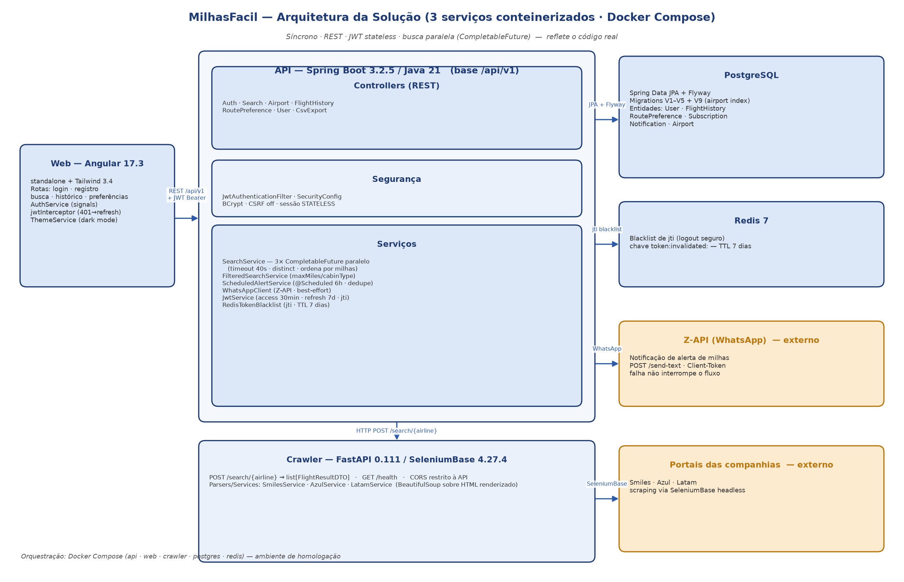

# Ata de Reunião — Design Review / Aprovação da Arquitetura · MilhasFacil

| Campo | Valor |
|---|---|
| **Documento** | ATA-MILHASFACIL01-002 |
| **Projeto** | MilhasFacil — Plataforma de Busca e Alerta de Passagens por Milhas |
| **Código do projeto** | MILHASFACIL01 |
| **Cliente** | Hub de Milhas |
| **Organização** | Timeware Brasil Softwares e Serviços LTDA |
| **Reunião** | Design Review — Aprovação da Arquitetura técnica da solução |
| **Data** | 11/02/2026 |
| **Horário** | 14h00 – 15h30 |
| **Canal** | Microsoft Teams |
| **Facilitador** | Cézar Velazquez (Tech Lead / Arquiteto) |
| **Versão** | 1.1 |

---

## 1. Participantes

| Nome | Empresa | Papel | Presença |
|---|---|---|---|
| Abraão | Timeware | Gerente de Projeto / PO | Presente |
| Cézar Velazquez | Timeware | Tech Lead / Arquiteto / DevOps | Presente (facilitador) |
| Felipe Santos | Timeware | Dev (Backend / Crawlers) | Presente |
| Lucas Batista | Timeware | Dev (Full Stack) | Presente |
| Henry Oliveira | Timeware | Dev (Full Stack) | Presente |

> A aprovação da arquitetura é responsabilidade conjunta do **Gerente de Projeto / PO (Abraão)** e do **Tech Lead / Arquiteto (Cézar Velazquez)**; os desenvolvedores participam como apoio técnico. A QA (Jonathan Alves) e a GQA independente (Carol/Caroline) não participam da decisão de arquitetura.

---

## 2. Pauta

1. Revisão da arquitetura distribuída em três serviços (API, Web, Crawler)
2. Validação das decisões arquiteturais (JWT stateless, busca paralela, crawler isolado)
3. Deliberação e aprovação formal da baseline de design
4. Registro de ações imediatas pós-aprovação

---

## 3. Objetivo

Revisar e **aprovar formalmente a arquitetura técnica** da plataforma MilhasFacil antes do início do desenvolvimento incremental, conforme o processo de Projeto e Construção do Produto (PCP) e a Gerência de Decisões (GDE). A arquitetura aprovada é a baseline de design registrada em **PCP-MILHASFACIL01-001**.

---

## 4. Escopo da aprovação de design

| Item de design | Aplicável? | Decisão |
|---|---|---|
| **Arquitetura técnica** (serviços, segurança, integração, dados) | **Sim** | Objeto desta ata — aprovada pelo PO + Tech Lead |
| **Design de UI / UX (layout, identidade visual, telas)** | **Não aplicável** | O **layout e a identidade visual são fornecidos pelo cliente (Hub de Milhas)**; o projeto **não inclui design de UI/UX**. A camada web (Angular + TailwindCSS) apenas **implementa** o layout entregue pelo cliente, com aprovação visual nas Sprint Reviews. Não há, portanto, etapa de aprovação de design de interface. |

---

## 5. Arquitetura revisada e aprovada

Arquitetura distribuída em **três serviços conteinerizados**, orquestrados por Docker Compose (lida do código-fonte; detalhada em PCP-MILHASFACIL01-001):

- **API (MilhasFacil_api)** — Spring Boot 3.2.5 / Java 21, padrão MVC em camadas (Controller → Service → Repository); persistência em **PostgreSQL** (migrations Flyway) e cache/segurança em **Redis**.
- **Web (MilhasFacil_web)** — Angular 17.3 standalone + TailwindCSS 3.4, com lazy loading; consome a API via REST.
- **Crawler (MilhasFacil_crawler)** — FastAPI 0.111 + SeleniumBase 4.27.4, com três parsers (Smiles/Azul/Latam); serviço isolado da API.

Decisões arquiteturais aprovadas (registradas em **GDE-MILHASFACIL01-001**):

- **GDE-1 — Autenticação JWT stateless** (HS256, access 30 min + refresh 7 dias) com **blacklist de jti no Redis** para logout seguro, mantendo escalabilidade horizontal sem sessão de servidor.
- **GDE-2 — Busca paralela** das três companhias com `CompletableFuture` (timeout de 40 s por crawler), consolidando resultados sem duplicatas e ordenando por milhas (atende RNF01).
- **GDE-3 — Crawler em serviço separado** (FastAPI + SeleniumBase) em vez de scraping embarcado na API — isola a volatilidade dos portais das cias (risco R-01) e permite evolução independente.
- **GDE-4 — Senhas com BCrypt** e CORS restrito; **GDE-5 — exclusão lógica** (flag `active`) em rotas favoritas para preservar rastreabilidade.

*Figura — Diagrama de arquitetura da solução, mantido no **Lucidchart**: <https://lucid.app/lucidchart/a51c0f84-cc01-4468-bfdd-6e94aa7a3ae3>. O **IMG-ARQ-01** é a exportação (PNG) desse diagrama. A arquitetura textual acima e o **PCP-MILHASFACIL01-001** detalham a referência aprovada.*

---

## 6. Deliberações

| # | Deliberação | Responsável |
|---|---|---|
| D-01 | Arquitetura técnica (3 serviços, JWT stateless + Redis, busca paralela, crawler isolado) **APROVADA** como baseline de design | Abraão (PO) + Cézar Velazquez (Tech Lead) |
| D-02 | Design de UI/UX **não se aplica** ao escopo — layout fornecido pelo cliente; validação visual ocorre nas Sprint Reviews | Abraão (PO) |
| D-03 | Decisões arquiteturais registradas em GDE-MILHASFACIL01-001; alterações estruturais seguem o fluxo de change request | Cézar Velazquez (Tech Lead) |
| D-04 | Revisão técnica contínua via Pull Request, com o Tech Lead como revisor obrigatório (branch policy) | Cézar Velazquez (Tech Lead) |

---

## 7. Aprovação

A arquitetura técnica da plataforma MilhasFacil foi **revisada e aprovada** nesta reunião pelo **Gerente de Projeto / PO (Abraão)** e pelo **Tech Lead / Arquiteto (Cézar Velazquez)**, constituindo a baseline de design do projeto (PCP-MILHASFACIL01-001). Reitera-se que **não há aprovação de design de UI/UX**, por o layout ser fornecido pelo cliente Hub de Milhas.

| Aprovador | Papel | Decisão |
|---|---|---|
| Abraão | Gerente de Projeto / PO | Aprovado |
| Cézar Velazquez | Tech Lead / Arquiteto | Aprovado |

---

## 8. Ações imediatas

| Ação | Responsável | Prazo |
|---|---|---|
| Publicar a baseline de design aprovada em PCP-MILHASFACIL01-001 e registrar as decisões em GDE-MILHASFACIL01-001 | Cézar Velazquez (Timeware) | 12/02/2026 |
| Provisionar os três repositórios no GitLab com as branches e a política de PR definidas | Cézar Velazquez (Timeware) | 13/02/2026 |
| Configurar Docker Compose de desenvolvimento local alinhado à arquitetura aprovada | Cézar Velazquez (Timeware) | 13/02/2026 |
| Iniciar implementação do RF01 (cadastro BCrypt) e RF02 (login JWT) conforme a arquitetura aprovada | Felipe Santos (Timeware) | Sprint 1 (até 22/02/2026) |

---

### Evidências referenciadas

| Código | O que capturar | Fonte |
|---|---|---|
| IMG-ARQ-01 | Diagrama de arquitetura da solução (3 serviços) | Documento de arquitetura / quadro do Design Review |

---

## Histórico de revisões

| Versão | Data | Autor | Descrição |
|---|---|---|---|
| 1.0 | 15/06/2026 | Time de Melhoria Contínua | Emissão inicial — registro da reunião de Design Review e aprovação da arquitetura (PO + Tech Lead) realizada em 11/02/2026. |
| 1.1 | 15/06/2026 | Time de Melhoria Contínua | Inclusão dos campos de cabeçalho Código do projeto (MILHASFACIL01) e Organização (Timeware Brasil Softwares e Serviços LTDA), padronizando com os demais registros do projeto. |
| 1.2 | 29/06/2026 | Auditoria MPS.BR Nível C | Adição da coluna Empresa na tabela de participantes, seção Pauta e seção Ações imediatas, padronizando a estrutura com os demais registros de ata do projeto; renumeração das seções. |
