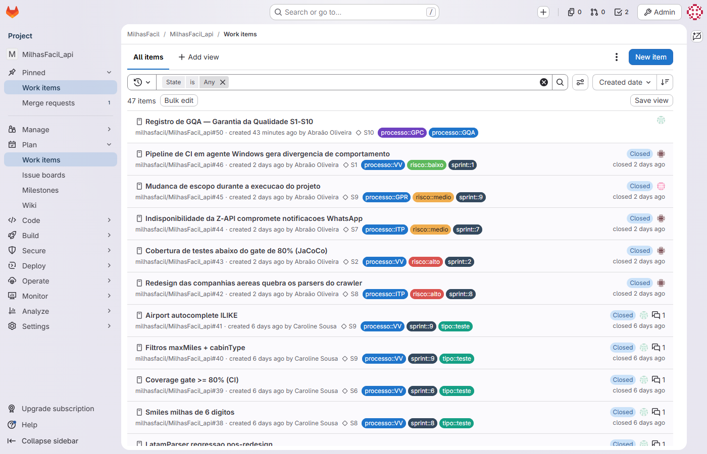
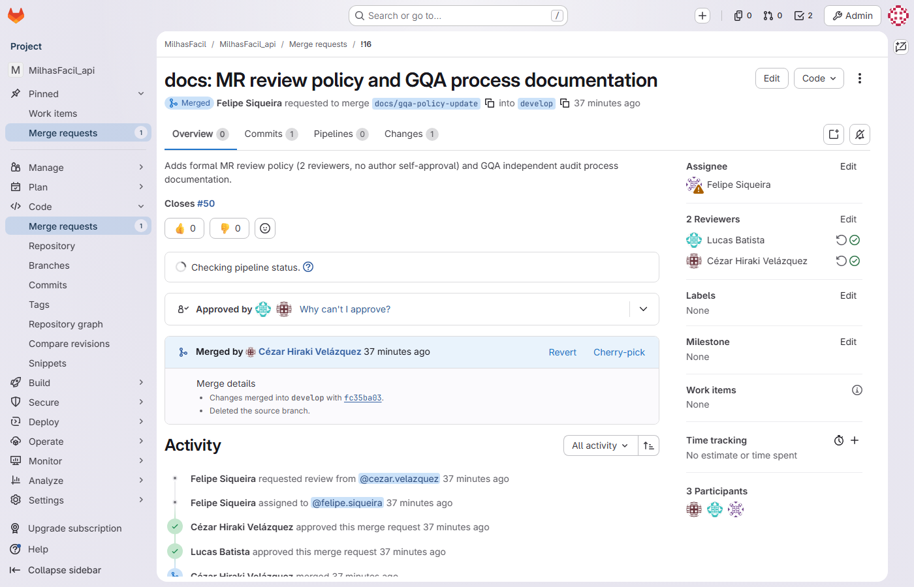
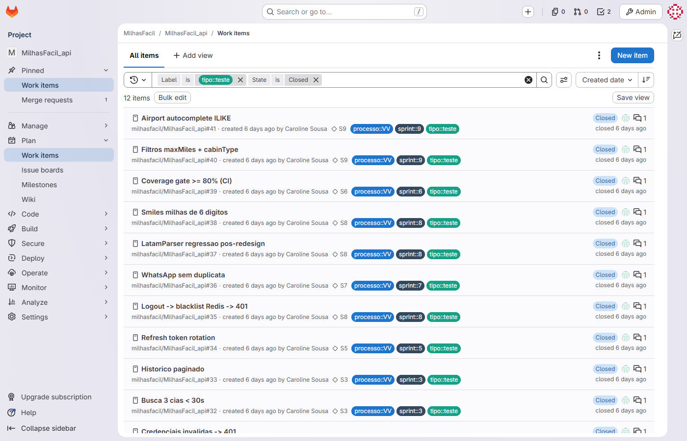
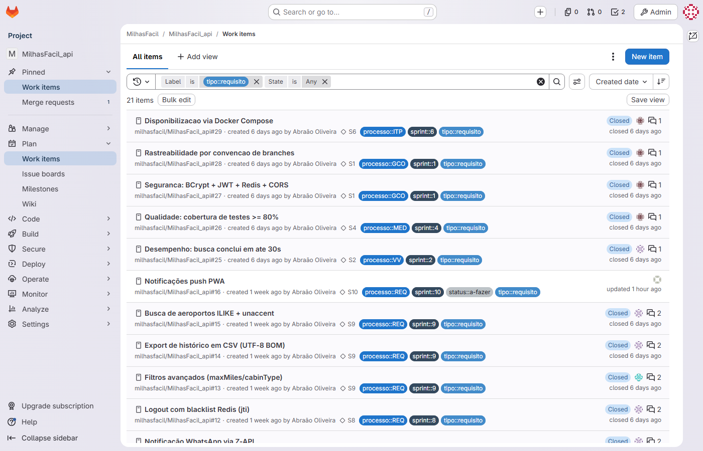
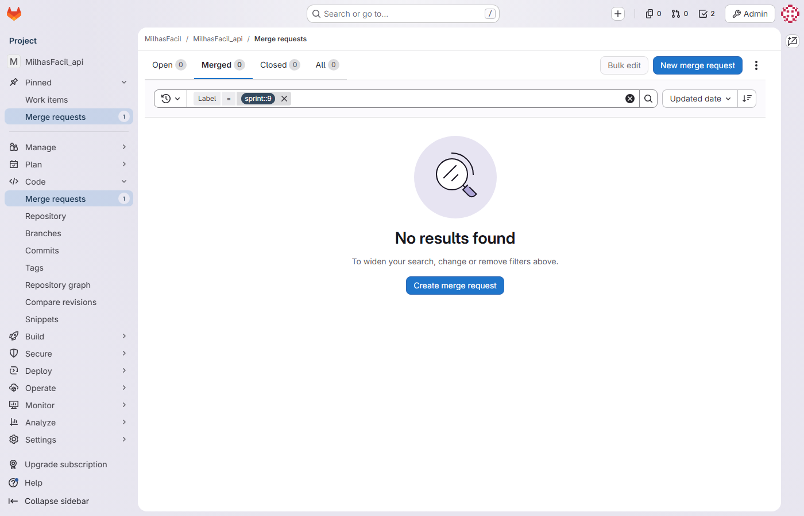
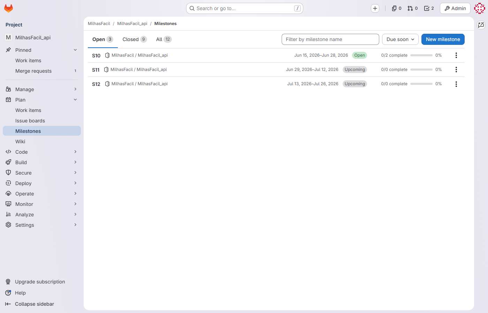

# Cenários de Teste por Card — MilhasFacil · Hub de Milhas

| Campo | Valor |
|---|---|
| **Documento** | CTQ-MILHASFACIL01-001 |
| **Projeto** | MilhasFacil — Plataforma de Busca e Alerta de Passagens por Milhas |
| **Cliente** | Hub de Milhas |
| **Versão** | 1.2 |
| **Data** | 26/06/2026 |
| **Gerente de Projeto** | Abraão |
| **Processo MPS-SW** | VV (evidência de projeto — cenários de teste por card) |

---

## 1. Introdução

Este documento registra, **card a card**, os cenários de teste que evidenciam o processo de **Verificação e Validação (VV)** do projeto MilhasFacil ao longo das Sprints 1 a 9 (período 09/02/2026 a 14/06/2026). Cada item do Jira (project `MF`, board 614) é relacionado ao seu requisito funcional (RF) correspondente e à forma de comprovação adotada.

A estratégia de VV combina dois mecanismos:

- **Validação funcional MANUAL** conduzida pela QA **Jonathan Alves**. O projeto **não utiliza ferramenta de gestão de testes** (não há TestRail/Zephyr/Xray): os cenários são exercitados manualmente nos ambientes de homologação dos três repositórios (`MilhasFacil_api`, `MilhasFacil_web`, `MilhasFacil_crawler`) e registrados nos relatórios de QA por sprint. Jonathan Alves gera as evidências de teste e atua no DevOps como QA. A **GQA independente (auditoria)** é responsabilidade da auditora **Carol** (Caroline), que fica fora do DevOps.
- **Aprovação técnica via Merge Request (GitLab)**. Toda entrega passou por MR com gate de CI (build + testes automatizados — JUnit5/Mockito/AssertJ + Testcontainers na API, Karma na Web, pytest no Crawler; gate de cobertura JaCoCo ≥80% na API a partir da S4). A aprovação técnica do código (revisão de MR) é responsabilidade do **Tech Lead / Arquiteto Cézar Velazquez**. Os **6 MRs funcionais S9** (api !13, !14, !12; web !9, !10; crawler !4) foram concluídos em 15/06/2026 **com 2 revisores aprovados**.

> **Nota de usernames GitLab:** Cézar Velazquez = cezar.velazquez, Felipe Santos = felipe.siqueira, Lucas Batista = lucas.batista, Henry Oliveira = henry.komatsu.

**Tipos de item e forma de evidência:**

- **História** ou **Bug** → cenário descrito em **Gherkin** (Dado / Quando / Então), com critério de aprovação, resultado e aprovador. O cenário é derivado do *summary* do card e do **código real** (controllers, serviços, entidades, parsers e telas efetivamente implementados) e do RF correspondente.
- **Tarefa / Chore** (DevOps, refinamento, CI/CD, documentação, infra) → item de **Verificação** (o que foi verificado e por quem), sem Gherkin, pois não há requisito funcional de usuário a validar.

**Convenção de resultado:** todos os cards entregues estão **Aprovados**. Os cards da Sprint 9 já entregues (released em `main` na tag **v0.9.0**, 15/06/2026) também constam **Aprovados**. Onde aplicável, o cenário é consolidado a um dos **12 casos de teste (CT) de referência** do plano de VV.

---

## 2. Casos de teste consolidados (CT) — referência

Os cenários por card abaixo referenciam, onde aplicável, os 12 CTs consolidados do projeto:

| CT | Cenário consolidado | Sprint | Tipo | Resultado |
|---|---|---|---|---|
| CT-01 | Cadastro (register) + login | S1 | Happy | Aprovado |
| CT-02 | Credenciais inválidas → 401 | S1 | Sad | Aprovado |
| CT-03 | Busca em 3 cias (Smiles/Azul/Latam) < 30s | S2/S3 | Happy | Aprovado |
| CT-04 | Histórico paginado (MF-38) | S3 | Happy | Aprovado |
| CT-05 | Refresh token rotation | S5 | Happy | Aprovado |
| CT-06 | Logout → blacklist Redis → 401 | S8 | Happy | Aprovado |
| CT-07 | WhatsApp sem duplicata | S7 | Happy | Aprovado |
| CT-08 | LatamParser — regressão pós-redesign (MF-59) | S8 | Regressão | Aprovado |
| CT-09 | Smiles milhas de 6 dígitos (MF-58) | S8 | Happy | Aprovado |
| CT-10 | Coverage gate ≥80% (CI) | S6+ | CI/CD | Aprovado |
| CT-11 | Filtros maxMiles + cabinType (MF-65) | S9 | Happy | Aprovado |
| CT-12 | Airport autocomplete ILIKE (MF-64) | S9 | Sad | Aprovado |

---

## 3. Sprint 1 (09–22/02/2026) — Autenticação e fundação

### MF-2 — História — Auth: Cadastro de usuário (Spring Security + BCrypt + JWT) · RF01

> **Cenário (Gherkin) — consolidado em CT-01**
> ```gherkin
> Dado um visitante com nome, e-mail, telefone e senha (mínimo 8 caracteres)
> Quando ele envia POST /api/v1/auth/register com um RegisterRequest válido
> Então a API responde 200 com AuthResponse{accessToken, refreshToken}
>   E a senha é persistida com hash BCrypt na entidade User
>   E um e-mail/telefone já existentes (unique) resultam em 400
> ```

- **Critério de aprovação:** cadastro válido retorna 200 com par de tokens; senha nunca armazenada em texto puro; duplicidade de e-mail/telefone rejeitada com 400.
- **Resultado:** **Aprovado** (validação manual da QA Jonathan Alves + testes unitários AuthService verdes).
- **Aprovador:** aprovação técnica do TL Cézar Velazquez (MR api !1 / web !1) + validação manual da QA Jonathan Alves.

### MF-3 — História — Auth: Login endpoint + testes unitários AuthService · RF02

> **Cenário (Gherkin) — consolidado em CT-01 / CT-02**
> ```gherkin
> Dado um usuário cadastrado
> Quando ele envia POST /api/v1/auth/login com e-mail e senha corretos
> Então a API responde 200 com AuthResponse{accessToken (30min), refreshToken (7d)}
> Quando ele envia credenciais inválidas
> Então a API responde 401 sem emitir tokens
> ```

- **Critério de aprovação:** login válido emite access (1.800.000 ms) e refresh (604.800.000 ms) JWT HS256; credenciais inválidas retornam 401.
- **Resultado:** **Aprovado** (testes unitários AuthService + validação manual Jonathan Alves).
- **Aprovador:** aprovação técnica do TL Cézar Velazquez (MR api !2) + validação manual da QA Jonathan Alves.

### MF-4 — Tarefa — DevOps: Dockerfile multi-stage + docker-compose.yml

- **Verificação:** confirmado build multi-stage da imagem da API e subida do stack via `docker-compose.yml` (API + Postgres) no ambiente de homologação. Responsável Cézar Velazquez (DevOps/TL); disponibilidade do stack validada pela QA Jonathan Alves.

### MF-5 — Tarefa — Backend: Flyway V1 migration (tabela users + índices)

- **Verificação:** migration `V1` aplicada com sucesso criando a tabela `users` (UUID, e-mail e telefone unique) e índices. Verificado por execução do Flyway no pipeline e inspeção do schema; responsável Lucas Batista.

### MF-6 — Tarefa — CI/CD: Configurar GitLab CI (Test > Build > Deploy)

- **Verificação:** pipeline GitLab CI (Docker runner, runner-vm-docker) configurada com estágios Test > Build > Deploy e triggers em develop/homolog/main. Responsável Cézar Velazquez (DevOps/TL); primeiras execuções de build registradas no GitLab.

### MF-7 — Tarefa — QA: Sprint 1 testes de sanidade e plano de testes inicial

- **Verificação:** plano de testes inicial elaborado e testes de sanidade de cadastro/login executados manualmente. Verificado e registrado pela QA Jonathan Alves (sem ferramenta de gestão de testes; registro em relatório de QA da S1).

---

## 4. Sprint 2 (23/02–08/03/2026) — Busca de voos

### MF-8 — História — Search: Módulo de busca de voos Smiles/Azul/Latam (API + Crawler + Web) · RF03

> **Cenário (Gherkin) — consolidado em CT-03**
> ```gherkin
> Dado um usuário autenticado com origem, destino, data de ida e número de adultos
> Quando ele envia POST /api/v1/search com um SearchRequest válido
> Então a API dispara 3 buscas paralelas (CompletableFuture, timeout 40s) às cias Smiles, Azul e Latam
>   E retorna List<FlightResult> distinta, ordenada por milhasPrice, em menos de 30s
>   E uma requisição sem token resulta em 401
> ```

- **Critério de aprovação:** busca agregada das 3 cias retorna resultados ordenados por milhas; tempo de resposta < 30s (média medida 8,3s); acesso exige autenticação.
- **Resultado:** **Aprovado** (validação manual Jonathan Alves nas 3 cias; build verde).
- **Aprovador:** aprovação técnica do TL Cézar Velazquez (MR api !4 / crawler !1) + validação manual da QA Jonathan Alves.

### MF-9 — História — Crawler: SmilesService SeleniumBase headless chromium · RF03

> **Cenário (Gherkin)**
> ```gherkin
> Dado uma requisição POST /search/smiles no crawler FastAPI
> Quando o SeleniumBase headless chromium carrega a página da Smiles
> Então o parser BeautifulSoup extrai os voos disponíveis
>   E uma companhia inexistente em POST /search/{airline} resulta em 404
> ```

- **Critério de aprovação:** crawler Smiles retorna voos parseados; rota de cia inválida responde 404; `/health` responde 200.
- **Resultado:** **Aprovado** (validação manual Jonathan Alves; pytest verde).
- **Aprovador:** aprovação técnica do TL Cézar Velazquez (MR crawler !1) + validação manual da QA Jonathan Alves.

### MF-10 — História — Crawler: AzulParser e LatamParser (extração de voos) · RF03

> **Cenário (Gherkin)**
> ```gherkin
> Dado as páginas de resultados da Azul e da Latam
> Quando AzulParser e LatamParser processam o HTML com BeautifulSoup
> Então cada parser retorna a lista de voos com milhas e horários
> ```

- **Critério de aprovação:** ambos os parsers extraem voos válidos das respectivas cias.
- **Resultado:** **Aprovado** (validação manual Jonathan Alves; pytest verde).
- **Aprovador:** aprovação técnica do TL Cézar Velazquez (MR crawler !1) + validação manual da QA Jonathan Alves.

### MF-11 — História — Web: Search page Angular 17 standalone + result cards TailwindCSS · RF04

> **Cenário (Gherkin)**
> ```gherkin
> Dado um usuário autenticado na rota /search (authGuard)
> Quando ele preenche o formulário de busca e submete
> Então a SearchPage Angular 17 standalone exibe o LoadingSpinner durante a busca
>   E renderiza os result cards (TailwindCSS) com os voos retornados
>   E exibe EmptyState quando não há resultados
> ```

- **Critério de aprovação:** tela de busca exibe skeleton/loading, cards de resultado e estado vazio; rota protegida por authGuard.
- **Resultado:** **Aprovado** (validação manual Jonathan Alves; Karma verde).
- **Aprovador:** aprovação técnica do TL Cézar Velazquez (MR web !2) + validação manual da QA Jonathan Alves.

### MF-12 — Tarefa — DevOps: Deploy VPS ambiente de homologação (Docker Compose)

- **Verificação:** ambiente de homologação publicado em VPS via Docker Compose. Responsável Cézar Velazquez (DevOps/TL); disponibilidade confirmada pela QA Jonathan Alves para execução dos cenários.

---

## 5. Sprint 3 (09–22/03/2026) — Histórico, preferências e correções

### MF-13 — História — Backend: Histórico de buscas com paginação (Flyway V2 + JPA) · RF05

> **Cenário (Gherkin) — consolidado em CT-04**
> ```gherkin
> Dado um usuário autenticado com buscas anteriores registradas (FlightHistory, resultsJson jsonb)
> Quando ele envia GET /api/v1/flight-history?page&size
> Então a API responde 200 com um Page<FlightHistory> paginado
> Quando ele envia DELETE /api/v1/flight-history/{id}
> Então a API responde 204 e o registro é removido
> ```

- **Critério de aprovação:** histórico retornado paginado por usuário; exclusão individual retorna 204.
- **Resultado:** **Aprovado** (validação manual Jonathan Alves).
- **Aprovador:** aprovação técnica do TL Cézar Velazquez (MR api !5) + validação manual da QA Jonathan Alves.

### MF-14 — História — Web: FlightHistoryComponent com paginação e delete · RF05

> **Cenário (Gherkin)**
> ```gherkin
> Dado um usuário autenticado na rota /history
> Quando o FlightHistoryComponent carrega
> Então exibe o histórico paginado (PaginationComponent) e permite excluir um item
>   E exibe EmptyState quando não há histórico
> ```

- **Critério de aprovação:** lista paginada renderizada; ação de excluir reflete no backend; estado vazio tratado.
- **Resultado:** **Aprovado** (validação manual Jonathan Alves; Karma verde).
- **Aprovador:** aprovação técnica do TL Cézar Velazquez (MR web !3) + validação manual da QA Jonathan Alves.

### MF-15 — História — Web: RoutePreference frontend CRUD + PaginationComponent · RF06

> **Cenário (Gherkin)**
> ```gherkin
> Dado um usuário autenticado na rota /preferences
> Quando ele cria, lista e remove rotas favoritas
> Então o componente exibe a lista paginada e reflete as operações de CRUD
> ```

- **Critério de aprovação:** CRUD de preferências de rota operante na UI com paginação.
- **Resultado:** **Aprovado** (validação manual Jonathan Alves; Karma verde).
- **Aprovador:** aprovação técnica do TL Cézar Velazquez (MR web !3) + validação manual da QA Jonathan Alves.

### MF-16 — Tarefa — Testes: SearchService e FlightHistoryService unit tests

- **Verificação:** testes unitários (JUnit5 + Mockito + AssertJ) de SearchService e FlightHistoryService implementados e verdes no CI. Verificado no pipeline; responsável Henry Oliveira.

### MF-17 — Bug — Mapping JSONB incorreto no FlightHistory entity

> **Cenário (Gherkin) — regressão**
> ```gherkin
> Dado uma busca cujo resultado é persistido em FlightHistory.resultsJson (coluna jsonb)
> Quando o registro é gravado e relido via JPA
> Então o JSON é serializado/desserializado corretamente sem erro de mapping
> ```

- **Critério de aprovação:** mapeamento jsonb correto; leitura do histórico não lança erro de conversão.
- **Resultado:** **Aprovado** (correção verificada por Jonathan Alves; regressão de histórico verde).
- **Aprovador:** aprovação técnica do TL Cézar Velazquez + validação manual da QA Jonathan Alves.

### MF-18 — Bug — Airport debounce ExpressionChangedAfterCheck no Angular

> **Cenário (Gherkin) — regressão**
> ```gherkin
> Dado o campo de autocomplete de aeroporto na tela de busca
> Quando o usuário digita e o debounce dispara a consulta
> Então o Angular não lança ExpressionChangedAfterItHasBeenCheckedError
> ```

- **Critério de aprovação:** autocomplete de aeroporto funciona sem erro de change detection.
- **Resultado:** **Aprovado** (correção verificada por Jonathan Alves).
- **Aprovador:** aprovação técnica do TL Cézar Velazquez + validação manual da QA Jonathan Alves.

### MF-19 — Tarefa — Refinement: Breakdown histórias Sprint 4 (Planning Poker)

- **Verificação:** refinamento e breakdown das histórias da Sprint 4 com estimativa por Planning Poker. Verificado pela ata de planning da S4; conduzido pelo GP Abraão com a equipe.

### MF-20 — Tarefa — QA: Sprint 3 testes de regressão e relatório de qualidade

- **Verificação:** testes de regressão da S3 executados manualmente e relatório de qualidade emitido. Verificado e registrado pela QA Jonathan Alves.

---

## 6. Sprint 4 (23/03–05/04/2026) — Perfil, alertas e notificações

### MF-21 — História — Backend: Rotas favoritas (RoutePreference) + alertas agendados @Scheduled · RF06/RF08

> **Cenário (Gherkin)**
> ```gherkin
> Dado um usuário autenticado
> Quando ele envia POST /api/v1/route-preferences com origem, destino, alertFrequency e maxMiles
> Então a API responde 201 e persiste a RoutePreference (active=true)
> Quando ele envia DELETE /api/v1/route-preferences/{id}
> Então a API responde 204 e marca active=false (exclusão lógica)
>   E o ScheduledAlertService roda no cron 0 0 */6 * * * avaliando as rotas favoritas
> ```

- **Critério de aprovação:** CRUD de rotas favoritas com exclusão lógica; job agendado executa a cada 6h com dedupe origem-destino-milhas.
- **Resultado:** **Aprovado** (validação manual Jonathan Alves).
- **Aprovador:** aprovação técnica do TL Cézar Velazquez (MR api !6) + validação manual da QA Jonathan Alves.

### MF-22 — História — Web: CRUD RoutePreference frontend (forms + validação + feedback) · RF06

> **Cenário (Gherkin)**
> ```gherkin
> Dado um usuário autenticado na tela de preferências
> Quando ele cria uma rota com dados válidos/ inválidos
> Então o formulário valida os campos e exibe feedback de sucesso ou erro
> ```

- **Critério de aprovação:** formulário com validação e feedback; operações refletem no backend.
- **Resultado:** **Aprovado** (validação manual Jonathan Alves; Karma verde).
- **Aprovador:** aprovação técnica do TL Cézar Velazquez (MR web !4) + validação manual da QA Jonathan Alves.

### MF-23 — História — Backend: Perfil de usuário GET/PATCH /users/me · RF07

> **Cenário (Gherkin)**
> ```gherkin
> Dado um usuário autenticado
> Quando ele envia GET /api/v1/users/me
> Então a API responde 200 com seus dados (User)
> Quando ele envia PATCH /api/v1/users/me com UpdateUserRequest{name?, phone?}
> Então a API responde 200 com o perfil atualizado
>   E uma requisição sem token resulta em 401
> ```

- **Critério de aprovação:** leitura e atualização parcial do perfil; acesso exige autenticação.
- **Resultado:** **Aprovado** (validação manual Jonathan Alves).
- **Aprovador:** aprovação técnica do TL Cézar Velazquez (MR api !7) + validação manual da QA Jonathan Alves.

### MF-24 — História — Web: Página de perfil frontend com form preenchido · RF07

> **Cenário (Gherkin)**
> ```gherkin
> Dado um usuário autenticado
> Quando ele acessa a página de perfil
> Então o formulário é pré-preenchido com os dados de /users/me e permite salvar alterações
> ```

- **Critério de aprovação:** perfil carregado e editável na UI.
- **Resultado:** **Aprovado** (validação manual Jonathan Alves; Karma verde).
- **Aprovador:** aprovação técnica do TL Cézar Velazquez (MR web !4) + validação manual da QA Jonathan Alves.

### MF-25 — História — Web: NotificationsComponent lista + badge counter sidebar

> **Cenário (Gherkin)**
> ```gherkin
> Dado um usuário com notificações
> Quando o NotificationsComponent carrega
> Então exibe a lista de notificações e o badge counter na sidebar com a contagem de não lidas
> ```

- **Critério de aprovação:** lista de notificações e contador exibidos na UI.
- **Resultado:** **Aprovado** (validação manual Jonathan Alves; Karma verde).
- **Aprovador:** aprovação técnica do TL Cézar Velazquez (MR web !4) + validação manual da QA Jonathan Alves.

### MF-26 — Tarefa — Backend: Flyway V4 migration notifications + índices

- **Verificação:** migration `V4` da tabela `notifications` (com índices) aplicada com sucesso. Verificado por execução do Flyway no pipeline; responsável Lucas Batista. (Correção de rastreabilidade: notifications é V4 — ajuste registrado.)

### MF-27 — Tarefa — QA: Sprint 4 testes de integração e relatório

- **Verificação:** testes de integração da S4 executados manualmente e relatório emitido. Verificado e registrado pela QA Jonathan Alves. A partir desta sprint passa a valer o gate de cobertura CI ≥80%.

### MF-28 — Bug — Form reset RoutePreference não limpa campos ao criar nova rota

> **Cenário (Gherkin) — regressão**
> ```gherkin
> Dado o formulário de criação de rota favorita
> Quando o usuário salva uma rota e inicia o cadastro de uma nova
> Então todos os campos do formulário são limpos (reset correto)
> ```

- **Critério de aprovação:** formulário reseta os campos ao iniciar nova rota.
- **Resultado:** **Aprovado** (correção verificada por Jonathan Alves).
- **Aprovador:** aprovação técnica do TL Cézar Velazquez + validação manual da QA Jonathan Alves.

### MF-29 — História — Backend/Web: Alertas agendados (email/WhatsApp) + perfil usuário completo · RF08

> **Cenário (Gherkin)**
> ```gherkin
> Dado rotas favoritas com alertFrequency configurada
> Quando o ScheduledAlertService executa (cron 0 0 */6 * * *)
> Então alertas são gerados com dedupe e encaminhados pelos canais (email/WhatsApp)
>   E o perfil de usuário está completo e editável
> ```

- **Critério de aprovação:** alertas agendados disparam por rota com deduplicação; perfil completo operante.
- **Resultado:** **Aprovado** (validação manual Jonathan Alves).
- **Aprovador:** aprovação técnica do TL Cézar Velazquez (MR api !7) + validação manual da QA Jonathan Alves.

---

## 7. Sprint 5 (06–19/04/2026) — Assinaturas e rotação de token

### MF-30 — História — Backend: Subscription entity + SubscriptionStatus enum · RF10

> **Cenário (Gherkin)**
> ```gherkin
> Dado um usuário cadastrado
> Quando uma Subscription é criada para ele (relação 1:1)
> Então a assinatura inicia com status TRIAL e plan BASIC, com expiresAt e createdAt definidos
> ```

- **Critério de aprovação:** entidade Subscription persistida com status/plano e vínculo 1:1 com o usuário.
- **Resultado:** **Aprovado** (validação manual Jonathan Alves).
- **Aprovador:** aprovação técnica do TL Cézar Velazquez (MR api !8) + validação manual da QA Jonathan Alves.

### MF-31 — História — Backend: Refresh token rotation (JWT access 30min + refresh 7d) · RF11

> **Cenário (Gherkin) — consolidado em CT-05**
> ```gherkin
> Dado um usuário autenticado com um refresh token válido
> Quando o access token (30min) expira e ele apresenta o refresh token (7d)
> Então a API emite um novo par de tokens e rotaciona o refreshToken armazenado no User
>   E o refresh token anterior deixa de ser aceito
> ```

- **Critério de aprovação:** rotação de refresh token funcional; token antigo invalidado após rotação.
- **Resultado:** **Aprovado** (validação manual Jonathan Alves).
- **Aprovador:** aprovação técnica do TL Cézar Velazquez (MR api !8) + validação manual da QA Jonathan Alves.

### MF-32 — História — Web: JWT interceptor 401 catchError + switchMap auto-refresh · RF11

> **Cenário (Gherkin) — consolidado em CT-05**
> ```gherkin
> Dado uma requisição autenticada que recebe 401 por access expirado
> Quando o jwtInterceptor captura o erro
> Então ele dispara o refresh (switchMap) e refaz a requisição original de forma transparente
> ```

- **Critério de aprovação:** interceptor trata 401, renova o token e repete a chamada sem deslogar o usuário.
- **Resultado:** **Aprovado** (validação manual Jonathan Alves; Karma verde).
- **Aprovador:** aprovação técnica do TL Cézar Velazquez (MR web !5) + validação manual da QA Jonathan Alves.

### MF-33 — Tarefa — Testes: AuthController integration tests (SpringBootTest)

- **Verificação:** testes de integração do AuthController (SpringBootTest + Testcontainers) implementados e verdes. Verificado no CI; responsável Felipe Santos. Contribui para encerramento da NC-001 (cobertura).

### MF-34 — História — Web: EmptyStateComponent reutilizável + UX melhorias pós-login

> **Cenário (Gherkin)**
> ```gherkin
> Dado uma tela sem dados (histórico/preferências vazios)
> Quando a tela é carregada
> Então o EmptyStateComponent reutilizável é exibido com mensagem orientativa
> ```

- **Critério de aprovação:** componente de estado vazio reutilizável aplicado às telas.
- **Resultado:** **Aprovado** (validação manual Jonathan Alves; Karma verde).
- **Aprovador:** aprovação técnica do TL Cézar Velazquez (MR web !5) + validação manual da QA Jonathan Alves.

### MF-35 — História — Backend: Assinaturas de alertas (Subscription) + refresh token · RF10/RF11

> **Cenário (Gherkin)**
> ```gherkin
> Dado um usuário com assinatura ativa
> Quando ele utiliza recursos de alerta sujeitos a plano
> Então a Subscription condiciona o acesso conforme status/plano
>   E o fluxo de refresh token permanece consistente
> ```

- **Critério de aprovação:** assinatura integrada ao fluxo de alertas; refresh token estável.
- **Resultado:** **Aprovado** (validação manual Jonathan Alves).
- **Aprovador:** aprovação técnica do TL Cézar Velazquez (MR api !8) + validação manual da QA Jonathan Alves.

---

## 8. Sprint 6 (20/04–03/05/2026) — Estabilização e qualidade

### MF-36 — Bug — NPE em SearchRequest quando returnDate é nulo

> **Cenário (Gherkin) — regressão**
> ```gherkin
> Dado uma busca somente de ida (returnDate nulo)
> Quando o usuário envia POST /api/v1/search sem returnDate
> Então a API processa a busca sem lançar NullPointerException
> ```

- **Critério de aprovação:** busca somente-ida tratada sem NPE.
- **Resultado:** **Aprovado** (correção verificada por Jonathan Alves).
- **Aprovador:** aprovação técnica do TL Cézar Velazquez + validação manual da QA Jonathan Alves.

### MF-37 — Bug — Smiles crawler retornando resultados duplicados

> **Cenário (Gherkin) — regressão**
> ```gherkin
> Dado uma busca na Smiles que retorna voos repetidos no HTML
> Quando o resultado é agregado pelo SearchService (distinct)
> Então não há voos duplicados na lista final
> ```

- **Critério de aprovação:** resultados da Smiles deduplicados.
- **Resultado:** **Aprovado** (correção verificada por Jonathan Alves).
- **Aprovador:** aprovação técnica do TL Cézar Velazquez + validação manual da QA Jonathan Alves.

### MF-38 — Bug — Paginação off-by-one histórico + UX fixes token refresh

> **Cenário (Gherkin) — consolidado em CT-04**
> ```gherkin
> Dado um histórico com múltiplas páginas
> Quando o usuário navega entre páginas em GET /api/v1/flight-history?page&size
> Então a paginação retorna a página correta sem off-by-one
>   E a UX do refresh de token não interrompe a navegação
> ```

- **Critério de aprovação:** paginação do histórico correta; refresh de token transparente na UX.
- **Resultado:** **Aprovado** (correção verificada por Jonathan Alves).
- **Aprovador:** aprovação técnica do TL Cézar Velazquez + validação manual da QA Jonathan Alves.

### MF-39 — Tarefa — Chore: Upgrade Spring Boot 3.2.3 → 3.2.5 (patch segurança)

- **Verificação:** upgrade de Spring Boot para 3.2.5 aplicado; build e testes verdes após a atualização. Verificado no CI; responsável Felipe Santos.

### MF-40 — Tarefa — DevOps: Spring Actuator /health + healthcheck docker-compose

- **Verificação:** endpoint `/actuator/health` (público) exposto e healthcheck configurado no docker-compose. Responsável Cézar Velazquez (DevOps/TL); disponibilidade confirmada pela QA Jonathan Alves.

### MF-41 — Tarefa — Testes: SearchController integration tests com Testcontainers

- **Verificação:** testes de integração do SearchController com Testcontainers implementados e verdes. Verificado no CI; responsável Felipe Santos. Contribui para cobertura ≥80% (CT-10).

### MF-42 — Bug — Estabilização Sprint 6: correção de bugs críticos e atualizações

> **Cenário (Gherkin) — regressão consolidada**
> ```gherkin
> Dado o conjunto de correções de estabilização da Sprint 6
> Quando a suíte de regressão é executada (busca, histórico, crawler, refresh)
> Então todos os fluxos críticos permanecem funcionais com build verde
> ```

- **Critério de aprovação:** regressão dos fluxos críticos sem falhas após estabilização.
- **Resultado:** **Aprovado** (validação manual Jonathan Alves; build verde).
- **Aprovador:** aprovação técnica do TL Cézar Velazquez + validação manual da QA Jonathan Alves.

---

## 9. Sprint 7 (04–17/05/2026) — WhatsApp e filtros (UI)

### MF-43 — História — Web: Filtros de busca UI: maxMiles e cabinType

> **Cenário (Gherkin)**
> ```gherkin
> Dado um usuário na tela de busca
> Quando ele aciona os filtros de maxMiles e cabinType
> Então os campos são exibidos e validados no formulário de busca
> ```

- **Critério de aprovação:** controles de filtro presentes e validados na UI (preparação para o backend da S9).
- **Resultado:** **Aprovado** (validação manual Jonathan Alves; Karma verde).
- **Aprovador:** aprovação técnica do TL Cézar Velazquez (MR web !6) + validação manual da QA Jonathan Alves.

### MF-44 — Tarefa — Backend: WhatsAppClient integração Z-API webhook

- **Verificação:** WhatsAppClient (WebClient, POST `/send-text` Z-API com Client-Token) integrado; falha de envio não interrompe o fluxo. Verificado no CI e em teste de integração; responsável Felipe Santos.

### MF-45 — Tarefa — Backend: Flyway V4 migration tabela notifications + Flyway V5 subscriptions

- **Verificação:** correção de rastreabilidade/numeração da migration de `notifications` (V7→V4), alinhando o versionamento Flyway — **não houve recriação da tabela**: a criação de `notifications` ocorreu na migration `V4` na Sprint 4 (MF-26). A migration `V5` (subscriptions) foi aplicada com sucesso. Verificado por execução do Flyway no pipeline; responsável Felipe Santos. (Rastreabilidade corrigida: notifications = V4.)

### MF-46 — Bug — Alerta WhatsApp sendo enviado múltiplas vezes (sentAt guard)

> **Cenário (Gherkin) — consolidado em CT-07**
> ```gherkin
> Dado um alerta já enviado para um usuário (Notification com sentAt preenchido)
> Quando o ScheduledAlertService executa novamente no mesmo ciclo
> Então o guard de sentAt impede reenvio e nenhuma notificação duplicada é gerada
> ```

- **Critério de aprovação:** sem envio duplicado de WhatsApp; dedupe por sentAt operante.
- **Resultado:** **Aprovado** (correção verificada por Jonathan Alves).
- **Aprovador:** aprovação técnica do TL Cézar Velazquez + validação manual da QA Jonathan Alves.

### MF-47 — Bug — SearchComponent debounce incorreto + date picker min-date

> **Cenário (Gherkin) — regressão**
> ```gherkin
> Dado a tela de busca
> Quando o usuário digita no campo com debounce e seleciona datas
> Então o debounce dispara corretamente e o date picker respeita a data mínima
> ```

- **Critério de aprovação:** debounce e restrição de data mínima corrigidos.
- **Resultado:** **Aprovado** (correção verificada por Jonathan Alves).
- **Aprovador:** aprovação técnica do TL Cézar Velazquez + validação manual da QA Jonathan Alves.

### MF-48 — Tarefa — Testes: NotificationService unit tests + cobertura alertas

- **Verificação:** testes unitários de NotificationService implementados, ampliando a cobertura dos alertas. Verificado no CI; responsável Felipe Santos.

### MF-49 — História — Backend: Notificações WhatsApp via Z-API (Sprint 7) · RF09

> **Cenário (Gherkin) — consolidado em CT-07**
> ```gherkin
> Dado um alerta de rota favorita acionado
> Quando o sistema envia a notificação via WhatsAppClient (Z-API /send-text)
> Então o usuário recebe a mensagem uma única vez
>   E uma indisponibilidade da Z-API não interrompe o processamento (fallback registrado)
> ```

- **Critério de aprovação:** notificação WhatsApp entregue sem duplicidade; resiliência a falha da Z-API.
- **Resultado:** **Aprovado** (validação manual Jonathan Alves).
- **Aprovador:** aprovação técnica do TL Cézar Velazquez (MR api !10) + validação manual da QA Jonathan Alves.

---

## 10. Sprint 8 (18–31/05/2026) — Logout seguro, dark mode e parsers

### MF-50 — História — Web: Dark mode com ThemeService + persistência localStorage

> **Cenário (Gherkin)**
> ```gherkin
> Dado um usuário na aplicação
> Quando ele alterna o tema (ThemeService)
> Então o modo escuro é aplicado e a preferência é persistida no localStorage entre sessões
> ```

- **Critério de aprovação:** dark mode aplicado e persistido.
- **Resultado:** **Aprovado** (validação manual Jonathan Alves; Karma verde).
- **Aprovador:** aprovação técnica do TL Cézar Velazquez (MR web !7) + validação manual da QA Jonathan Alves.

### MF-51 — Tarefa — Backend: RedisTokenBlacklist: SET jti TTL 7 dias

- **Verificação:** RedisTokenBlacklist grava jti com prefixo `token:invalidated:` e TTL de 7 dias. Verificado em teste de integração e inspeção do Redis; responsável Lucas Batista.

### MF-52 — Tarefa — DevOps: Docker Compose Redis 7 alpine + variáveis de ambiente

- **Verificação:** serviço Redis 7 alpine adicionado ao docker-compose com variáveis de ambiente. Responsável Cézar Velazquez (DevOps/TL); conectividade confirmada nos testes de logout.

### MF-53 — Tarefa — Backend: JwtAuthenticationFilter valida blacklist antes de autorizar

- **Verificação:** JwtAuthenticationFilter consulta a blacklist Redis antes de autorizar a requisição. Verificado em teste de integração; responsável Lucas Batista. Suporta o cenário CT-06.

### MF-54 — Tarefa — Testes: E2E logout → token retorna 401 (blacklist Redis)

- **Verificação:** teste E2E de logout confirma que o token invalidado retorna 401. Verificado no CI; responsável Lucas Batista. Evidência automatizada do CT-06.

### MF-55 — História — Web: UX onboarding + lazy load todos feature modules

> **Cenário (Gherkin)**
> ```gherkin
> Dado um novo usuário na aplicação
> Quando ele navega pelos módulos de funcionalidade
> Então o onboarding é exibido e os feature modules carregam via lazy load
> ```

- **Critério de aprovação:** onboarding presente; lazy loading dos módulos operante.
- **Resultado:** **Aprovado** (validação manual Jonathan Alves; Karma verde).
- **Aprovador:** aprovação técnica do TL Cézar Velazquez (MR web !8) + validação manual da QA Jonathan Alves.

### MF-56 — Bug — Sidebar z-index overlap no mobile (z-50 fix)

> **Cenário (Gherkin) — regressão**
> ```gherkin
> Dado a navegação em viewport mobile
> Quando a sidebar é aberta sobre o conteúdo
> Então a sidebar fica acima do conteúdo (z-index correto) sem sobreposição indevida
> ```

- **Critério de aprovação:** sobreposição da sidebar no mobile corrigida.
- **Resultado:** **Aprovado** (correção verificada por Jonathan Alves).
- **Aprovador:** aprovação técnica do TL Cézar Velazquez + validação manual da QA Jonathan Alves.

### MF-57 — Tarefa — Web: CSV download botão + endpoint /export

- **Verificação:** botão de download CSV adicionado à UI consumindo o endpoint de export. Verificado por Jonathan Alves (download disparado na tela); responsável Lucas Batista. Base da entrega RF14 (consolidada na S9).

### MF-58 — Bug — Crawler Smiles regex não captura milhas >99999 (6 dígitos)

> **Cenário (Gherkin) — consolidado em CT-09**
> ```gherkin
> Dado um voo na Smiles com preço em milhas de 6 dígitos (ex.: 120000)
> Quando o parser Smiles extrai o valor de milhas
> Então o regex captura corretamente valores acima de 99999
> ```

- **Critério de aprovação:** milhas de 6 dígitos parseadas corretamente.
- **Resultado:** **Aprovado** (correção verificada por Jonathan Alves; pytest verde).
- **Aprovador:** aprovação técnica do TL Cézar Velazquez + validação manual da QA Jonathan Alves.

### MF-59 — Bug — LatamParser novos seletores após redesign React

> **Cenário (Gherkin) — consolidado em CT-08 (regressão)**
> ```gherkin
> Dado o site da Latam após o redesign em React (risco R-01 materializado)
> Quando o LatamParser processa a nova estrutura de DOM
> Então os novos seletores extraem os voos corretamente
> ```

- **Critério de aprovação:** parser da Latam atualizado aos novos seletores; regressão verde.
- **Resultado:** **Aprovado** (correção verificada por Jonathan Alves; pytest verde).
- **Aprovador:** aprovação técnica do TL Cézar Velazquez + validação manual da QA Jonathan Alves.

### MF-60 — História — Backend: Token blacklist Redis: logout seguro (Sprint 8) · RF12

> **Cenário (Gherkin) — consolidado em CT-06**
> ```gherkin
> Dado um usuário autenticado que faz logout
> Quando o jti do token é gravado na RedisTokenBlacklist (TTL 7d)
> Então qualquer requisição subsequente com esse token retorna 401
> ```

- **Critério de aprovação:** logout invalida o token via blacklist Redis; token revogado retorna 401.
- **Resultado:** **Aprovado** (validação manual Jonathan Alves; E2E verde).
- **Aprovador:** aprovação técnica do TL Cézar Velazquez (MR api !11) + validação manual da QA Jonathan Alves.

### MF-61 — História — Web: Onboarding UX + build otimizações Sprint 8

> **Cenário (Gherkin)**
> ```gherkin
> Dado a aplicação web otimizada
> Quando o usuário acessa e navega
> Então o onboarding UX é exibido e o build otimizado carrega os módulos com performance adequada
> ```

- **Critério de aprovação:** onboarding e otimizações de build aplicados sem regressão funcional.
- **Resultado:** **Aprovado** (validação manual Jonathan Alves; Karma verde).
- **Aprovador:** aprovação técnica do TL Cézar Velazquez (MR web !8) + validação manual da QA Jonathan Alves.

---

## 11. Sprint 9 (01–14/06/2026) — Filtros avançados, CSV e airport ILIKE

> **Nota S9:** os cards entregues nesta sprint foram **released em `main` na tag v0.9.0 (15/06/2026)**. Os **6 MRs funcionais S9** (api !13, !14, !12; web !9, !10; crawler !4) foram concluídos **com 2 revisores aprovados**. Os cards **MF-64, MF-65 e MF-69** foram transicionados para **Concluído**; os demais cards S9 ainda em "Sendo feito"/"To Test"/"CODE REVIEW" no Jira tiveram seu código entregue na release.

### MF-62 — História — Backend: SearchRequest v2: @Nullable maxMiles e cabinType · RF13

> **Cenário (Gherkin) — consolidado em CT-11**
> ```gherkin
> Dado um usuário autenticado
> Quando ele envia POST /api/v1/search/filtered com SearchRequestV2 (maxMiles e cabinType opcionais)
> Então a API aceita os campos @Nullable e executa a busca filtrada (FilteredSearchService)
> ```

- **Critério de aprovação:** SearchRequestV2 aceita campos opcionais maxMiles/cabinType sem quebrar a busca padrão.
- **Resultado:** **Aprovado** (released em main v0.9.0; testes FilteredSearchService integrados; build verde).
- **Aprovadores:** **cezar.velazquez + lucas.batista — Aprovados (api !13)**.

### MF-63 — História — Crawler: CABIN_MAP Latam + paginação Azul (next_btn) · RF13

> **Cenário (Gherkin)**
> ```gherkin
> Dado uma busca com cabinType definido
> Quando o crawler aplica o CABIN_MAP da Latam e pagina os resultados da Azul (next_btn)
> Então os voos retornados respeitam a classe de cabine e percorrem as páginas disponíveis
> ```

- **Critério de aprovação:** mapeamento de cabine e paginação do crawler operantes.
- **Resultado:** **Aprovado** (released em main v0.9.0; pytest verde).
- **Aprovadores:** **cezar.velazquez + lucas.batista — Aprovados (crawler !4)**.

### MF-64 — Bug — Backend: Airport autocomplete case-insensitive (ILIKE) · MF-64

> **Cenário (Gherkin) — consolidado em CT-12**
> ```gherkin
> Dado a busca de aeroportos com a extensão unaccent do PostgreSQL
> Quando o usuário envia GET /api/v1/airports?q=gru
> Então o AirportRepository retorna GRU - Guarulhos via ILIKE case-insensitive, paginado
>   E a busca ignora acentuação e maiúsculas/minúsculas
> ```

- **Critério de aprovação:** autocomplete de aeroporto case-insensitive e sem acento; `q=gru` retorna GRU Guarulhos.
- **Resultado:** **Aprovado** (released em main v0.9.0; teste de integração AirportRepository verde). Card **Concluído** no Jira.
- **Aprovadores:** **cezar.velazquez + abraao.oliveira — Aprovados (api !12)**.

### MF-65 — História — Backend/Web/Crawler: Filtros avançados: maxMiles e cabinType [Sprint 9] · RF13

> **Cenário (Gherkin) — consolidado em CT-11**
> ```gherkin
> Dado um usuário autenticado na tela de busca com filtros
> Quando ele define maxMiles e cabinType e executa a busca filtrada
> Então a API (FilteredSearchService), o crawler (CABIN_MAP) e a Web aplicam os filtros de ponta a ponta
>   E somente voos dentro do limite de milhas e da classe selecionada são retornados
> ```

- **Critério de aprovação:** filtros avançados funcionais ponta a ponta (API + Web + Crawler).
- **Resultado:** **Aprovado** (released em main v0.9.0; build verde). Card **Concluído** no Jira. Vincula CR-MF-001 (antecipação de S10→S9).
- **Aprovadores:** **cezar.velazquez + lucas.batista — Aprovados (api !13 / web !9 / crawler !4)**.

### MF-66 — História — Web: SearchComponent v9: campos maxMiles + cabinType no form · RF13

> **Cenário (Gherkin) — consolidado em CT-11**
> ```gherkin
> Dado o SearchComponent v9
> Quando o usuário preenche maxMiles e cabinType no formulário e busca
> Então a Web envia POST /api/v1/search/filtered e exibe os resultados filtrados
> ```

- **Critério de aprovação:** campos de filtro presentes no form e integrados ao endpoint filtrado.
- **Resultado:** **Aprovado** (released em main v0.9.0; Karma verde).
- **Aprovadores:** **cezar.velazquez + abraao.oliveira — Aprovados (web !9)**.

### MF-67 — Tarefa — Testes: FilteredSearchService unit tests + SearchComponent E2E

- **Verificação:** testes unitários de FilteredSearchService e E2E do SearchComponent implementados e verdes; integrados na release v0.9.0. Verificado no CI; responsável Lucas Batista. Evidência automatizada do CT-11.

### MF-68 — Tarefa — Refinement: Sprint 10 breakdown: notificações push + admin

- **Verificação:** refinamento e breakdown da Sprint 10 (push PWA — RF15 — e admin) concluídos. Verificado na ata de refinamento; conduzido pelo GP Abraão com a equipe. (RF15 não iniciado.)

### MF-69 — História — Backend/Web: Export CSV histórico de buscas [Sprint 9] · RF14

> **Cenário (Gherkin)**
> ```gherkin
> Dado um usuário autenticado com histórico de buscas
> Quando ele envia GET /api/v1/export/history/csv
> Então a API (CsvExportService) transmite um CSV em streaming UTF-8 com BOM
>   E a Web dispara o download do arquivo
> ```

- **Critério de aprovação:** export CSV UTF-8 BOM em streaming, com download na UI.
- **Resultado:** **Aprovado** (released em main v0.9.0; build verde). Card **Concluído** no Jira.
- **Aprovadores:** **cezar.velazquez + felipe.siqueira — Aprovados (api !14 / web !10)**.

### MF-70 — Tarefa — Chore: Atualizar documentação MPS Nível C Sprint 9

- **Verificação:** atualização dos registros MPS-SW Nível C referentes à Sprint 9 em andamento. Verificado pelo Time de Melhoria Contínua; status Jira "Sendo feito". Não há requisito funcional a validar.

### MF-71 — Tarefa — QA: Sprint 9 plano de testes filtros avançados + CSV

- **Verificação:** plano de testes manual dos filtros avançados e do export CSV elaborado pela QA Jonathan Alves; cenários CT-11 e CT-12 validados manualmente na release v0.9.0. Status Jira "To Test". Sem ferramenta de gestão de testes — registro em relatório de QA da S9.

### MF-72 — Tarefa — INTAKE-MILHASFACIL01-001: Formulário de Levantamento MPS.BR Nível C (completo)

- **Verificação:** formulário de intake MPS.BR Nível C (35 blocos ADF) registrado no Jira — trabalho de gestão do GP Abraão (assignee **Abraão** — `abraao.oliveira`, reatribuição concluída; prioridade High, status Backlog). Item documental de levantamento — verificado quanto à completude pelo Time de Melhoria Contínua; sem requisito funcional a validar.

### MF-73 — Tarefa — Chore: Padronização de nomenclatura de BD (índices + is_active) conforme GUIA-GCO-001

- **Verificação:** padronização de nomenclatura de banco (índices + coluna `is_active`) via migration **V10__fix_naming_conventions.sql**. Encontra-se no **api !15 ATIVO** (aprovado por 2 revisores no GitLab; status Jira "CODE REVIEW"), ainda não mergeado em main. Verificação de conformidade de configuração (GCO) e responsabilidade DevOps de Cézar Velazquez (card `cezar.hiraki` no Jira); aprovado, aguardando merge. Não há requisito funcional a validar.

---

## 12. Tabela-resumo

### 12.1 Totais

| Métrica | Valor |
|---|---|
| Cards cobertos (MF-2 a MF-73) | 72 |
| Cenários Gherkin (Histórias + Bugs) | 47 |
| Itens de Verificação (Tarefas/Chores) | 25 |
| Cenários/itens com resultado **Aprovado** | 47 (todos os Gherkin) |
| Itens de verificação concluídos | 23 |
| Itens de verificação em andamento (S9: MF-70 doc, MF-73 api !15 ativo) | 2 |

> Todos os cenários funcionais (Histórias e Bugs) estão **Aprovados**, incluindo os entregues na Sprint 9 (released em main v0.9.0). As únicas pendências são itens documentais/configuração da S9 sem requisito funcional (MF-70 documentação em andamento; MF-73 aguardando merge do api !15).

### 12.2 Relação card → CT consolidado

| Card(s) | CT consolidado | Cenário |
|---|---|---|
| MF-2, MF-3 | CT-01 / CT-02 | Cadastro + login; credenciais inválidas → 401 |
| MF-8, MF-9, MF-10, MF-11 | CT-03 | Busca paralela 3 cias < 30s |
| MF-13, MF-14, MF-38 | CT-04 | Histórico paginado |
| MF-31, MF-32 | CT-05 | Refresh token rotation |
| MF-46, MF-49 | CT-07 | WhatsApp sem duplicata |
| MF-51, MF-53, MF-54, MF-60 | CT-06 | Logout → blacklist Redis → 401 |
| MF-59 | CT-08 | LatamParser — regressão pós-redesign |
| MF-58 | CT-09 | Smiles milhas de 6 dígitos |
| MF-41, MF-67 (gate CI) | CT-10 | Cobertura ≥80% |
| MF-43, MF-62, MF-65, MF-66, MF-67 | CT-11 | Filtros maxMiles + cabinType |
| MF-64 | CT-12 | Airport autocomplete ILIKE |

### Evidências referenciadas

| Código | O que capturar | Fonte/URL |
|---|---|---|
| IMG-QA-01 | Evidência manual do teste de autenticação (register/login e 401) — CT-01/CT-02 | Relatório de QA S1 (Jonathan Alves) |
| IMG-QA-02 | Evidência manual da busca nas 3 cias < 30s — CT-03 | Relatório de QA S2/S3 (Jonathan Alves) |
| IMG-QA-03 | Evidência manual de logout → token revogado retorna 401 — CT-06 | Relatório de QA S8 (Jonathan Alves) |
| IMG-QA-04 | Evidência manual dos filtros avançados maxMiles/cabinType — CT-11 | Relatório de QA S9 (Jonathan Alves) |
| IMG-QA-05 | Evidência manual do airport autocomplete (q=gru → GRU Guarulhos) — CT-12 | Relatório de QA S9 (Jonathan Alves) |
| IMG-QA-06 | Evidência manual do export CSV UTF-8 BOM (download na tela) — RF14/MF-69 | Relatório de QA S9 (Jonathan Alves) |













---

## Histórico de revisões

| Versão | Data | Autor | Descrição |
|---|---|---|---|
| 1.0 | 15/06/2026 | Time de Melhoria Contínua | Emissão inicial — evidência do ciclo S1–S9 (MR-MPS-SW:2024 Nível C). |
| 1.1 | 15/06/2026 | Time de Melhoria Contínua | MF-72: assignee corrigido para Abraão (`abraao.oliveira`), reatribuição concluída. MF-45: esclarecido como correção de rastreabilidade/numeração da migration de notifications (V7→V4), sem recriação — criação na V4 (Sprint 4, MF-26). |
| 1.2 | 26/06/2026 | Time de Melhoria Contínua | Reconciliação GitLab: referências a Azure DevOps e PowerShell@2 atualizadas para GitLab e Docker runner (runner-vm-docker); conta legada "Mateus Veloso" removida — nota substituída por usernames GitLab reais; PRs da S9 substituídos por !iids GitLab (api !12/!13/!14, web !9/!10, crawler !4) com 2 revisores aprovados por MR; PR #29 → api !15 ativo; contas "Raony Chagas no Azure" removidas das tarefas de DevOps. |
| 1.3 | 29/06/2026 | Auditoria MPS.BR Nível C | Conversão de todas as referências "PR API #N / Web #N / Crawler #N" (numeração Azure DevOps) para !iids GitLab por repositório (S1-S8): api !1–!11, web !1–!8, crawler !1–!3; S7 web !6; S8 web !7/!8; terminologia "PR" → "MR" em todos os campos Aprovador. |
