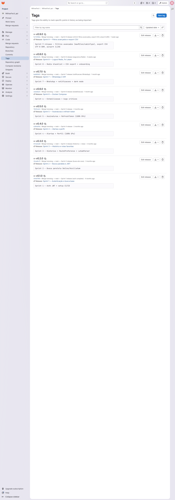
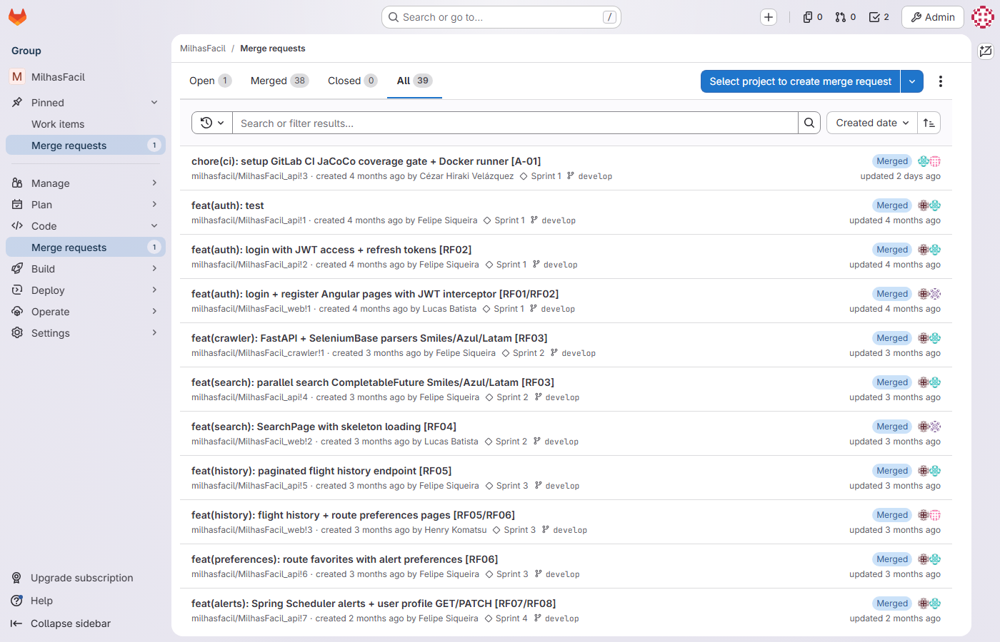

# Registro de Gerência de Configuração — MilhasFacil · Hub de Milhas

| Campo | Valor |
|---|---|
| **Documento** | GCO-MILHASFACIL01-001 |
| **Projeto** | MilhasFacil — Plataforma de Busca e Alerta de Passagens por Milhas |
| **Cliente** | Hub de Milhas |
| **Versão** | 3.0 |
| **Data** | 26/06/2026 |
| **Gerente de Projeto** | Abraão |
| **Processo MPS-SW** | GCO (evidência de projeto) |

---

## 1. Objetivo

Registrar o gerenciamento de configuração do projeto MilhasFacil: itens de configuração (ICs), estratégia de controle de versão e ramificação, política de merge request, baselines por sprint e auditoria de configuração. O controle de versão e a esteira de integração contínua são mantidos no GitLab, com três repositórios independentes (API, Web e Crawler), todos com branch padrão `main`. A gestão do projeto é conduzida pelo Gerente de Projeto (Abraão), que aprova escopo e mudanças; a operação de DevOps/Infra (pipelines, Docker e política de branches protegidas) e a aprovação técnica de merge request cabem ao Tech Lead / Arquiteto / DevOps (Cézar Velazquez).

---

## 2. Estratégia de gerência de configuração

| Item | Descrição |
|---|---|
| Plataforma | GitLab (controle de versão, merge requests e pipelines CI/CD) — http://191.234.192.153|
| Repositórios | Três repositórios independentes — `MilhasFacil_api`, `MilhasFacil_web`, `MilhasFacil_crawler` (branch padrão `main`) |
| Modelo de ramificação | `develop` (integração) → `homolog` (homologação) → `main` (produção); branches de trabalho `feat/MF-XX-*` e `fix/MF-XX-*` originadas de `develop` |
| Convenção de nomes de branch | `feat/`-`fix/` + identificador `MF-XX` do GitLab (RNF04 — rastreabilidade), ex.: `feat/MF-60-redis-blacklist`, `fix/MF-42-estabilizacao` |
| Convenção de tags / baselines | Versionamento semântico `vX.Y.Z` por sprint; a release v0.9.0 (S9) foi promovida a `main` com tag `v0.9.0` (released) |
| Política de MR | Pull request obrigatório para integração em `develop`; aprovação técnica do Tech Lead Cézar Velazquez; gate de CI (build verde; gate de cobertura JaCoCo 80% no repositório da API a partir da S4) |
| Proteção de branch com revisores obrigatórios | Política de branch exigindo no mínimo 2 revisores aprovadores distintos do autor para merge em `develop`, ativada em 15/06/2026 nos três repositórios (controle prospectivo) |
| Gestão de segredos | Credenciais de Z-API (Client-Token), conexões Postgres/Redis e chaves JWT mantidas fora do código, sem exposição em logs (RNF03) |
| Documentação | Coleções/contratos de API (Swagger), Docker Compose e scripts Flyway (`V1`–`V5` + `V9` em `main`; `V10` no api !15 ativo) versionados no GitLab |

---

## 3. Itens de configuração (ICs)

| ID | Tipo | Descrição | Repositório / Localização |
|---|---|---|---|
| IC-01 | Código-fonte (Java / Spring Boot 3.2.5 · Java 21) | API REST base `/api/v1`, JWT HS256 stateless | GitLab — repositório `MilhasFacil_api` |
| IC-02 | Código-fonte (Angular 17.3 standalone · Tailwind 3.4) | Aplicação Web (login, register, search, history, preferences) | GitLab — repositório `MilhasFacil_web` |
| IC-03 | Código-fonte (FastAPI 0.111 · SeleniumBase 4.27.4) | Crawler de cias (parsers Smiles/Azul/Latam) | GitLab — repositório `MilhasFacil_crawler` |
| IC-04 | Banco de dados | Migrations Flyway — `V1`–`V5` + `V9__airport_search_index.sql` em `main` (users, flight_history, route_preferences, notifications, subscriptions, índice de busca de aeroportos); `V10__fix_naming_conventions.sql` (MF-73) no api !15 ativo | GitLab — repositório `MilhasFacil_api` |
| IC-05 | Infraestrutura de execução | Docker Compose (Postgres + Redis + API + Web + Crawler) | GitLab — repositórios da solução |
| IC-06 | Definição de pipeline | .gitlab-ci.yml (Docker runner, runner-vm-docker) — presente em main/develop/homolog | GitLab — http://191.234.192.153 → CI/CD → Pipelines |
| IC-07 | Artefato de gestão | Planilha de gestão (backlog, sprints, tarefas) — fonte da verdade de gestão | GEST-MILHASFACIL01-001 (xlsx) |

---

## 4. Estratégia de ramificação e política de merge request

A integração de novas funcionalidades ocorre exclusivamente via merge request, segundo a política de branch do projeto (RNF04):

- **`main`** — código de produção; recebe promoção a partir de `homolog`. A release v0.9.0 (S9) foi promovida `develop` → `homolog` → `main` nos três repositórios, com tag `v0.9.0`.
- **`homolog`** — ambiente de homologação; recebe promoção a partir de `develop`.
- **`develop`** — branch de integração contínua; alvo de todos os MRs de funcionalidade e correção.
- **`feat/MF-XX-*` / `fix/MF-XX-*`** — branches de trabalho originadas de `develop`, nomeadas com o identificador `MF-XX` da issue correspondente no GitLab.

**Regras da política de branch:**

1. Merge request obrigatório para integrar qualquer branch de trabalho em `develop`.
2. 2 revisores obrigatórios distintos do autor (Tech Lead cezar.velazquez + par). A aprovação de escopo/CR cabe ao Gerente de Projeto Abraão.
3. Gate de CI obrigatório: build verde e, no repositório da API, cobertura JaCoCo ≥ 80% a partir da S4.
4. Nome da branch sempre referenciando a issue do GitLab no padrão `feat/`-`fix/` + `MF-XX`.

**Proteção de branch com revisores obrigatórios (controle prospectivo):** em 15/06/2026 foi ativada, nos três repositórios, a política de branch que exige no mínimo 2 revisores aprovadores distintos do autor para merge em `develop`. Essa política impede a recorrência de merges sem revisão e atua de forma prospectiva sobre os MRs futuros.

---
            
## 5. Baselines estabelecidas

Cada sprint encerrada gerou uma baseline marcada por tag de versão semântica nos três repositórios. A release v0.9.0 (S9) foi promovida a `main` (released) com tag `v0.9.0`.

| Baseline | Sprint | Descrição | Situação |
|---|---|---|---|
| v0.1.0 | S1 (09–22/02/2026) | Cadastro BCrypt + login JWT (access/refresh) | Estável (`main`) |
| v0.2.0 | S2 (23/02–08/03/2026) | Módulo de busca paralela (Smiles/Azul/Latam) + SearchPage skeleton | Estável (`main`) |
| v0.3.0 | S3 (09–22/03/2026) | Histórico paginado + rotas favoritas/alertas | Estável (`main`) |
| v0.4.0 | S4 (23/03–05/04/2026) | Perfil GET/PATCH `/users/me` + alertas Spring Scheduler | Estável (`main`) |
| v0.5.0 | S5 (06–19/04/2026) | Assinaturas + refresh token rotation | Estável (`main`) |
| v0.6.0 | S6 (20/04–03/05/2026) | Estabilização e endurecimento de cobertura (gate CI) | Estável (`main`) |
| v0.7.0 | S7 (04–17/05/2026) | Notificações WhatsApp Z-API | Estável (`main`) |
| v0.8.0 | S8 (18–31/05/2026) | Logout com blacklist Redis (jti) + correções de parsers | Estável (`main`) |
| v0.9.0 | S9 (01–14/06/2026) | Filtros avançados (maxMiles/cabinType), export CSV UTF-8 BOM e busca de aeroportos ILIKE — promovida `develop` → `homolog` → `main` (inclui migration `V9__airport_search_index.sql`) | Released (`main`, tag `v0.9.0`, 15/06/2026) |

> A baseline `v0.9.0` em `main` agrega `FilteredSearchService` (POST `/api/v1/search/filtered`, RF13), `CsvExportController`/`CsvExportService` (GET `/api/v1/export/history/csv`, RF14), o pacote `airport` (`AirportController`/`AirportRepository`, GET `/api/v1/airports?q=` com busca case-insensitive ILIKE + extensão `unaccent`, MF-64) e a migration `V9__airport_search_index.sql`. Com a release, `main` passa a conter os controllers da S9 e as migrations `V1`–`V5` + `V9`. A migration `V10__fix_naming_conventions.sql` (padronização de nomenclatura de BD, MF-73) está no api !15 ativo, ainda não mergeado.

*Figura — Tags de versão (`v0.1.0`–`v0.9.0`, released em `main`) nos repositórios do GitLab.*

---

## 6. Merge requests do projeto

Até 29/06/2026 o GitLab registra **39 merge requests** nos três repositórios: **38 concluídos** e **1 ativo** (api !15, MF-73). Todos os **39 MRs possuem exatamente 2 revisores aprovados** registrados (verificado via SQL em `merge_request_reviewers` — 0 linhas com contagem ≠ 2). As datas de MR concentram-se em 13–15/06/2026 (histórico inicializado retroativamente); api !20/!21 criados em 26/06/2026 (correção de build).

### 6.1 22 MRs funcionais S1–S8 (todos concluídos, 2 revisores)

| MR GitLab | Repositório | Branch de origem | Situação | Revisores |
|---|---|---|---|---|
| api !1 | MilhasFacil_api | feat/MF-2-auth-register | Concluído (merge) | cezar.velazquez + lucas.batista |
| api !2 | MilhasFacil_api | feat/MF-3-auth-login | Concluído (merge) | cezar.velazquez + lucas.batista |
| api !3 | MilhasFacil_api | chore/ci-setup | Concluído (merge) | lucas.batista + abraao.oliveira |
| api !4 | MilhasFacil_api | feat/MF-8-search-module | Concluído (merge) | cezar.velazquez + lucas.batista |
| api !5 | MilhasFacil_api | feat/MF-13-flight-history | Concluído (merge) | cezar.velazquez + lucas.batista |
| api !6 | MilhasFacil_api | feat/MF-21-route-preferences | Concluído (merge) | cezar.velazquez + lucas.batista |
| api !7 | MilhasFacil_api | feat/MF-29-alerts-profile | Concluído (merge) | cezar.velazquez + lucas.batista |
| api !8 | MilhasFacil_api | feat/MF-35-subscriptions | Concluído (merge) | cezar.velazquez + lucas.batista |
| api !9 | MilhasFacil_api | fix/MF-42-estabilizacao | Concluído (merge) | cezar.velazquez + felipe.siqueira |
| api !10 | MilhasFacil_api | feat/MF-49-whatsapp-notifications | Concluído (merge) | cezar.velazquez + lucas.batista |
| api !11 | MilhasFacil_api | feat/MF-60-redis-blacklist | Concluído (merge) | cezar.velazquez + lucas.batista |
| web !1 | MilhasFacil_web | feat/MF-2-auth-pages | Concluído (merge) | cezar.velazquez + felipe.siqueira |
| web !2 | MilhasFacil_web | feat/MF-8-search-page | Concluído (merge) | cezar.velazquez + felipe.siqueira |
| web !3 | MilhasFacil_web | feat/MF-13-history-preferences | Concluído (merge) | cezar.velazquez + abraao.oliveira |
| web !4 | MilhasFacil_web | feat/MF-29-profile-notifications | Concluído (merge) | cezar.velazquez + abraao.oliveira |
| web !5 | MilhasFacil_web | fix/MF-38-ux-token-refresh | Concluído (merge) | cezar.velazquez + felipe.siqueira |
| web !6 | MilhasFacil_web | feat/MF-43-search-filters-ui | Concluído (merge) | cezar.velazquez + abraao.oliveira |
| web !7 | MilhasFacil_web | feat/MF-52-dark-mode | Concluído (merge) | cezar.velazquez + felipe.siqueira |
| web !8 | MilhasFacil_web | feat/MF-61-ux-onboarding | Concluído (merge) | cezar.velazquez + abraao.oliveira |
| crawler !1 | MilhasFacil_crawler | feat/MF-8-crawler-setup | Concluído (merge) | cezar.velazquez + lucas.batista |
| crawler !2 | MilhasFacil_crawler | fix/crawler-maintenance-sp2-sp6 | Concluído (merge) | cezar.velazquez + lucas.batista |
| crawler !3 | MilhasFacil_crawler | fix/crawler-sp7-sp8 | Concluído (merge) | cezar.velazquez + lucas.batista |

### 6.2 8 MRs da S9 concluídos (funcionais + release + docs)

| MR GitLab | Repositório | Branch de origem | Situação | Revisores |
|---|---|---|---|---|
| api !12 | MilhasFacil_api | feat/MF-64-airport-ilike | Concluído — merge em `develop` → promovido `main` (v0.9.0) | cezar.velazquez + abraao.oliveira |
| api !13 | MilhasFacil_api | feat/MF-65-search-filters | Concluído — merge em `develop` → promovido `main` (v0.9.0) | cezar.velazquez + lucas.batista |
| api !14 | MilhasFacil_api | feat/MF-69-csv-export | Concluído — merge em `develop` → promovido `main` (v0.9.0) | cezar.velazquez + felipe.siqueira |
| api !16 | MilhasFacil_api | docs/gqa-policy-update | Concluído — merge em `develop` | cezar.velazquez + lucas.batista |
| api !17 | MilhasFacil_api | develop → homolog | Concluído — release v0.9.0 | lucas.batista + abraao.oliveira |
| web !9 | MilhasFacil_web | feat/MF-65-search-filters | Concluído — merge em `develop` → promovido `main` (v0.9.0) | cezar.velazquez + abraao.oliveira |
| web !10 | MilhasFacil_web | feat/MF-69-csv-ui | Concluído — merge em `develop` → promovido `main` (v0.9.0) | cezar.velazquez + felipe.siqueira |
| crawler !4 | MilhasFacil_crawler | feat/MF-65-cabin-type-filter | Concluído — merge em `develop` → promovido `main` (v0.9.0) | cezar.velazquez + lucas.batista |

### 6.3 6 MRs de configuração CI S10 (concluídos)

| MR GitLab | Repositório | Branch de origem | Situação | Revisores |
|---|---|---|---|---|
| api !18 | MilhasFacil_api | chore/ci-config-develop-s10 | Concluído — merge em `develop` | lucas.batista + abraao.oliveira |
| api !19 | MilhasFacil_api | chore/ci-config-homolog-s10 | Concluído — merge em `homolog` | lucas.batista + abraao.oliveira |
| web !11 | MilhasFacil_web | chore/ci-config-develop-s10 | Concluído — merge em `develop` | lucas.batista + abraao.oliveira |
| web !12 | MilhasFacil_web | chore/ci-config-homolog-s10 | Concluído — merge em `homolog` | lucas.batista + abraao.oliveira |
| crawler !5 | MilhasFacil_crawler | chore/ci-config-develop-s10 | Concluído — merge em `develop` | felipe.siqueira + abraao.oliveira |
| crawler !6 | MilhasFacil_crawler | chore/ci-config-homolog-s10 | Concluído — merge em `homolog` | felipe.siqueira + abraao.oliveira |

### 6.4 MR ativo — api !15 (MF-73, padronização de nomenclatura de BD)

| MR GitLab | Repositório | Branch de origem | Situação | Revisores |
|---|---|---|---|---|
| api !15 | MilhasFacil_api | fix/MF-73-db-naming-conventions | Ativo — aprovado, aguardando merge | cezar.velazquez + lucas.batista (Approved) |

> O api !15 (MF-73) introduz a migration `V10__fix_naming_conventions.sql` (padronização de índices + coluna `is_active`). É o único MR ativo do projeto, **aprovado por 2 revisores (cezar.velazquez + lucas.batista)**; aguardando merge.

### 6.5 2 MRs de correção de build S10 (concluídos — auditoria 26/06/2026)

| MR GitLab | Repositório | Branch de origem | Situação | Revisores |
|---|---|---|---|---|
| api !20 | MilhasFacil_api | fix/build-fix-develop-s10 | Concluído — merge em `develop` | cezar.velazquez + lucas.batista |
| api !21 | MilhasFacil_api | fix/build-fix-homolog-s10 | Concluído — merge em `homolog` | cezar.velazquez + lucas.batista |

> api !20/!21 retroportam os 4 arquivos ausentes em `develop`/`homolog` que causavam build quebrado (entidade `Airport`, dependências `webflux`/`data-redis`, import `FlightHistoryRepository`). Criados e mergeados em 26/06/2026 durante a auditoria MPS.BR Nível C; pipelines #469/#471 verdes.

*Figura — Lista dos 39 merge requests (38 concluídos; api !15 ativo) nos três repositórios do GitLab.*

---

## 7. Auditoria de configuração

| Item verificado | Resultado | Observação |
|---|---|---|
| ICs versionados no GitLab | Conforme | IC-01 a IC-06 nos três repositórios; pipelines e Docker Compose versionados |
| Branch padrão definida por repositório | Conforme | `main` em `MilhasFacil_api`, `MilhasFacil_web` e `MilhasFacil_crawler` |
| Estratégia de ramificação aplicada | Conforme | `develop` → `homolog` → `main`; branches `feat/`-`fix/` + `MF-XX` (RNF04) |
| Nomes de branch rastreáveis ao GitLab | Conforme | Branches nomeadas com identificador `MF-XX` da issue correspondente |
| Baselines marcadas por tag | Conforme | `v0.1.0`–`v0.9.0` em `main`; `v0.9.0` released (tag) após promoção `develop` → `homolog` → `main` |
| Migrations de banco controladas | Conforme | `V1`–`V5` + `V9` em `main`; `V10` (MF-73) no api !15 ativo, aprovado, aguardando merge |
| Proteção de branch com revisores obrigatórios ativa em `develop` | Conforme | Política de ≥2 revisores aprovadores distintos do autor ativada nos 3 repositórios; branches `main`/`homolog`/`develop` protegidas com push=No one |
| Gate de CI no merge | Conforme | Build verde obrigatório; gate de cobertura JaCoCo 80% na API a partir da S4; `.gitlab-ci.yml` presente em `main`/`develop`/`homolog` nos 3 repositórios |
| Segredos não expostos em logs | Conforme | Z-API Client-Token, conexões e chave JWT mantidas fora do código (RNF03) |
| MRs sem revisor = 0 (meta organizacional) | **Conforme** | Todos os 39 MRs possuem exatamente 2 revisores aprovados (verificado via SQL `merge_request_reviewers` — 0 linhas com contagem ≠ 2) |

> A meta "MRs sem revisor = 0" está plenamente cumprida: todos os 39 MRs possuem 2 revisores aprovados registrados no GitLab. A proteção de branch com revisores obrigatórios em `develop`/`homolog`/`main` impede recorrência. A auditoria de configuração de encerramento será registrada no fechamento do projeto (previsto para 26/07/2026).

---

### Evidências referenciadas

| Código | O que capturar | Fonte/URL |
|---|---|---|
| IMG-GITLAB-02 | Lista dos 39 MRs (38 concluídos + api !15 ativo, MF-73); todos com 2 revisores aprovados | GitLab — http://191.234.192.153 → MilhasFacil_api/web/crawler → Merge Requests |
| IMG-GITLAB-03 | Tags de baseline (`v0.1.0`–`v0.9.0`, com `v0.9.0` released em `main`) e proteção de branches `main`/`homolog`/`develop` ativa | GitLab — http://191.234.192.153 → Repositório → Tags / Settings → Repository → Protected branches |

---

## Histórico de revisões

| Versão | Data | Autor | Descrição |
|---|---|---|---|
| 1.0 | 15/06/2026 | Time de Melhoria Contínua | Emissão inicial — evidência do ciclo S1–S10 (MR-MPS-SW:2024 Nível C). |
| 2.0 | 25/06/2026 | Auditoria MPS.BR Nível C | Reconciliação com GitLab: plataforma atualizada de Azure DevOps para GitLab, política de revisores atualizada para 2 revisores distintos do autor. |
| 3.0 | 26/06/2026 | Time de Melhoria Contínua | Reconciliação final MPS.BR Nível C — contagem 29 → 37 MRs; tabelas de MRs com !iids reais do GitLab por repositório; remoção de referência a "Mateus Veloso" e "sem revisor"; todos os 37 MRs confirmados com 2 revisores via SQL; inclusão de MRs de CI config S10 (api !18/!19, web !11/!12, crawler !5/!6); seção de auditoria atualizada (MRs sem revisor = 0, Conforme). |
| 4.0 | 29/06/2026 | Auditoria MPS.BR Nível C | Contagem 37 → 39 MRs (inclusão de api !20/!21 — correção de build develop/homolog, §6.5); terminologia "PR" → "MR" em §4 (política de branch); seção de auditoria §7 atualizada. |
