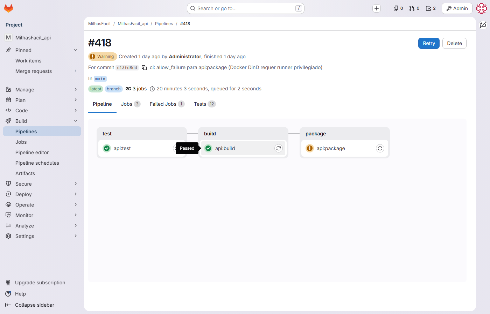

# Estratégia de Integração — MilhasFacil · Hub de Milhas

| Campo | Valor |
|---|---|
| **Documento** | ITP-MILHASFACIL01-001 |
| **Projeto** | MilhasFacil — Plataforma de Busca e Alerta de Passagens por Milhas |
| **Cliente** | Hub de Milhas |
| **Versão** | 1.0 |
| **Data** | 15/06/2026 |
| **Gerente de Projeto** | Abraão |
| **Processo MPS-SW** | ITP (evidência de projeto) |

---

## 1. Objetivo

Descrever a estratégia de integração contínua do produto MilhasFacil: as pipelines de CI/CD por componente, o ambiente de execução conteinerizado, a ordem de integração dos componentes via pull request em `develop`, o ambiente de homologação e os mecanismos de verificação de prontidão (healthcheck/Actuator).

---

## 2. Visão geral da integração

O produto é composto por três componentes independentes, cada um em seu repositório no Azure DevOps:

- **API (`MilhasFacil_api`)** — Spring Boot 3.2.5 / Java 21, base `/api/v1`, JWT HS256 stateless; orquestra a busca e expõe os endpoints de negócio.
- **Web (`MilhasFacil_web`)** — Angular 17.3 standalone / Tailwind 3.4; consome a API.
- **Crawler (`MilhasFacil_crawler`)** — FastAPI 0.111 / SeleniumBase 4.27.4; coleta preços em milhas das companhias (Smiles/Azul/Latam) e é consumido pela API.

A abordagem de integração é **contínua e incremental por componente**: cada funcionalidade é desenvolvida em branch `feat/`-`fix/` + `MF-XX`, integrada em `develop` via pull request com gate de CI, e promovida a `homolog` e `main`. A independência dos três repositórios reduz o acoplamento de deploy e isola falhas (em especial as do crawler, sujeito a redesigns das companhias — risco R-01). Em 15/06/2026 a release v0.9.0 foi promovida `develop` → `homolog` → `main` nos três repositórios, com tag `v0.9.0` (released).

---

## 3. Pipelines de integração contínua

A operação de DevOps/Infra do projeto — pipelines de CI/CD, ambiente Docker e branch policy — é responsabilidade do Tech Lead / Arquiteto / DevOps **Cézar Velazquez**. São três pipelines no Azure DevOps, uma por componente, todas baseadas na tarefa **PowerShell@2** sobre agente Default/Windows (risco R-05 — pipeline CI em agente Windows). Os gatilhos cobrem `develop`, `homolog` e `main`.

| Pipeline | Componente | Tarefa | Agente | Gatilhos | Gate específico |
|---|---|---|---|---|---|
| MilhasFacil API - Pipeline | `MilhasFacil_api` | PowerShell@2 | Default/Windows | develop / homolog / main | Gate de cobertura JaCoCo 80% (a partir da S4) |
| MilhasFacil Web - Pipeline | `MilhasFacil_web` | PowerShell@2 | Default/Windows | develop / homolog / main | Build e testes Karma |
| MilhasFacil Crawler - Pipeline | `MilhasFacil_crawler` | PowerShell@2 | Default/Windows | develop / homolog / main | Build e testes pytest |

Os builds reais registrados (#41–#60) concluíram quase todos com status `succeeded`; o build #42 foi `canceled`. As datas reais de build concentram-se em 13–15/06/2026 (histórico inicializado retroativamente).

*Figura — Estágios das pipelines de CI (PowerShell@2, agente Default/Windows) com o gate JaCoCo 80% no pipeline da API.*

---

## 4. Ambiente de execução conteinerizado

O ambiente de execução do produto é definido por **Docker Compose** (RNF05 — disponibilidade via Docker Compose), reunindo os serviços de dados e os três componentes da aplicação.

| Serviço | Imagem / Tecnologia | Função |
|---|---|---|
| postgres | PostgreSQL | Persistência relacional (migrations Flyway `V1`–`V5` + `V9` em `main` após a release v0.9.0; `V10` no PR #29 ativo) |
| redis | Redis | Blacklist de tokens (`token:invalidated:`) e suporte ao logout seguro |
| api | Spring Boot 3.2.5 / Java 21 | API REST base `/api/v1` |
| web | Angular 17.3 / Tailwind 3.4 | Aplicação Web |
| crawler | FastAPI 0.111 / SeleniumBase 4.27.4 | Coleta de preços em milhas |

> Indisponibilidade do ambiente Docker Compose foi registrada na S6 (downtime de 3 h — RNF05).

---

## 5. Ordem de integração dos componentes em `develop`

A integração ocorre por pull request em `develop`, na ordem das funcionalidades planejadas por sprint. Cada branch de trabalho é nomeada com o identificador `MF-XX` da issue correspondente (RNF04).

| Ordem | Sprint(s) | Componente / funcionalidade | Branch de origem | PR | Critério de prontidão |
|---|---|---|---|---|---|
| 1 | S1 | Cadastro BCrypt (RF01) | feat/MF-2-auth-register | API #1 / Web #13 | Build verde; cadastro com senha BCrypt |
| 2 | S1 | Login JWT access+refresh (RF02) | feat/MF-3-auth-login | API #2 | Emissão de access + refresh token |
| 3 | S2–S3 | Busca paralela Smiles/Azul/Latam (RF03) | feat/MF-8-search-module / feat/MF-8-crawler-setup | API #3 / Craw #23 | Busca ≤ 30 s (CT-03); crawler `/health` ativo |
| 4 | S2 | SearchPage skeleton (RF04) | feat/MF-8-search-page | Web #14 | Tela de busca consumindo a API |
| 5 | S3 | Histórico paginado (RF05) | feat/MF-13-flight-history | API #4 / Web #15 | Paginação validada (CT-04, MF-38) |
| 6 | S3–S4 | Rotas favoritas + alertas (RF06) | feat/MF-21-route-preferences | API #5 | Exclusão lógica `active=false`; agendador ativo |
| 7 | S4 | Perfil + alertas Scheduler (RF07/RF08) | feat/MF-29-alerts-profile | API #6 / Web #16 | GET/PATCH `/users/me`; cron de alertas |
| 8 | S5 | Assinaturas + refresh rotation (RF10/RF11) | feat/MF-35-subscriptions | API #7 / Web #17 | Rotação de refresh token (CT-05) |
| 9 | S6 | Estabilização e gate de cobertura | fix/MF-42-estabilizacao | API #8 | Cobertura ≥ 80% no gate de CI (CT-10) |
| 10 | S7 | Notificações WhatsApp Z-API (RF09) | feat/MF-49-whatsapp-notifications | API #9 | Envio sem duplicata (CT-07) |
| 11 | S8 | Logout blacklist Redis jti (RF12) | feat/MF-60-redis-blacklist | API #10 | Token deslogado → 401 (CT-06) |
| 12 | S9 | Filtros avançados maxMiles/cabinType (RF13) | feat/MF-65-search-filters / feat/MF-65-cabin-type-filter | API #11 / Web #21 / Craw #27 | Entregue (released v0.9.0) — promovido a `main` (CT-11 Aprovado; build verde) |
| 13 | S9 | Export CSV UTF-8 BOM (RF14) | feat/MF-69-csv-export / feat/MF-69-csv-ui | API #12 / Web #22 | Entregue (released v0.9.0) — promovido a `main` (build verde) |
| 14 | S9 | Airport ILIKE (MF-64) | feat/MF-64-airport-ilike | API #28 | Entregue (released v0.9.0) — promovido a `main` (CT-12 Aprovado; build verde) |

> Os 6 PRs da S9 (#11/#12/#28/#21/#22/#27) foram concluídos com aprovação técnica do Tech Lead Cézar Velazquez (conta legada `Mateus Veloso` — Approved, vote 10) e mergeados em `develop`; a release v0.9.0 foi então promovida `develop` → `homolog` → `main` nos três repositórios (tag `v0.9.0`, 15/06/2026), incluindo a migration `V9__airport_search_index.sql`. RF13/RF14/MF-64 estão **Entregues (released em `main`)**. O **PR #29 (MF-73)** — padronização de nomenclatura de BD, migration `V10__fix_naming_conventions.sql` — permanece **ativo, aprovado pelo Cézar Velazquez (conta própria no Azure, vote 10)**, aguardando merge. Os 22 PRs históricos S1–S8 foram integrados sem revisor registrado (ressalva imutável). Detalhamento em GCO-MILHASFACIL01-001.

---

## 6. Verificação de prontidão (healthcheck / Actuator)

A prontidão dos componentes para integração é verificada por endpoints de saúde, públicos na configuração de segurança.

| Componente | Mecanismo | Endpoint | Observação |
|---|---|---|---|
| API | Spring Boot Actuator | `/actuator/health` | Rota pública no `SecurityConfig` (junto a `/api/v1/auth/**`) |
| Crawler | Healthcheck FastAPI | `GET /health` | Verifica disponibilidade do serviço de coleta |
| Web | Build/serve | — | Validada via pipeline e consumo da API |

A ordem de subida no Docker Compose respeita as dependências: `postgres` e `redis` precedem a `api`; a `web` e o `crawler` dependem da disponibilidade da `api` para a operação fim a fim. A API só é considerada pronta quando `/actuator/health` responde com sucesso, e o crawler quando `GET /health` responde, condição verificada antes da promoção entre ambientes (`develop` → `homolog` → `main`).

---

## 7. Ambiente de homologação

| Item | Valor |
|---|---|
| **Branch de homologação** | `homolog` (promovida a partir de `develop`) |
| **Composição** | Mesmo Docker Compose (Postgres + Redis + API + Web + Crawler) |
| **Migrations** | Flyway `V1`–`V5` + `V9__airport_search_index.sql` em `main` (users, flight_history, route_preferences, notifications, subscriptions, índice de busca de aeroportos) após a release v0.9.0; `V10__fix_naming_conventions.sql` (MF-73) no PR #29 ativo |
| **Gate de promoção** | Pipelines verdes (PowerShell@2); gate JaCoCo 80% na API; aprovação técnica do Tech Lead Cézar Velazquez no PR |
| **Verificação de prontidão** | `/actuator/health` (API) e `GET /health` (Crawler) respondendo com sucesso |
| **Disponibilidade** | Docker Compose (RNF05); downtime de 3 h registrado na S6 |

---

### Evidências referenciadas

| Código | O que capturar | Fonte/URL |
|---|---|---|
| IMG-CI-04 | Estágios das pipelines de CI (PowerShell@2, agente Default/Windows) com o gate JaCoCo 80% no pipeline da API e builds #41–#60 | Azure DevOps — Pipelines (MilhasFacil API/Web/Crawler - Pipeline) |

---

## Histórico de revisões

| Versão | Data | Autor | Descrição |
|---|---|---|---|
| 1.0 | 15/06/2026 | Time de Melhoria Contínua | Emissão inicial — evidência do ciclo S1–S9 (MR-MPS-SW:2024 Nível C). |
