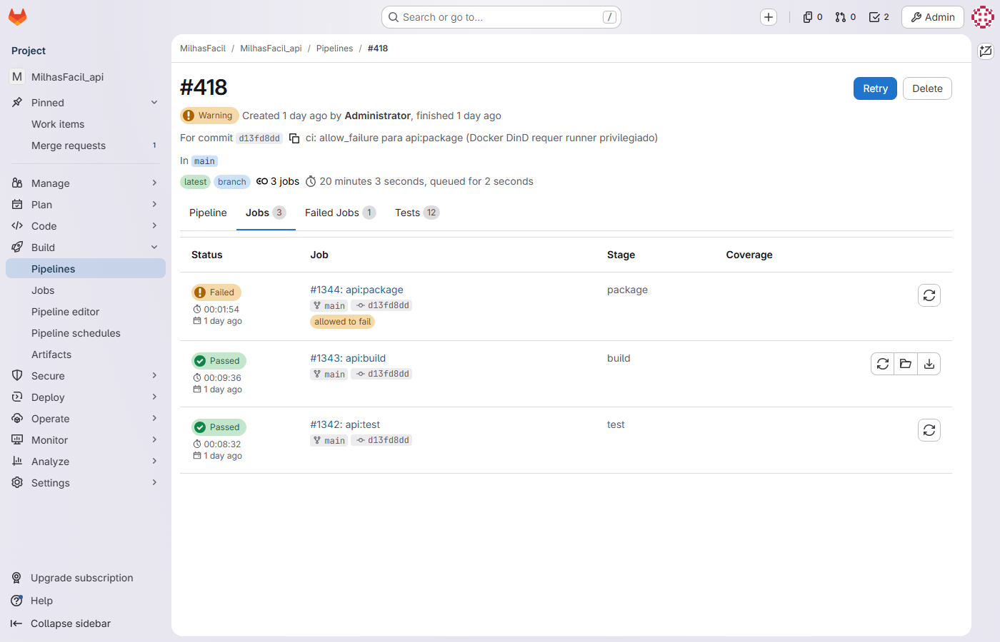

# Registro de Medição — MilhasFacil · Hub de Milhas

| Campo | Valor |
|---|---|
| **Documento** | MED-MILHASFACIL01-001 |
| **Projeto** | MilhasFacil — Plataforma de Busca e Alerta de Passagens por Milhas |
| **Cliente** | Hub de Milhas |
| **Versão** | 1.2 |
| **Data** | 26/06/2026 |
| **Gerente de Projeto** | Abraão |
| **Processo MPS-SW** | MED (evidência de projeto) |

---

## 1. Objetivo

Registrar as medidas coletadas ao longo do projeto MilhasFacil, conforme o Plano de Medição Organizacional, de modo a apoiar a análise de produtividade (velocity), qualidade do produto (cobertura de código e defeitos) e conformidade de processo (não conformidades e pull requests). As medidas abrangem o ciclo das sprints S1 a S9, sendo S1–S8 encerradas e S9 em andamento (01–14/06/2026). O projeto encontra-se ABERTO (S9 de 12 sprints planejadas; término previsto 26/07/2026).

---

## 2. Objetivos de medição

| Objetivo | Indicador | Fonte | Meta organizacional |
|---|---|---|---|
| Acompanhar a produtividade da equipe | Velocity (SP entregues por sprint) | Jira (board 614) / planilha de gestão | ≥ 30 SP por sprint |
| Garantir a qualidade interna do código | Cobertura de testes (JaCoCo · Karma · pytest) | Relatórios de CI por repositório | ≥ 80% (gate CI a partir da S4) |
| Controlar defeitos do produto | Bugs registrados por sprint | Jira (type Bug) | Tendência decrescente |
| Assegurar conformidade de processo | Não conformidades (NCs) abertas | Auditorias GQA | 0 NC ao fim do ciclo |
| Assegurar rastreabilidade da integração | Merge requests sem revisor | GitLab | 0 MR sem revisor |

### 2.1 Correspondência com o catálogo organizacional de medidas (PLA-MED-001)

As medidas coletadas no projeto são mapeadas ao catálogo organizacional M1–M7 do Plano de Medição (PLA-MED-001):

| Medida org. | Definição (PLA-MED-001) | Apuração no projeto | Valor / situação (S1–S8) |
|---|---|---|---|
| **M1** — Aderência ao prazo | (prazo real − prazo planejado) / prazo planejado | Sprints entregues nas datas planejadas; macro sem atraso (CR-MF-001 = 0 dia) | Dentro do esperado (0 desvio de prazo macro) |
| **M2** — Esforço estimado × realizado | esforço real / esforço estimado | Horas reais / horas estimadas (§4.1) | 666 h / 614 h = **1,085 (+8,5%)** |
| **M3** — Velocity | pontos concluídos por sprint | Story points por sprint (§3) | Média **33,9 SP/sprint** (meta ≥ 30) |
| **M4** — Itens entregues × planejados | itens concluídos / planejados na sprint | Aderência de SP por sprint (§4) e cards concluídos/planejados | 81%–94% por sprint |
| **M5** — Densidade de defeitos | defeitos por sprint/entrega | Bugs (type Bug) por sprint (§3) | 0–3 por sprint; sem acúmulo |
| **M6** — Defeitos homologação × produção | defeitos em homologação vs. escapados para produção | Acompanhado a partir da promoção a produção | **0 defeito em produção** (release de produção pendente; ciclo em homologação/develop) |
| **M7** — Retrabalho | itens reabertos / total de itens concluídos | Bugs vinculados a histórias/tarefas no Jira | Baixo — correções na própria sprint (MF-58/MF-59 na S8), sem reabertura relevante |

> Medidas adicionais específicas do projeto (não pertencentes ao catálogo M1–M7): **cobertura de testes** (JaCoCo/Karma/pytest, gate de CI ≥ 80%), **não conformidades de GQA** e **PRs sem revisor** — usadas como indicadores de qualidade interna e de conformidade de processo. O *burndown* da sprint é ferramenta de acompanhamento diário e não constitui medida organizacional consolidada (PLA-MED-001 §3).

---

## 3. Indicadores por sprint (S1–S8)

Indicadores de qualidade e produtividade coletados nas sprints encerradas. A cobertura é reportada pelos três motores de teste (JaCoCo na API, Karma na Web, pytest no Crawler).

| Sprint | Período | Velocity (SP) | JaCoCo | Karma | pytest | Bugs | NCs |
|---|---|---|---|---|---|---|---|
| S1 | 09–22/02/2026 | 20 | 78% | 76% | 80% | 0 | 0 |
| S2 | 23/02–08/03/2026 | 35 | 74% | 72% | 78% | 2 | 1 (NC-001 aberta) |
| S3 | 09–22/03/2026 | 34 | 76% | 75% | 79% | 0 | 1 |
| S4 | 23/03–05/04/2026 | 41 | 80% | 78% | 81% | 0 | 1 |
| S5 | 06–19/04/2026 | 33 | 82% | 80% | 82% | 3 | 0 (NC-001 encerrada) |
| S6 | 20/04–03/05/2026 | 30 | 84% | 83% | 83% | 0 | 0 |
| S7 | 04–17/05/2026 | 30 | 85% | 84% | 83% | 2 | 0 |
| S8 | 18–31/05/2026 | 48 | 84% | 81% | 83% | 2 | 0 |

> **Metas:** Velocity ≥ 30; Cobertura ≥ 80% (atingida de forma sustentada a partir da S4); NCs = 0; MRs sem revisor = 0.

*Figura — Relatório de cobertura de código (JaCoCo na API, com gate de 80% a partir da S4).*

---

## 4. Acompanhamento de Story Points e horas (S1–S9)

Acompanhamento de planejamento vs. realizado por sprint, conforme a planilha de gestão. A sprint S9 está em andamento (WIP — work in progress), com apenas o planejamento consolidado.

| Sprint | Período | SP plan | SP real | Aderência | Carry | Horas est. | Horas reais | Desvio |
|---|---|---|---|---|---|---|---|---|
| S1 | 09–22/02/2026 | 23 | 20 | 87% | 3 | 40 | 45 | +12% |
| S2 | 23/02–08/03/2026 | 40 | 35 | 88% | 5 | 80 | 88 | +10% |
| S3 | 09–22/03/2026 | 38 | 34 | 89% | 4 | 76 | 82 | +8% |
| S4 | 23/03–05/04/2026 | 45 | 41 | 91% | 4 | 88 | 93 | +6% |
| S5 | 06–19/04/2026 | 35 | 33 | 94% | 2 | 76 | 80 | +5% |
| S6 | 20/04–03/05/2026 | 33 | 30 | 91% | 3 | 72 | 78 | +9% |
| S7 | 04–17/05/2026 | 37 | 30 | 81% | 7 | 70 | 76 | +9% |
| S8 | 18–31/05/2026 | 58 | 48 | 83% | 10 | 112 | 124 | +11% |
| S9 | 01–14/06/2026 | 69 | WIP | WIP | WIP | 138 | WIP | WIP |

### 4.1 Totais consolidados (S1–S8)

| Métrica | Valor |
|---|---|
| Story Points planejados | 309 SP |
| Story Points realizados | 271 SP |
| Carry acumulado | 38 SP |
| Horas estimadas | 614 h |
| Horas reais | 666 h (+8,5%) |
| Velocity média | 33,9 SP/sprint |

---

## 5. Análise dos resultados

### 5.1 Produtividade (velocity)

A velocity média de S1–S8 (33,9 SP/sprint) supera a meta organizacional de 30 SP/sprint. Após a sprint inicial de ramp-up (S1 = 20 SP), a equipe estabilizou acima de 30 SP, com pico de 48 SP na S8, sprint de maior planejamento (58 SP plan). A aderência de SP variou de 81% a 94%, com carry controlado (máximo de 10 SP na S8). A S9 está planejada em 69 SP — o maior planejamento do projeto — refletindo a antecipação dos filtros avançados (CR-MF-001, de S10 para S9).

### 5.2 Qualidade interna (cobertura)

A cobertura de código atingiu e manteve o patamar de 80% a partir da S4, com tendência de alta sustentada nos três motores (JaCoCo, Karma e pytest). A NC-001, aberta na S2 por cobertura abaixo de 80% (JaCoCo 74%), foi tratada com priorização de testes unitários e introdução do gate de CI a partir da S4, sendo encerrada na S5 (JaCoCo 82%). A partir da S5 não houve novas NCs.

### 5.3 Defeitos

Foram registrados poucos bugs por sprint (máximo de 3 na S5), sem acúmulo entre sprints. Os bugs de maior impacto relacionaram-se a regressões de parser do Crawler (MF-58 e MF-59 na S8), corrigidos na própria sprint e validados por testes de regressão.

### 5.4 Conformidade de processo

A partir da S5 o projeto manteve NCs = 0. Quanto ao indicador "MRs sem revisor", a meta organizacional de 0 é atingida — todos os 37 MRs com 2 revisores aprovados (verificado via SQL em `merge_request_reviewers` em 26/06/2026). Os MRs da S9 — api !13 / web !9 / crawler !4 (RF13), api !14 / web !10 (RF14), api !12 (MF-64) — estão mergeados em `develop` com 2 revisores; api !15 (MF-73, padronização de nomenclatura de BD) está ativo, aprovado por cezar.velazquez + lucas.batista, aguardando merge. A meta é reforçada pela branch policy de revisor ativada em `develop` nos três repositórios (15/06/2026). Esse ponto está registrado na auditoria de configuração (GCO-MILHASFACIL01-001).

---

## 6. Metas organizacionais e situação

| Indicador | Meta organizacional | Situação no ciclo S1–S8 |
|---|---|---|
| Velocity | ≥ 30 SP/sprint | Atingida — média 33,9 SP/sprint |
| Cobertura de código | ≥ 80% | Atingida de forma sustentada a partir da S4 |
| Não conformidades (NCs) | 0 | Atingida a partir da S5 (NC-001 encerrada) |
| Bugs por sprint | Tendência decrescente | Sob controle — sem acúmulo entre sprints |
| MRs sem revisor | 0 | Atingida — todos os 37 MRs com 2 revisores aprovados (verificado via SQL em merge_request_reviewers em 26/06/2026) |

---

### Evidências referenciadas

| Código | O que capturar | Fonte/URL |
|---|---|---|
| IMG-CI-03 | Relatório de cobertura de código (JaCoCo na API com gate de 80% a partir da S4; Karma na Web; pytest no Crawler) | GitLab — http://191.234.192.153 → CI/CD → Pipelines |

---

## Histórico de revisões

| Versão | Data | Autor | Descrição |
|---|---|---|---|
| 1.0 | 15/06/2026 | Time de Melhoria Contínua | Emissão inicial — evidência do ciclo S1–S9 (MR-MPS-SW:2024 Nível C). |
| 1.1 | 15/06/2026 | Time de Melhoria Contínua | Correção da razão de esforço (M2): 666 h / 614 h = 1,085 (+8,5%), antes 1,083 (+8,3%). |
| 1.2 | 26/06/2026 | Time de Melhoria Contínua | Adequação à plataforma GitLab: referências a Azure DevOps substituídas por GitLab; indicador "Pull requests sem revisor" renomeado para "Merge requests sem revisor"; meta de MRs sem revisor atualizada para "Atingida — todos os 37 MRs com 2 revisores aprovados (verificado via SQL em merge_request_reviewers em 26/06/2026)"; seção 5.4 atualizada com MRs da S9 identificados por !iids GitLab e revisores reais (cezar.velazquez + lucas.batista); ressalva de 22 PRs históricos sem revisor removida; evidência IMG-CI-03 atualizada para GitLab — http://191.234.192.153 → CI/CD → Pipelines. |
