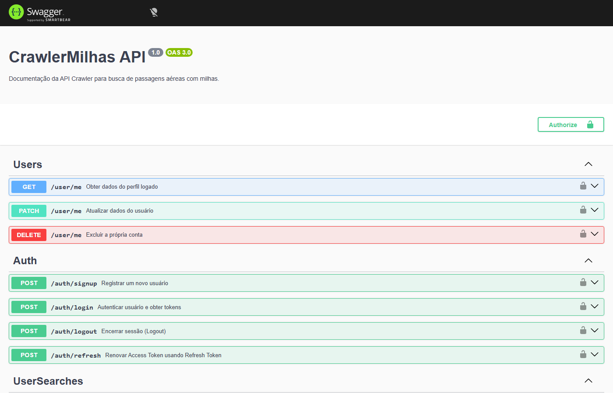

# Documento de Design — Hub de Milhas · MilhasFacil (Busca de Milhas)

| Campo | Valor |
|---|---|
| **Documento** | PCP-MILHASFACIL01-001 |
| **Projeto** | MilhasFacil — Plataforma de Busca e Alerta de Passagens por Milhas |
| **Código do projeto** | MILHASFACIL01 |
| **Cliente** | Hub de Milhas |
| **Organização** | Timeware Brasil Softwares e Serviços LTDA |
| **Versão** | 1.2 |
| **Data** | 26/06/2026 |
| **Situação** | Aprovado |
| **Gerente de Projeto** | Abraão |
| **Processo MPS-SW** | PCP (evidência de projeto) |

---

## 1. Visão geral da solução

O MilhasFacil é uma plataforma que busca, em paralelo, passagens aéreas resgatáveis por milhas nos programas Smiles, Azul e Latam, mantém o histórico das buscas por usuário e dispara alertas quando uma rota favorita atinge um bom preço em milhas. A solução é composta por **três serviços independentes**, implantáveis via Docker Compose:

| Serviço | Tecnologia | Responsabilidade |
|---|---|---|
| **API** | Spring Boot 3.2.5 / Java 21 | Núcleo de negócio: autenticação JWT, busca, busca filtrada, busca de aeroportos, histórico, exportação CSV, rotas favoritas, perfil, alertas agendados e notificação. Base `/api/v1`. |
| **Web** | Angular 17.3 standalone / Tailwind 3.4 | Interface do usuário: login, registro, busca, histórico e preferências. |
| **Crawler** | FastAPI 0.111 / SeleniumBase 4.27.4 | Consulta os portais das companhias (Smiles, Azul, Latam) e devolve resultados estruturados à API. |

> **Linha de ramos (15/06/2026 — release v0.9.0):** após a promoção `develop → homolog → main` (tag **v0.9.0**), `main` contém **8 controllers** (Auth, Search, User, RoutePreference, FlightHistory, **Airport**, **CsvExport**) — somados ao serviço **FilteredSearchService** — e migrations **V1–V5 + V9** (`V9__airport_search_index`). A padronização de nomenclatura de banco (MF-73, migration **V10__fix_naming_conventions** com a coluna `route_preferences.is_active` e a complementação de índices) está no **api !15 ativo**, ainda não mergeado em `main`. Os componentes promovidos na v0.9.0 estão detalhados em §2.3 e §4.

---

## 2. Arquitetura da solução

### 2.1 Diagrama textual (visão de serviços)

> O diagrama de arquitetura oficial é mantido no **Lucidchart**: <https://lucid.app/lucidchart/a51c0f84-cc01-4468-bfdd-6e94aa7a3ae3> (exportação em `evidencias/IMG-ARQ-01_diagrama-arquitetura.png`). A visão textual abaixo o reproduz. Arquitetura aprovada no Design Review (ATA-MILHASFACIL01-002, PO + Tech Lead).

```
                         ┌──────────────────────────────┐
                         │   Navegador do usuário        │
                         └───────────────┬──────────────┘
                                         │ HTTPS
                                         ▼
                  ┌──────────────────────────────────────────┐
                  │  WEB — Angular 17.3 (standalone)          │
                  │  /login /register /search /history        │
                  │  /preferences  (authGuard)                │
                  │  AuthService (signals + localStorage)     │
                  │  jwtInterceptor (401 → refresh → retry)   │
                  └───────────────────┬──────────────────────┘
                                      │ REST /api/v1 (Bearer JWT)
                                      ▼
   ┌─────────────────────────────────────────────────────────────────────┐
   │  API — Spring Boot 3.2.5 / Java 21  (main, v0.9.0)                   │
   │                                                                     │
   │  SecurityConfig (CSRF off, STATELESS, BCrypt)                       │
   │  JwtAuthenticationFilter → JwtService (HS256) → RedisTokenBlacklist │
   │                                                                     │
   │  Controllers (8): Auth · Search · User · RoutePreference ·          │
   │                   FlightHistory · Airport · CsvExport               │
   │  SearchService (3× CompletableFuture, timeout 40s, distinct, sort)  │
   │  FilteredSearchService (/search/filtered, SearchRequestV2)          │
   │  ScheduledAlertService (@Scheduled cron 0 0 */6 * * *)              │
   │  WhatsAppClient (WebClient → Z-API)                                 │
   └───────┬───────────────────┬──────────────────────┬─────────────────┘
           │ JPA/Flyway        │ HTTP                  │ RedisTemplate
           ▼                   ▼                       ▼
   ┌───────────────┐   ┌──────────────────┐    ┌──────────────────┐
   │ PostgreSQL    │   │ CRAWLER          │    │ Redis            │
   │ V1..V5 + V9   │   │ FastAPI 0.111    │    │ token:invalidated│
   │ (main)        │   │ SeleniumBase     │    │ :{jti} (TTL 7d)  │
   │ 5 tabelas +   │   │ POST /search/    │    └──────────────────┘
   │ idx aeroportos│   │   {airline}      │
   └───────────────┘   │ Parsers Smiles/  │         ┌──────────────┐
                       │ Azul/Latam (BS4) │────────▶│ Z-API        │
                       │ CABIN_MAP        │  POST   │ /send-text   │
                       │ /health          │ send-text└──────────────┘
                       └──────────────────┘
                              │ Selenium
                              ▼
                  Portais Smiles / Azul / Latam
```

### 2.2 Componentes e tecnologias

| Componente | Tecnologia | Descrição |
|---|---|---|
| API | Spring Boot 3.2.5 / Java 21 | Exposição dos endpoints REST sob `/api/v1`; segurança JWT stateless; 8 controllers em `main` |
| Persistência | PostgreSQL + Spring Data JPA / Hibernate | 5 entidades JPA; coluna `results_json` em `jsonb`; índice de busca de aeroportos (V9) |
| Migrações | Flyway (V1–V5 + V9 em `main`) | Versionamento do schema; V10 pendente no api !15 |
| Cache / blacklist | Redis (`RedisTemplate`) | Blacklist de `jti` invalidados (logout), TTL 7 dias |
| Crawler | FastAPI 0.111 / SeleniumBase 4.27.4 | Coleta nos portais; parsers Smiles/Azul/Latam com BeautifulSoup; `CABIN_MAP` para tipos de cabine |
| Web | Angular 17.3 standalone / Tailwind 3.4 | SPA com rotas protegidas por `authGuard` |
| Mensageria WhatsApp | Z-API (WebClient) | Envio de alertas (`POST /send-text`, header `Client-Token`) |
| Documentação de API | Swagger / springdoc-openapi | Anotações `@Tag`/`@Operation` no `AuthController` (Swagger UI) |
| Testes | JUnit5 + Mockito + AssertJ (unit); SpringBootTest + Testcontainers (integração); Karma (Web); pytest (Crawler) | Suíte de testes com gate de cobertura no CI |
| Empacotamento | Docker / Docker Compose | Sobe os três serviços de forma integrada |

### 2.3 Pacotes promovidos a `main` na release v0.9.0

A release v0.9.0 (promoção `develop → homolog → main`, tag v0.9.0) integrou em `main` três pacotes novos na API e a migration Flyway V9:

| Pacote / componente | Conteúdo | Função |
|---|---|---|
| `airport` | `AirportController` + `AirportRepository` | Busca de aeroportos via `GET /api/v1/airports?q=`, paginada, com `ILIKE` + extensão `unaccent` do PostgreSQL (MF-64). Passa a ser a fonte de aeroportos da plataforma (substitui a lista fixa em memória do `SearchService`). |
| `export` | `CsvExportController` + `CsvExportService` | Exportação do histórico em `GET /api/v1/export/history/csv`, com streaming de CSV em UTF-8 com BOM (RF14). |
| `search/service/` | `FilteredSearchService` | Busca filtrada via `POST /api/v1/search/filtered` (`SearchRequestV2` com `maxMiles`/`cabinType`), integrando o `CABIN_MAP` dos crawlers (RF13). |
| Migration | `V9__airport_search_index.sql` | Índice de busca de aeroportos que suporta a consulta `ILIKE`/`unaccent` do pacote `airport`. Não há V6/V7/V8. |

> A padronização de nomenclatura de banco (MF-73) — migration `V10__fix_naming_conventions.sql`, com a coluna `route_preferences.is_active` e a complementação dos índices — está no **api !15 ativo (aprovado por cezar.velazquez + lucas.batista no GitLab)**, aguardando merge, e **ainda não integrada a `main`**.

---

## 3. Modelo de dados

### 3.1 Entidades JPA (5)

| Entidade | Chave | Campos principais |
|---|---|---|
| `User` | `UUID id` | `name`, `email` (unique), `phone` (unique), `password` (BCrypt), `role` (enum), `refreshToken`, `createdAt`, `updatedAt`. Implementa `UserDetails`. |
| `FlightHistory` | `UUID id` | `user` (ManyToOne), `origin`, `destination`, `departureDate`, `returnDate`, `resultsJson` (`jsonb`), `resultCount`, `searchedAt`. |
| `RoutePreference` | `UUID id` | `user` (ManyToOne), `origin`, `destination`, `alertFrequency` (enum HOURLY/DAILY/WEEKLY), `maxMiles`, `active`, `createdAt`. |
| `Subscription` | `Long id` | `user` (OneToOne, unique), `status` (default `TRIAL`), `plan` (default `BASIC`), `expiresAt`, `createdAt`. |
| `Notification` | `Long id` | `user` (ManyToOne), `message`, `read` (default false), `sentAt`, `channel` (default `WHATSAPP`). |

### 3.2 Migrations Flyway

**Em `main` (V1–V5 + V9):**

| Versão | Arquivo | Objeto criado | Observações |
|---|---|---|---|
| V1 | `V1__create_users.sql` | `users` | PK `UUID`, `email` único, `role` default `USER`; coluna `phone` adicionada via `ALTER TABLE` |
| V2 | `V2__create_flight_history.sql` | `flight_history` | FK `user_id`; índice `idx_fh_user` |
| V3 | `V3__create_route_preferences.sql` | `route_preferences` | `alert_frequency` default `DAILY`; `active` default `TRUE` |
| V4 | `V4__create_notifications.sql` | `notifications` | `channel` default `WHATSAPP`; índice `idx_notif_user` |
| V5 | `V5__create_subscriptions.sql` | `subscriptions` | `user_id` único; `status` default `TRIAL`; `plan` default `BASIC` |
| V9 | `V9__airport_search_index.sql` | Índice de busca de aeroportos | Suporta a busca `ILIKE` + `unaccent` do pacote `airport` (MF-64). Não há V6/V7/V8. |

**Pendente no api !15 (MF-73), ainda não em `main`:**

| Versão | Arquivo | Objeto | Observações |
|---|---|---|---|
| V10 | `V10__fix_naming_conventions.sql` | Padronização de nomenclatura | Renomeia a coluna para `route_preferences.is_active` e completa a nomenclatura dos índices (GUIA-GCO-001). api !15 ativo, aprovado por cezar.velazquez + lucas.batista, aguardando merge. |

> O schema de `main` abrange V1–V5 + V9. A migration V9 adiciona o índice que viabiliza a busca de aeroportos do pacote `airport`. A V10 (padronização de nomenclatura + `is_active`) está no api !15 ativo e ainda não foi promovida.

---

## 4. Endpoints REST

A API expõe os endpoints reais abaixo, todos sob a base `/api/v1`. Após a release v0.9.0, todos os endpoints de negócio listados estão em `main`.

| # | Método | Rota | Entrada | Saída / status | RF | Componente |
|---|---|---|---|---|---|---|
| 1 | POST | `/api/v1/auth/register` | `RegisterRequest{name, email, phone, password (≥8)}` | `AuthResponse{accessToken, refreshToken, email, name}` (200/400) | RF01 | `AuthController` |
| 2 | POST | `/api/v1/auth/login` | `LoginRequest{email, password}` | `AuthResponse` (200/401) | RF02 | `AuthController` |
| 3 | POST | `/api/v1/auth/refresh` | `RefreshRequest{refreshToken}` | `AuthResponse` (novo par) (200) | RF11 | `AuthController` |
| 4 | POST | `/api/v1/auth/logout` | Header `Authorization: Bearer` | 204 (jti adicionado à blacklist) | RF12 | `AuthController` |
| 5 | POST | `/api/v1/search` | `SearchRequest{origin, destination, departureDate, returnDate?, adults}` | `List<FlightResult>` (200/400/401) | RF03 | `SearchController`/`SearchService` |
| 6 | GET | `/api/v1/search/airports?q=` | query `q` | `List<String>` IATA (200/401) | RF03 | `SearchController` (lista fixa) |
| 7 | GET | `/api/v1/flight-history?page&size` | paginação | `Page<FlightHistory>` (200/401) | RF05 | `FlightHistoryController` |
| 8 | DELETE | `/api/v1/flight-history/{id}` | path `id` | 204 | RF05 | `FlightHistoryController` |
| 9 | GET / PATCH | `/api/v1/users/me` | (PATCH) `UpdateUserRequest{name?, phone?}` | `User` (200/401) | RF07 | `UserController` |
| 10 | GET / POST | `/api/v1/route-preferences` | (POST) `RoutePreference` | lista (GET) / criada (POST 201) | RF06 | `RoutePreferenceController` |
| 11 | DELETE | `/api/v1/route-preferences/{id}` | path `id` | 204 (exclusão lógica `active=false`) | RF06 | `RoutePreferenceController` |
| 12 | POST | `/api/v1/search/filtered` | `SearchRequestV2{...maxMiles, cabinType}` | `List<FlightResult>` filtrada (integra `CABIN_MAP`) | RF13 | `FilteredSearchService` |
| 13 | GET | `/api/v1/export/history/csv` | header `Authorization: Bearer` | streaming CSV UTF-8 com BOM | RF14 | `CsvExportController`/`CsvExportService` |
| 14 | GET | `/api/v1/airports?q=` | query `q` (paginado) | aeroportos (`ILIKE` + `unaccent`) | MF-64 | `AirportController`/`AirportRepository` |

O Crawler expõe `GET /health` e `POST /search/{airline}` (retorna 404 para companhia não suportada); o DTO `SearchRequest` do Crawler inclui `max_miles` e `cabin_type` (default `ECONOMY`), o `CABIN_MAP` mapeia os tipos de cabine, e o CORS é restrito à origem da API.

### 4.1 Evidências referenciadas



A documentação interativa da API é gerada por springdoc-openapi (anotações `@Tag`/`@Operation`). A captura IMG-SWAGGER-01 evidencia os endpoints reais expostos pela API.

| Código | O que capturar | Fonte/URL |
|---|---|---|
| IMG-SWAGGER-01 | Tela do Swagger UI com os 8 controllers (Auth/Search/User/RoutePreference/FlightHistory/Airport/CsvExport) e os endpoints sob `/api/v1` | Swagger UI da API (`/swagger-ui.html`) |

---

## 5. Padrões e decisões de design

### 5.1 Autenticação JWT stateless

**Decisão:** autenticação por JWT HS256 sem estado de sessão no servidor (`SessionCreationPolicy.STATELESS`, CSRF desabilitado).

**Justificativa:** elimina sessão no servidor, simplifica a escalabilidade horizontal e atende os três serviços de forma uniforme. O access token tem vida curta (30 min) e o refresh token, longa (7 dias), com rotação a cada uso do endpoint `/auth/refresh`. Senhas são protegidas por `BCryptPasswordEncoder`.

### 5.2 Busca paralela com CompletableFuture e timeout de 40 s

**Decisão:** o `SearchService` dispara 3 `CompletableFuture` (smiles, azul, latam) e coleta cada um com `f.get(40, TimeUnit.SECONDS)`.

**Justificativa:** a consulta às companhias é independente e lenta (scraping); a execução paralela reduz a latência total. O timeout de 40 s por companhia isola lentidão de um portal — uma falha ou estouro devolve lista vazia e não derruba a busca como um todo.

### 5.3 distinct e ordenação por milhas

**Decisão:** aplicar `distinct()` sobre os resultados unificados e ordenar por `milesPrice` crescente.

**Justificativa:** retentativas no portal da Smiles podem produzir resultados idênticos; o `distinct()` remove duplicatas. A ordenação por milhas entrega ao usuário a opção mais barata primeiro.

### 5.4 Blacklist de tokens em Redis

**Decisão:** no logout, gravar o `jti` do token na chave `token:invalidated:{jti}` em Redis com TTL de 7 dias.

**Justificativa:** mesmo sendo o JWT stateless, o logout precisa invalidar tokens ainda válidos. O TTL acompanha a validade máxima do refresh token (7 dias), garantindo limpeza automática. O `JwtAuthenticationFilter` consulta a blacklist a cada requisição.

### 5.5 Exclusão lógica de rotas favoritas

**Decisão:** o `DELETE /api/v1/route-preferences/{id}` define `active = false` em vez de remover o registro.

**Justificativa:** preserva o histórico de preferências e mantém integridade referencial; a listagem usa `findByUserAndActiveTrue`, exibindo apenas rotas ativas. A padronização de nomenclatura para `is_active` está prevista na migration V10 (MF-73, api !15 ativo).

### 5.6 Alertas agendados com dedupe

**Decisão:** o `ScheduledAlertService` roda a cada 6 horas (cron `0 0 */6 * * *`) e usa a chave `origem-destino-milhas` para deduplicar notificações; o `WhatsAppClient` envia via Z-API e a falha de envio não interrompe o fluxo.

**Justificativa:** o intervalo de 6 horas equilibra atualidade do alerta e custo de scraping; o dedupe evita spam ao usuário; a resiliência do envio evita que uma indisponibilidade da Z-API trave o processamento dos demais alertas.

### 5.7 Busca de aeroportos por ILIKE + unaccent (MF-64)

**Decisão:** mover a busca de aeroportos para o pacote `airport` (`AirportController`/`AirportRepository`), consultando o banco com `ILIKE` + extensão `unaccent` do PostgreSQL, apoiada na migration `V9__airport_search_index.sql`.

**Justificativa:** a lista fixa em memória do `SearchService` não escala nem trata acentuação; a busca por `ILIKE`/`unaccent` permite consulta case-insensitive e insensível a acentos, paginada e indexada (V9), tornando-se a fonte de aeroportos da plataforma após a release v0.9.0.

### 5.8 Busca filtrada e exportação CSV (RF13/RF14)

**Decisão:** expor `POST /api/v1/search/filtered` (`FilteredSearchService`, `SearchRequestV2` com `maxMiles`/`cabinType`, integrando o `CABIN_MAP` dos crawlers) e `GET /api/v1/export/history/csv` (`CsvExportController`/`CsvExportService`, streaming CSV UTF-8 com BOM).

**Justificativa:** os filtros avançados (RF13) refinam os resultados sem alterar o endpoint de busca original; a exportação CSV (RF14) com streaming e BOM garante compatibilidade com planilhas em português sem carregar todo o histórico em memória.

---

## 6. Segurança

| Mecanismo | Aplicação |
|---|---|
| BCrypt | Hash de senha (`BCryptPasswordEncoder`) no cadastro e login |
| JWT HS256 | Access token (30 min) e refresh token (7 dias) com claim `type` e `jti` |
| Redis blacklist | Invalidação de `jti` no logout (`token:invalidated:{jti}`, TTL 7 dias) |
| STATELESS / CSRF off | `SecurityConfig` sem sessão de servidor; rotas públicas: `/api/v1/auth/**`, `/actuator/health` |
| CORS | Crawler restringe origens à origem da API (`ALLOWED_ORIGINS`) |

---

## 7. Design de produto (UX/UI)

A camada Web (Angular 17.3 standalone, Tailwind 3.4) oferece as telas das rotas `/login`, `/register`, `/search`, `/history` e `/preferences`, todas protegidas por `authGuard`. O `AuthService` gerencia o estado de autenticação com signals e `localStorage`; o `jwtInterceptor` trata respostas 401 renovando o token (refresh) e reexecutando a requisição (`switchMap`); o `ThemeService` controla o modo escuro. Os componentes compartilhados incluem `LoadingSpinner`, `EmptyState` e `Pagination`. Não há telas de perfil, alertas ou assinatura no escopo atual da Web.

---

## 8. Rastreabilidade requisito → design

| Requisito | Elemento de design |
|---|---|
| RF01 | `POST /api/v1/auth/register` — `AuthController`/`AuthService`, `BCryptPasswordEncoder`, entidade `User`, migration V1 |
| RF02 | `POST /api/v1/auth/login` — `AuthService`, `JwtService` (access+refresh) |
| RF03 | `POST /api/v1/search` + `SearchService` (3× CompletableFuture, timeout 40s, distinct, sort) → Crawler `POST /search/{airline}` |
| RF04 | Web `/search` (Angular) — `LoadingSpinner`/skeleton, `EmptyState` |
| RF05 | `GET/DELETE /api/v1/flight-history` — `FlightHistoryController`, entidade `FlightHistory`, migration V2 |
| RF06 | `GET/POST/DELETE /api/v1/route-preferences` — `RoutePreferenceController`, exclusão lógica, migration V3 |
| RF07 | `GET/PATCH /api/v1/users/me` — `UserController`, `UpdateUserRequest` |
| RF08 | `ScheduledAlertService` (`@Scheduled` cron 6h, dedupe), `Notification`, migration V4 |
| RF09 | `WhatsAppClient` (WebClient → Z-API `POST /send-text`, `Client-Token`) |
| RF10 | Entidade `Subscription` (TRIAL/BASIC), migration V5 |
| RF11 | `POST /api/v1/auth/refresh` — `AuthService.refresh` (rotação) |
| RF12 | `POST /api/v1/auth/logout` — `RedisTokenBlacklist`, `JwtAuthenticationFilter` |
| RF13 | `POST /api/v1/search/filtered` — `FilteredSearchService`, `SearchRequestV2` (`maxMiles`/`cabinType`), `CABIN_MAP` (main, v0.9.0) |
| RF14 | `GET /api/v1/export/history/csv` — `CsvExportController`/`CsvExportService`, CSV UTF-8 com BOM (main, v0.9.0) |
| MF-64 | `GET /api/v1/airports?q=` — `AirportController`/`AirportRepository`, `ILIKE` + `unaccent`, migration V9 (main, v0.9.0) |
| RF15 | Push PWA — não iniciado (S10) |
| RNF01 | `SearchService` timeout 40s; tempo de resposta dentro de 30s |
| RNF02 | JaCoCo/Karma/pytest com gate de CI (S4+) |
| RNF03 | BCrypt + JWT HS256 + Redis blacklist + CORS (`SecurityConfig`) |
| RNF04 | Convenção de branches `feat/`/`fix/`+`MF-XX`, MR + gate de CI (branch policy de revisor em `develop`) |
| RNF05 | Docker Compose para os três serviços |

---

## 9. Avaliação e aprovação do design (PCP2)

A **arquitetura técnica** foi formalmente revisada e aprovada pelo **GP/PO (Abraão)** e pelo **Tech Lead / Arquiteto (Cézar Velazquez)** no **Design Review de 11/02/2026** (registrado em **ATA-MILHASFACIL01-002**). **Não há aprovação de design de UI/UX**, pois o **layout e a identidade visual são fornecidos pelo cliente Hub de Milhas** — a camada web apenas implementa o layout entregue, com validação visual nas Sprint Reviews.

O design da solução foi avaliado e aprovado por **cezar.velazquez (Tech Lead)** (Tech Lead / Arquiteto / DevOps), responsável pelas decisões arquiteturais e pela revisão de MR. As decisões de design (§5) e os pacotes promovidos a `main` na release v0.9.0 (`airport`, `export` e `FilteredSearchService` + migration V9) foram aprovados pelo Tech Lead, com evidência registrada no Jira/GitLab (todos os MRs da Sprint 9 com 2 revisores aprovados). A antecipação dos filtros avançados (CR-MF-001, 28/05/2026) teve o escopo aprovado pelo **GP Abraão**. A padronização de nomenclatura de banco (MF-73, migration V10) segue em revisão no api !15 ativo, sob responsabilidade do Tech Lead cezar.velazquez.

---

## Histórico de revisões

| Versão | Data | Autor | Descrição |
|---|---|---|---|
| 1.0 | 15/06/2026 | Time de Melhoria Contínua | Emissão inicial — evidência do ciclo S1–S9 (MR-MPS-SW:2024 Nível C). |
| 1.1 | 15/06/2026 | Time de Melhoria Contínua | Correção da PK da migration V1 (`BIGSERIAL` → `UUID`) para consistência com a entidade `User` (UUID id) e o CTQ. |
| 1.2 | 26/06/2026 | Time de Melhoria Contínua | Atualização da plataforma de Azure DevOps para GitLab; todas as ocorrências de "PR #29" substituídas por "api !15"; "Mateus Veloso" removido — revisores reais são cezar.velazquez (Tech Lead) e lucas.batista; referências a Azure DevOps corrigidas para GitLab. |
| 1.3 | 29/06/2026 | Auditoria MPS.BR Nível C | Terminologia "PR + gate de CI" → "MR + gate de CI" em §7 (RNF04). |
