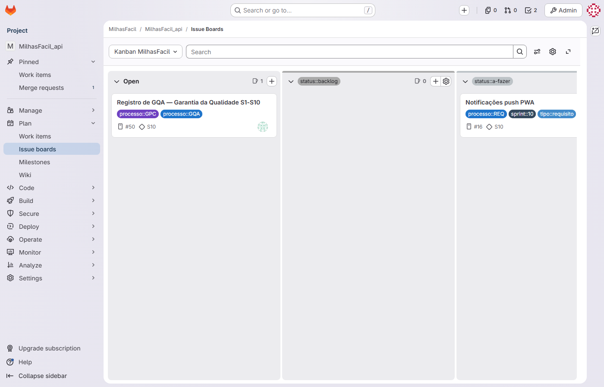
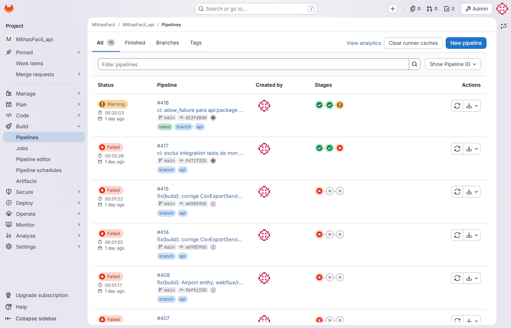

# Relatório de Acompanhamento — MilhasFacil · Busca de Milhas

| Campo | Valor |
|---|---|
| **Documento** | RAC-MILHASFACIL01-001 |
| **Projeto** | MilhasFacil — Plataforma de Busca e Alerta de Passagens por Milhas |
| **Código do projeto** | MILHASFACIL01 |
| **Cliente** | Hub de Milhas |
| **Organização** | Timeware Brasil Softwares e Serviços LTDA |
| **Versão** | 1.1 |
| **Data** | 15/06/2026 |
| **Situação** | Aprovado |
| **Gerente de Projeto** | Abraão |
| **Tech Lead / Arquiteto / DevOps** | Cézar Velazquez |
| **Processo MPS-SW** | GPR |

---

## 1. Situação geral

Projeto **em andamento e sob controle**: Sprint 9 de 12 dentro da janela do cronograma (09/02–26/07/2026), com a release v0.9.0 promovida a `main` (RF13/RF14/MF-64 entregues) e o único change request do período (CR-MF-001) absorvido sem atraso macro.

| Dimensão | Status | Comentário (1 linha) |
|---|---|---|
| **Prazo** | 🟢 No prazo | Sprint 9 de 12 dentro da janela 09/02–26/07/2026; sem atraso macro |
| **Escopo** | 🟡 Em mudança | CR-MF-001 absorvido na S9 (+10 h, antecipação de RF13 de S10→S9), sem atraso macro |
| **Risco** | 🟢 Sob controle | R-01 e R-02 materializados e tratados (encerrados); R-03 (Z-API) mantido como best-effort com fallback por e-mail |
| **Qualidade** | 🟢 Dentro do esperado | Cobertura JaCoCo 82%+ desde a S5, com gate de CI ≥80% ativo desde a S4; NC-001 encerrada |

> *Convenção de cores:* 🟢 sem ação necessária · 🟡 sob acompanhamento, ação em curso · 🔴 exige decisão/atenção do cliente.

## 2. Objetivo

Monitorar o progresso do projeto MilhasFacil em relação ao plano estabelecido (`PLA-MILHASFACIL01-001`), identificar desvios de prazo, escopo, esforço e qualidade por sprint, e registrar a situação atual. Este relatório consolida os snapshots de acompanhamento das Sprints S1 a S9 e serve como evidência do processo GPR (Gerência de Projeto). A fonte da verdade de gestão é a planilha `GEST-MILHASFACIL01-001`.

---

## 3. Acompanhamento por sprint (S1–S9)

| Sprint | Período | SP plan | SP real | Aderência | Carry | h_est | h_real | Desvio h | Situação |
|---|---|---|---|---|---|---|---|---|---|
| S1 | 09–22/02/2026 | 23 | 20 | 87% | 3 | 40 | 45 | +12% | Concluída |
| S2 | 23/02–08/03/2026 | 40 | 35 | 88% | 5 | 80 | 88 | +10% | Concluída |
| S3 | 09–22/03/2026 | 38 | 34 | 89% | 4 | 76 | 82 | +8% | Concluída |
| S4 | 23/03–05/04/2026 | 45 | 41 | 91% | 4 | 88 | 93 | +6% | Concluída |
| S5 | 06–19/04/2026 | 35 | 33 | 94% | 2 | 76 | 80 | +5% | Concluída |
| S6 | 20/04–03/05/2026 | 33 | 30 | 91% | 3 | 72 | 78 | +9% | Concluída |
| S7 | 04–17/05/2026 | 37 | 30 | 81% | 7 | 70 | 76 | +9% | Concluída |
| S8 | 18–31/05/2026 | 58 | 48 | 83% | 10 | 112 | 124 | +11% | Concluída |
| S9 | 01–14/06/2026 | 69 | WIP | WIP | WIP | 138 | WIP | WIP | Em andamento |
| **Total S1–S8** | | **309** | **271** | | **38** | **614** | **666** | **+8,5%** | |

O board do Jira (board 614) e os burndowns por sprint evidenciam a execução planejada vs. real.

## 4. Medição por sprint (S1–S8)

| Sprint | Velocity | JaCoCo | Karma | pytest | Bugs | NCs |
|---|---|---|---|---|---|---|
| S1 | 20 | 78% | 76% | 80% | 0 | 0 |
| S2 | 35 | 74% | 72% | 78% | 2 | 1 (NC-001 aberta) |
| S3 | 34 | 76% | 75% | 79% | 0 | 1 |
| S4 | 41 | 80% | 78% | 81% | 0 | 1 |
| S5 | 33 | 82% | 80% | 82% | 3 | 0 (NC-001 encerrada) |
| S6 | 30 | 84% | 83% | 83% | 0 | 0 |
| S7 | 30 | 85% | 84% | 83% | 2 | 0 |
| S8 | 48 | 84% | 81% | 83% | 2 | 0 |

Metas: Velocity ≥ 30, Cobertura ≥ 80%, NCs = 0, PRs sem revisor = 0.

## 5. Velocity

A velocity média no ciclo S1–S8 foi de **33,9 SP por sprint**, acima da meta de ≥30 SP. A aderência de SP variou de **81% (S7) a 94% (S5)**, com carry controlado — máximo de **10 SP na S8** (sprint de maior planejamento, 58 SP plan). A cobertura de testes superou o limiar de 80% de forma sustentada a partir da S4 (gate de CI ativado), com JaCoCo entre 80% e 85% nas Sprints S4–S8. Os builds das pipelines (PowerShell@2, agente Windows) #41–#60 ficaram quase todos `succeeded`, com exceção do build #42 (`canceled`).

## 6. Marcos e baselines

| Baseline | Sprint | Situação |
|---|---|---|
| v0.1.0 … v0.8.0 | S1 … S8 | Liberadas |
| v0.9.0 | S9 | Released em main (tag nos três repositórios, 15/06/2026) |

Na S9, a baseline foi promovida de develop para main na release **v0.9.0** (develop→homolog→main nos três repositórios, com tag v0.9.0), entregando RF13, RF14 e MF-64 em main.

## 7. Desvios identificados e riscos materializados

| Sprint | Desvio / evento | Referência |
|---|---|---|
| S2 | Cobertura abaixo de 80% (JaCoCo 74%) — NC-001 aberta (risco R-02 materializado) | GQA / NC-001 |
| S2–S4 | Desvio de esforço acima de +6% por sprint; carry acumulado | Planilha §7 |
| S5 | NC-001 encerrada com JaCoCo 82% após priorização de testes e gate de CI (S4+) | GQA / NC-001 |
| S6 | Indisponibilidade de serviços (downtime 3h registrado) — RNF05 | Planilha §6 |
| S8 | Redesign de companhia quebrou o LatamParser (MF-59); corrigido (risco R-01 materializado) | CT-08 |
| S8 | Maior desvio de esforço do ciclo (+11%, h_real 124 vs. h_est 112) | Planilha §7 |

## 8. Situação atual

A Sprint 9 (01–14/06/2026) está **em andamento**, com SP planejado de 69 e horas estimadas de 138; SP real, aderência, carry e horas reais permanecem em apuração (WIP). Na S9, os **6 PRs** #11/#12/#28/#21/#22/#27 foram **concluídos em 15/06/2026 (revisor Cézar Velazquez (TL) — Approved, vote 10; conta legada `Mateus Veloso` no Azure DevOps) e mergeados em develop**, integrando os filtros avançados (RF13 — `maxMiles`/`cabinType`, PRs #11/#21/#27), a exportação CSV UTF-8 BOM (RF14 — PRs #12/#22) e o ajuste de busca de aeroportos por ILIKE (MF-64, PR #28). Em seguida, a release **v0.9.0** foi promovida de develop para main (develop→homolog→main, tag v0.9.0 nos três repositórios) em 15/06/2026, deixando **RF13, RF14 e MF-64 Entregues (released em main)**. No Jira, os cards **MF-64, MF-65 e MF-69 estão "Concluído"** (transicionados em 15/06 após o merge dos PRs); os demais cards da S9 (MF-62/63/66/67/68/70/71) seguem "Sendo feito". Foi criado o card **MF-73** (Chore — padronização de nomenclatura de BD, GUIA-GCO-001, responsável Cézar Velazquez (DevOps/TL); conta Jira atual sob `Raony Chagas` (legada), reatribuição pendente de provisionamento).

Na medição de qualidade, os **6 PRs da S9** (#11, #12, #28, #21, #22, #27) foram concluídos com revisor **Cézar Velazquez (TL) — Approved (vote 10)** (conta legada `Mateus Veloso` no Azure DevOps); há **1 PR ativo** — **PR #29 (MF-73)**, padronização de nomenclatura de BD (migration `V10__fix_naming_conventions.sql`), aprovado pelo Tech Lead Cézar Velazquez na conta própria dele no Azure DevOps (vote 10), **aguardando merge**. Os **22 PRs históricos (S1–S8)** permanecem **sem revisor registrado** (integração retroativa do histórico, ressalva com causa-raiz). Total: **28 PRs concluídos + 1 ativo (#29)**. Foi ativada a **branch policy** de revisor (≥1 revisor) em develop nos três repositórios, impedindo recorrência; a meta "PRs sem revisor = 0" é cumprida pelos 6 PRs da S9 e pela branch policy. A auditoria de GQA da S9 está em andamento. O consolidado S1–S8 é **CONFORME**.

> Nota de equivalência: a aprovação de PR registrada no Azure DevOps sob a conta legada `Mateus Veloso` corresponde ao Tech Lead/Arquiteto/DevOps **Cézar Velazquez**, revisor de PR do projeto. O card MF-73 sob a conta legada `Raony Chagas` também corresponde a Cézar (DevOps/TL); a reatribuição no Jira/Azure aguarda provisionamento de conta. A aprovação de escopo/CR é do GP (Abraão).

## 9. Mudanças (change requests)

| ID | Descrição | Abertura | Dias em aberto | Status | Aceite final |
|---|---|---|---|---|---|
| CR-MF-001 | Antecipação dos filtros avançados de busca (`maxMiles`/`cabinType`, RF13) da Sprint 10 para a Sprint 9 (+10 h; 0 dia de atraso macro) | 28/05/2026 | — | Aprovada (implementada na S9) | RF13 entregue na release v0.9.0 (released em `main`) |

> Detalhamento em `CR-MILHASFACIL01-001`. A absorção do CR na S9 (PRs #11/#21/#27, card MF-65 "Concluído") está refletida no escopo (painel §1) e nas baselines (§6).

## 10. Decisões necessárias

Nenhuma decisão pendente no período de referência.

---

### Evidências referenciadas

| Código | O que capturar | Fonte/URL |
|---|---|---|
| IMG-JIRA-01 | Board 614 com as colunas e o burndown das Sprints S1–S9 (cards por sprint; S9 com MF-64/MF-65/MF-69 "Concluído", demais "Sendo feito" e MF-73 criado) | Jira — board 614 |
| IMG-CI-01 | Lista de builds #41–#60 das pipelines "MilhasFacil API/Web/Crawler - Pipeline" (status `succeeded`; #42 `canceled`) | Azure DevOps — Pipelines |

---

## Histórico de revisões

| Versão | Data | Autor | Descrição |
|---|---|---|---|
| 1.0 | 15/06/2026 | Time de Melhoria Contínua | Emissão inicial — evidência do ciclo S1–S9 (MR-MPS-SW:2024 Nível C). |
| 1.1 | 15/06/2026 | Time de Melhoria Contínua | Aderência ao TPL-GPR-005: inclusão do painel de situação RAG de 4 dimensões (§1, obrigatório), da seção de mudanças/change requests com CR-MF-001 (§9) e da seção de decisões necessárias (§10). Renumeração das seções subsequentes. Uniformização do desvio acumulado de horas para +8,5% (M2), consistente com MED e GEST. |
