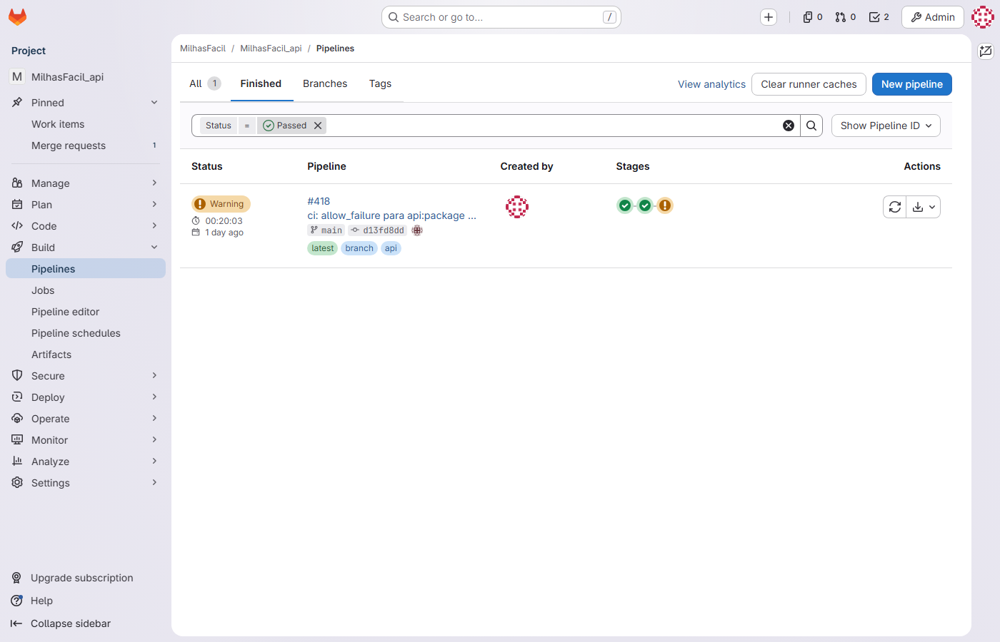
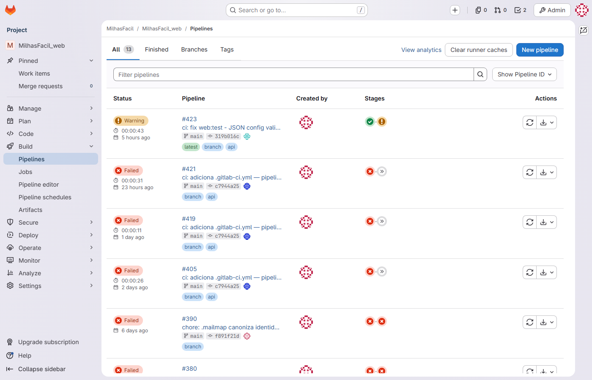

# Relatório de Execução de Testes — MilhasFacil · Busca e Alerta de Passagens por Milhas

| Campo | Valor |
|---|---|
| **Documento** | REL-VV-MILHASFACIL01-001 |
| **Projeto** | MilhasFacil — Plataforma de Busca e Alerta de Passagens por Milhas |
| **Cliente** | Hub de Milhas |
| **Versão** | 1.1 |
| **Data** | 15/06/2026 |
| **Gerente de Projeto** | Abraão |
| **Processo MPS-SW** | VV |

---

## 1. Objetivo

Registrar os resultados de execução das atividades de teste realizadas ao longo do projeto MilhasFacil — Busca e Alerta de Passagens por Milhas, abrangendo testes unitários (JUnit 5, Karma, pytest), testes de integração (Spring Boot Test + Testcontainers), o gate de cobertura no pipeline de CI e os testes de aceitação manuais da QA. Este documento serve como evidência do processo VV (Verificação e Validação) e consolida cobertura, defeitos, resultado dos casos de teste e status por sprint. O projeto está ABERTO (Sprint 9 de 12, em andamento de 01–14/06/2026); os casos de teste CT-11 e CT-12 foram integrados em `develop` na Sprint 9 e promovidos para `main` na **release v0.9.0** (15/06/2026), com builds verdes e validação manual da QA.

---

## 2. Resultados por sprint — cobertura e defeitos

Cobertura medida por JaCoCo (API), Karma (Web) e pytest (Crawler). Bugs e não conformidades conforme registro de Medição (planilha GEST-MILHASFACIL01-001).

| Sprint | Período | Velocity | JaCoCo | Karma | pytest | Bugs | NCs |
|---|---|---|---|---|---|---|---|
| S1 | 09–22/02/2026 | 20 | 78% | 76% | 80% | 0 | 0 |
| S2 | 23/02–08/03/2026 | 35 | 74% | 72% | 78% | 2 | 1 (NC-001 aberta) |
| S3 | 09–22/03/2026 | 34 | 76% | 75% | 79% | 0 | 1 |
| S4 | 23/03–05/04/2026 | 41 | 80% | 78% | 81% | 0 | 1 |
| S5 | 06–19/04/2026 | 33 | 82% | 80% | 82% | 3 | 0 (NC-001 encerrada) |
| S6 | 20/04–03/05/2026 | 30 | 84% | 83% | 83% | 0 | 0 |
| S7 | 04–17/05/2026 | 30 | 85% | 84% | 83% | 2 | 0 |
| S8 | 18–31/05/2026 | 48 | 84% | 81% | 83% | 2 | 0 |
| S9 | 01–14/06/2026 | Em andamento | Em andamento | Em andamento | Em andamento | — | — |

**Observações:**

- A cobertura JaCoCo caiu a 74% na Sprint 2, originando a NC-001 (abaixo da meta de 80%, RNF02). Após o plano de tratamento (priorização de unit tests + gate de CI a partir da S4), a cobertura atingiu 80% na S4 e 82% na S5, quando a NC-001 foi encerrada. A partir da S6 a cobertura manteve-se estável acima da meta.
- Os 2 bugs da Sprint 8 incluem a regressão do LatamParser causada por redesign de companhia (MF-59, risco R-01), corrigida e coberta por teste de regressão (CT-08).
- A Sprint 9 está em andamento; as métricas consolidadas de cobertura, bugs e NCs do período ainda não foram fechadas. As funcionalidades de filtros avançados (RF13), export CSV (RF14) e busca de aeroporto por ILIKE (MF-64) foram integradas em `develop` e promovidas para `main` na **release v0.9.0** com builds verdes, sustentando CT-11 e CT-12.



---

## 3. Resultado dos casos de teste (CT-01 a CT-12)

| CT | Cenário | Sprint | Tipo | Resultado |
|---|---|---|---|---|
| CT-01 | Cadastro (register) + login com credenciais válidas | S1 | Happy | Aprovado |
| CT-02 | Login/credenciais inválidas retornam HTTP 401 | S1 | Sad | Aprovado |
| CT-03 | Busca paralela nas 3 companhias < 30 s | S2/S3 | Happy | Aprovado |
| CT-04 | Histórico de buscas paginado (MF-38) | S3 | Happy | Aprovado |
| CT-05 | Refresh token com rotação | S5 | Happy | Aprovado |
| CT-06 | Logout invalida token via blacklist Redis → 401 | S8 | Happy | Aprovado |
| CT-07 | Alerta WhatsApp sem duplicata | S7 | Happy | Aprovado |
| CT-08 | Regressão do LatamParser (MF-59) | S8 | Regressão | Aprovado |
| CT-09 | Smiles — milhas com 6 dígitos (MF-58) | S8 | Happy | Aprovado |
| CT-10 | Gate de cobertura ≥ 80% no CI | S6+ | CI/CD | Aprovado |
| CT-11 | Filtros avançados maxMiles + cabinType | S9 | Happy | Aprovado |
| CT-12 | Busca de aeroporto por ILIKE (MF-64) | S9 | Sad | Aprovado |

Os 12 casos estão aprovados. **CT-11** (filtros avançados maxMiles + cabinType, RF13) é coberto pelos testes integrados de `FilteredSearchService` (build verde). **CT-12** (busca de aeroporto por ILIKE, MF-64) é coberto pelo teste de integração do `AirportRepository` (`q=gru` → GRU Guarulhos; build verde). Ambos foram integrados em `develop` na Sprint 9, promovidos para `main` na **release v0.9.0** (15/06/2026) e **validados manualmente pela QA Jonathan Alves** sobre a aplicação em homologação, com evidências geradas à mão. Os PRs associados (#11/#21/#27 para filtros, #12/#22 para CSV e #28 para airport ILIKE) foram concluídos em 15/06/2026 com aprovação do Tech Lead Cézar Velazquez (conta legada Mateus Veloso no Azure DevOps; ver REV-MILHASFACIL01-001 §4).

---

## 4. Especificação dos casos de teste em Gherkin

Os cenários a seguir refletem o código de teste real dos três repositórios (JUnit 5 + Mockito + AssertJ, Spring Boot Test + Testcontainers e pytest).

### CT-01 — Cadastro e login (Happy)

```gherkin
Funcionalidade: Cadastro e autenticação de usuário
  Cenário: Registro com payload válido retorna tokens
    Dado um payload de registro com email, senha e nome válidos
    Quando o cliente faz POST em /api/v1/auth/register
    Então a resposta tem status 200
    E o corpo contém accessToken não vazio
    E o corpo contém refreshToken não vazio

  Cenário: Senha é codificada com BCrypt no registro
    Dado um RegisterRequest para um email ainda não cadastrado
    Quando o serviço de autenticação registra o usuário
    Então a senha é codificada pelo PasswordEncoder
    E são gerados accessToken e refreshToken
```

### CT-02 — Credenciais inválidas (Sad)

```gherkin
Funcionalidade: Autenticação de usuário
  Cenário: Login com senha incorreta retorna 401
    Dado um usuário cadastrado
    Quando o cliente faz POST em /api/v1/auth/login com senha incorreta
    Então a resposta tem status 401

  Cenário: Registro com email duplicado é rejeitado
    Dado um email já existente na base
    Quando o serviço tenta registrar novo usuário com esse email
    Então é lançada IllegalArgumentException com mensagem "already in use"
```

### CT-03 — Busca paralela e ordenação por milhas (Happy)

```gherkin
Funcionalidade: Busca agregada de passagens por milhas
  Cenário: Resultados das 3 companhias são agregados e ordenados por milhas
    Dada uma busca de GRU para GIG com 1 adulto
    E a Smiles retorna um voo de 15000 milhas
    E a Azul retorna um voo de 12000 milhas
    E a Latam não retorna voos
    Quando o serviço de busca agrega os resultados
    Então são retornados 2 resultados
    E o primeiro resultado é da Azul com 12000 milhas
```

### CT-07 — Alerta WhatsApp sem duplicata (Happy)

```gherkin
Funcionalidade: Alerta agendado de preço por milhas
  Cenário: Não reenvia alerta já notificado
    Dada uma preferência de rota ativa GRU->GIG
    E já existe notificação registrada para o usuário com esse conteúdo
    Quando o serviço de alertas executa a verificação
    Então nenhuma mensagem de WhatsApp é enviada
    E nenhuma notificação é salva

  Cenário: Envia alerta quando há resultado novo
    Dada uma preferência de rota ativa BSB->GRU
    E não existe notificação prévia para o usuário
    Quando o serviço de alertas executa a verificação
    Então uma mensagem de WhatsApp é enviada para o telefone do usuário contendo "BSB->GRU"
    E a notificação é salva
```

### CT-09 — Smiles com 6 dígitos (Happy)

```gherkin
Funcionalidade: Parser de resultados da Smiles
  Cenário: Extrai voos do HTML de resultados
    Dado um HTML com dois cards de voo
    Quando o SmilesParser processa o HTML para GRU-GIG
    Então são retornados 2 voos

  Cenário: Lê milhas com 6 dígitos
    Dado um HTML cujo segundo card exibe "120.000 milhas"
    Quando o SmilesParser processa o HTML
    Então o segundo voo tem miles_price igual a 120000

  Cenário: Lê o valor da taxa em reais
    Dado um HTML cujo primeiro card exibe "R$ 48,50"
    Quando o SmilesParser processa o HTML
    Então o primeiro voo tem tax_price igual a 48.50

  Cenário: HTML sem cards retorna lista vazia
    Dado um HTML sem cards de voo
    Quando o SmilesParser processa o HTML
    Então a lista de resultados é vazia
```

### CT-11 — Filtros avançados maxMiles + cabinType (Happy)

```gherkin
Funcionalidade: Busca filtrada de passagens por milhas
  Cenário: Aplica filtro de milhas máximas e tipo de cabine
    Dada uma busca de GRU para GIG com 1 adulto
    E um SearchRequestV2 com maxMiles e cabinType definidos
    Quando o FilteredSearchService executa a busca filtrada
    Então apenas resultados dentro do limite de milhas são retornados
    E os resultados respeitam o tipo de cabine informado (CABIN_MAP)
```

### CT-12 — Busca de aeroporto por ILIKE (Sad/Happy)

```gherkin
Funcionalidade: Busca de aeroportos por texto
  Cenário: Busca case-insensitive retorna aeroporto correspondente
    Dado o índice de busca de aeroportos populado
    Quando o cliente consulta GET /api/v1/airports?q=gru
    Então o AirportRepository retorna GRU Guarulhos
    E a busca é case-insensitive (ILIKE com unaccent)
```

### CT-06 / CT-11 / CT-12 — Acesso autenticado (Sad)

```gherkin
Funcionalidade: Proteção de endpoints autenticados
  Cenário: Busca sem autenticação retorna 401
    Dado um cliente não autenticado
    Quando faz POST em /api/v1/search com origem, destino, data e adultos
    Então a resposta tem status 401
```

---

## 5. Resumo executivo dos resultados

| Nível de teste | Ferramenta | Status | Observação |
|---|---|---|---|
| Unitários — API | JUnit 5 + Mockito + AssertJ | Passando | AuthService, SearchService, FilteredSearchService, ScheduledAlertService |
| Integração — API | Spring Boot Test + Testcontainers | Passando | AuthController, SearchController e AirportRepository (q=gru → GRU) via MockMvc |
| Unitários — Web | Karma + Jasmine | Passando | AuthService, jwtInterceptor, ThemeService, shared |
| Unitários — Crawler | pytest | Passando | SmilesParser, parsers Azul/Latam, endpoints FastAPI |
| Gate de cobertura | Pipeline CI (JaCoCo 80%) | Aprovado | Ativo desde a S4; CT-10 aprovado |
| Aceitação manual — QA | Execução manual (sem ferramenta de gestão de testes) | Aprovado | Validação da QA Jonathan Alves na release v0.9.0; evidências geradas à mão |

Os builds de CI recentes da S9 (#52–#60), dentro da série de CI do projeto (#41–#60), concluíram com sucesso, sustentando o gate de cobertura da API e a execução dos testes nos três repositórios. Os testes integrados de `FilteredSearchService` (CT-11) e de integração do `AirportRepository` (CT-12) foram integrados em `develop` na Sprint 9 e promovidos para `main` na release v0.9.0 com builds verdes, e validados manualmente pela QA Jonathan Alves.



---

## 6. Defeitos do projeto

Os defeitos (type Bug, Jira board 614) registrados ao longo do projeto são: MF-17, MF-18, MF-28, MF-36, MF-37, MF-38, MF-46, MF-47, MF-56, MF-58 e MF-59. Destaques de V&V:

- **MF-58** (Smiles — milhas com 6 dígitos): corrigido na S8; coberto por CT-09 e pelo teste `test_parse_miles_6_digits`.
- **MF-59** (regressão do LatamParser após redesign de companhia): risco R-01 materializado na S8, corrigido e coberto por teste de regressão (CT-08).
- **MF-38** (UX de histórico/refresh de token): vinculado ao histórico paginado (CT-04).

Não há defeitos críticos em aberto. A não conformidade NC-001 (cobertura < 80% na S2) foi encerrada na S5 com JaCoCo 82%.

---

## Evidências referenciadas

| Código | O que capturar | Fonte/URL |
|---|---|---|
| IMG-CI-01 | Relatório de cobertura JaCoCo exibido no pipeline da API (gate de 80%) | Azure DevOps — Pipeline "MilhasFacil API - Pipeline" |
| IMG-CI-02 | Lista de builds #52–#60 concluídos com sucesso nos três pipelines | Azure DevOps — Builds dos pipelines API/Web/Crawler |

---

## Histórico de revisões

| Versão | Data | Autor | Descrição |
|---|---|---|---|
| 1.0 | 15/06/2026 | Time de Melhoria Contínua | Emissão inicial — evidência do ciclo S1–S9 (MR-MPS-SW:2024 Nível C). |
| 1.1 | 15/06/2026 | Time de Melhoria Contínua | Esclarecimento na §5 de que os builds #52–#60 são os recentes da S9, subconjunto da série de CI do projeto (#41–#60). |
