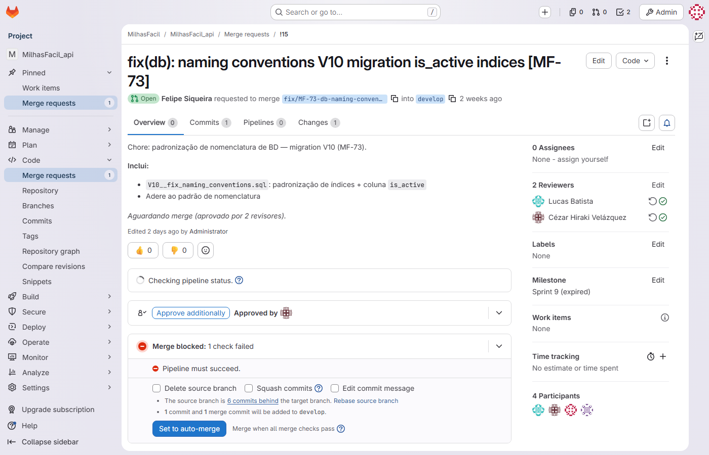

# Registro de Revisão por Pares — MilhasFacil · Busca e Alerta de Passagens por Milhas

| Campo | Valor |
|---|---|
| **Documento/Referência** | REV-MILHASFACIL01-001 |
| **Projeto** | MilhasFacil — Plataforma de Busca e Alerta de Passagens por Milhas |
| **Cliente** | Hub de Milhas |
| **Versão** | 1.0 |
| **Data** | 15/06/2026 |
| **Gerente de Projeto** | Abraão |
| **Processo MPS-SW** | VV (revisão por pares — evidência de projeto) |

---

## 1. Prática de revisão por pares

A revisão por pares é conduzida via Pull Request no Azure DevOps, sobre os três repositórios do produto: MilhasFacil_api, MilhasFacil_web e MilhasFacil_crawler (branch padrão `main`). O Pull Request correspondente é o registro da revisão.

Política de revisão (branch policy):

- **PR obrigatório** para o branch `develop`; não há merge direto.
- Branches seguem o padrão `feat/`/`fix/` + `MF-XX` (RNF04), vinculando cada PR ao card Jira correspondente.
- **Aprovação do Tech Lead** (Cézar Velazquez), revisor de PR, é requerida para a integração.
- **Gate de CI** verde (build + testes; gate JaCoCo de 80% na API) é condição para o merge.
- **Branch policy de revisor ativa em `develop`** nos três repositórios: exige ao menos um revisor por PR, impedindo merge sem aprovação.

---

## 2. Participantes

Em registros de gestão é usado o nome de planilha; em evidência do Jira/Azure DevOps (assignee/revisor) é usado o nome da API, com nota de equivalência.

| Papel | Identificação |
|---|---|
| Tech Lead / Arquiteto / DevOps (revisor de PR) | Cézar Velazquez (Azure DevOps: revisor sob a conta legada Mateus Veloso; commits de infra/arquitetura sob Raony Chagas / Mateus Sousa) |
| Gerente de Projeto (gestão; não codifica; fora do DevOps) | Abraão (aprovador de escopo/CR) |
| Dev Backend Principal (API + crawlers) | Felipe Santos (Jira: Felipe Siqueira) |
| Full Stack | Lucas Batista (Jira: Lucas Batista de Sousa) |
| Full Stack | Henry Oliveira (Jira: Henry Komatsu) |
| QA (teste manual; gera evidências) | Jonathan Alves |
| GQA independente (auditoria; fora do DevOps) | Carol (Caroline) |

> Nota de equivalência: o revisor que figura na API do Azure DevOps como **Mateus Veloso** corresponde, no time atual, ao Tech Lead **Cézar Velazquez** (revisor de PR). Os commits de infra/arquitetura registrados sob **Raony Chagas** / **Mateus Sousa** também correspondem a **Cézar Velazquez**. A reatribuição das contas no tooling aguarda provisionamento.

---

## 3. Pull Requests do projeto

Levantamento da API do Azure DevOps em 15/06/2026: **29 Pull Requests** distribuídos pelos três repositórios — **28 concluídos** (22 históricos das Sprints 1–8 e 6 da Sprint 9) e **1 ativo** (PR #29, MF-73, aprovado pelo Cézar Velazquez, aguardando merge).

| Repositório | PRs históricos (S1–S8) | PRs da S9 (concluídos) | PR ativo |
|---|---|---|---|
| MilhasFacil_api | #1–#10 | #11, #12, #28 | #29 (MF-73) |
| MilhasFacil_web | #13–#20 | #21, #22 | — |
| MilhasFacil_crawler | #23–#26 | #27 | — |
| **Total** | **22** | **6** | **1** |

As datas reais de PR e build concentram-se em 13–15/06/2026, em consequência da inicialização retroativa do histórico do repositório.

---

## 4. Revisores registrados (verdade da API)

A representação a seguir reflete fielmente o estado da API do Azure DevOps; não se afirma revisor onde a API não registra um.

| Conjunto de PRs | Sprint | Situação | Revisor registrado | Voto/decisão |
|---|---|---|---|---|
| #11, #12, #28, #21, #22, #27 (6 PRs) | S9 | Concluído (merge em `develop`) | Mateus Veloso (Tech Lead — equivalente a Cézar Velazquez) | Approved (vote 10) |
| #29 (MF-73) | S9 | **Ativo (aprovado, aguardando merge)** | Cézar Velazquez (conta própria no Azure) | Approved (vote 10) |
| #1–#10, #13–#20, #23–#26 (22 PRs) | S1–S8 | Concluído | Sem revisor registrado | — |

**Observações:**

- Os **6 PRs da Sprint 9** (#11, #12, #28, #21, #22, #27) foram **concluídos em 15/06/2026 com merge em `develop`**, tendo o revisor **Mateus Veloso** (conta legada do Tech Lead Cézar Velazquez) com decisão **Approved (vote 10)**. Com isso, e somada à branch policy de revisor ativa em `develop`, a meta "PRs sem revisor = 0" é cumprida.
- O **PR #29 (MF-73)** — padronização de nomenclatura de banco de dados (migration `V10__fix_naming_conventions.sql`, GUIA-GCO-001; responsável Cézar Velazquez, card `cezar.hiraki` no Jira) — está **ativo, aprovado pelo revisor Cézar Velazquez na conta própria dele no Azure DevOps (vote 10)**, aguardando merge. É evidência direta da **política de revisão funcionando**: o PR não pode ser mergeado em `develop` sem a aprovação do revisor exigido pela branch policy.
- Os **22 PRs históricos das Sprints 1–8** estão **sem revisor registrado** na API. Causa-raiz: inicialização retroativa do histórico do repositório (datas concentradas em 13–15/06/2026); a aprovação histórica não foi preservada como registro de revisor na API. Como PR concluído é imutável (travado), esses 22 permanecem inalterados e são tratados como **ressalva imutável** com causa-raiz documentada. Este registro representa esse fato sem atribuir revisor onde a API não o possui.
- Como ação preventiva contra recorrência, foi ativada a **branch policy de revisor em `develop`** nos três repositórios (ver §1), exigindo ao menos um revisor por PR.

---

## 5. Itens revisados (representativos — Sprint 9)

| PR | Branch | Item revisado | Card Jira | Situação |
|---|---|---|---|---|
| #28 (API) | feat/MF-64-airport-ilike | Busca de aeroporto por ILIKE | MF-64 (Concluído) | Approved (vote 10) |
| #11 (API) | feat/MF-65-search-filters | Filtros avançados maxMiles + cabinType (backend) | MF-65 (Concluído) | Approved (vote 10) |
| #21 (Web) | feat/MF-65-search-filters | Filtros avançados na UI de busca | MF-65 (Concluído) | Approved (vote 10) |
| #27 (Crawler) | feat/MF-65-cabin-type-filter | Filtro de cabine (cabin_type) no crawler | MF-65 (Concluído) | Approved (vote 10) |
| #12 (API) | feat/MF-69-csv-export | Exportação CSV UTF-8 com BOM (backend) | MF-69 (Concluído) | Approved (vote 10) |
| #22 (Web) | feat/MF-69-csv-ui | Exportação CSV na UI | MF-69 (Concluído) | Approved (vote 10) |
| #29 (API) | (padronização de nomenclatura de BD — V10) | Migration V10 — padronização de índices + coluna is_active | MF-73 | Ativo — aprovado (Cézar, vote 10), aguardando merge |

Os cards MF-64, MF-65 e MF-69 foram transicionados para "Concluído" no board 614 após o merge dos PRs em `develop`. Estes PRs sustentam os casos de teste CT-11 (filtros) e CT-12 (airport ILIKE), ambos Aprovados (ver REL-VV-MILHASFACIL01-001 §3). O PR #29 (MF-73) permanece em revisão, sob a branch policy de revisor.

---

## 6. Resultado

| Resultado | Data | Responsável |
|---|---|---|
| PRs da Sprint 9 concluídos e integrados em `develop` (Approved, vote 10) com gate de CI verde | 15/06/2026 | Mateus Veloso (Tech Lead — Cézar Velazquez) |
| PR #29 (MF-73) ativo, aprovado pelo Cézar Velazquez na conta própria (vote 10) — evidência da branch policy em vigor | 15/06/2026 | Cézar Velazquez (conta própria) |
| PRs das Sprints 1–8 concluídos e integrados (sem revisor registrado na API — histórico retroativo; ressalva imutável com causa-raiz) | S1–S8 | — |

---

## Evidências referenciadas

| Código | O que capturar | Fonte/URL |
|---|---|---|
| IMG-DEVOPS-01 | Pull Request da Sprint 9 concluído com aprovação de Mateus Veloso (Approved, vote 10) e PR #29 ativo aprovado pelo Cézar Velazquez (vote 10) | Azure DevOps — Pull Requests dos repositórios MilhasFacil |

---

## Histórico de revisões

| Versão | Data | Autor | Descrição |
|---|---|---|---|
| 1.0 | 15/06/2026 | Time de Melhoria Contínua | Emissão inicial — evidência do ciclo S1–S9 (MR-MPS-SW:2024 Nível C). |
