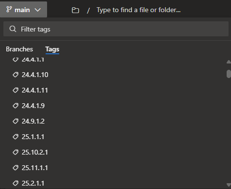
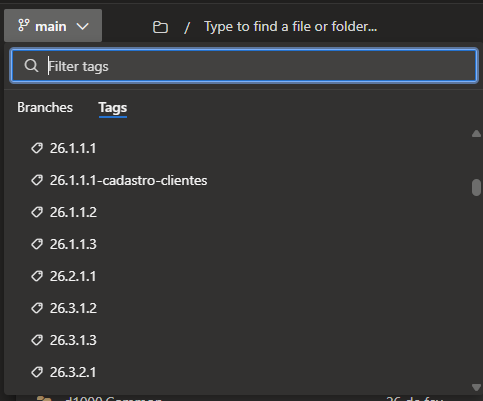
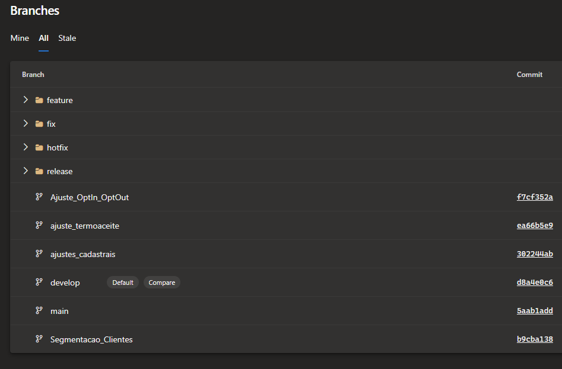
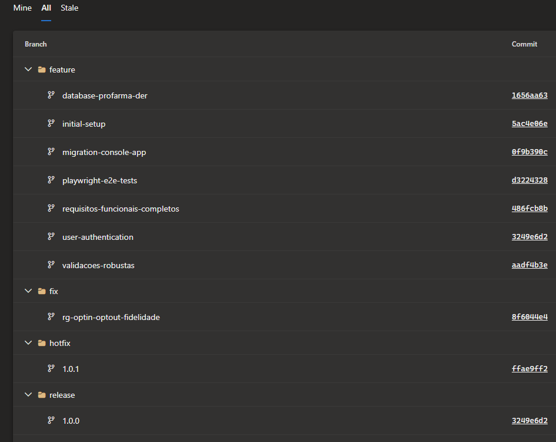

# Registro de Gerência de Configuração — Rede D1000 · Cadastro de Clientes

| Campo | Valor |
|---|---|
| **Documento** | GCO-PROFARMA01-001 |
| **Projeto** | Cadastro de Clientes — Rede D1000 |
| **Cliente** | Profarma S.A. / Rede D1000 |
| **Versão** | 1.0 |
| **Data** | 05/06/2026 |
| **Gerente de Projeto / Responsável GCO** | Abraão Oliveira |
| **Processo MPS-SW** | GCO (evidência de projeto) |

---

## 1. Objetivo

Registrar o gerenciamento de configuração do projeto, incluindo identificação dos itens de configuração (ICs), estratégia de controle de versão, baselines estabelecidas e auditoria de configuração.

Conforme ADAP-PROFARMA01-001 (A-08), o papel de responsável por GCO foi acumulado pelo Gerente de Projeto (Abraão Oliveira), dada a maturidade do controle de versão via Azure DevOps e Git Flow já adotado pelo squad.

---

## 2. Estratégia de gerência de configuração

| Item | Descrição |
|---|---|
| Repositório | Azure DevOps — `profarma.visualstudio.com/rede-d1000/` — branches: `loja-backend` e `loja-balcao-frontend` |
| Modelo de branching | Git Flow — `feature/*` → `develop` → `release/*` → `main` |
| Convenção de tags | `YY.MM.NÚMERO.PATCH` (ex.: 25.12.1.1, 26.1.1.1) |
| Gate de merge em main | Pipeline CI verde obrigatório: build + testes unitários + análise estática |
| Aprovação de PR | Mínimo 1 revisor; mudanças arquiteturais requerem aprovação de Armando Junior (D1000) |
| Gestão de segredos | Nenhum segredo comitado em repositório; todas as credenciais via Azure Key Vault |
| Documentação | Artefatos em Markdown versionados junto ao repositório MPS-SW Timeware |

---

## 3. Itens de configuração (ICs)

| ID | Tipo | Descrição | Repositório / Localização | Convenção de versão | Status no encerramento |
|---|---|---|---|---|---|
| IC-01 | Código-fonte | API de Cadastro de Clientes (.NET 8 / Clean Architecture) | Azure DevOps `rede-d1000/loja-backend` | Tags `YY.MM.N.PATCH` | Baseline BL-02 (26.1.1.1) |
| IC-02 | Código-fonte | Frontend Balcão (.NET / Blazor) | Azure DevOps `rede-d1000/loja-balcao-frontend` | Tags `YY.MM.N.PATCH` | Baseline BL-02 |
| IC-03 | Banco de dados | Migrations EF Core (esquema PostgreSQL: clientes, endereços, outbox, auditoria) | `loja-backend/src/Infrastructure/Migrations/` | Numeração sequencial EF Core | Sincronizado com BL-02 |
| IC-04 | Infraestrutura | Manifests Kubernetes AKS (Deployment, Service, HPA, ConfigMap) | `loja-backend/k8s/` | Versionados junto ao tag da API | Baseline BL-02 |
| IC-05 | Pipeline | Definição de pipeline CI/CD (`azure-pipelines.yml`) | `loja-backend/` e `loja-balcao-frontend/` | Versionado junto ao código | Ativo |
| IC-06 | Configuração | Variáveis de ambiente e referências ao Azure Key Vault (sem valores sensíveis) | `loja-backend/src/API/appsettings.*.json` | Versionado junto ao código | Sem segredos expostos |
| IC-07 | Documentação técnica | Pacote de artefatos MPS-SW do projeto (TAP, PLA, REQ, PCP, VV e demais) | Repositório Timeware MPS-SW (branch de entrega) | Versão por documento | 18 artefatos entregues |
| IC-08 | Documentação técnica | Documentação de APIs (Swagger/OpenAPI gerado automaticamente) | Azure DevOps + entregue ao cliente | Vinculado ao tag da API | Entregue no pacote de encerramento |

---

## 4. Baselines estabelecidas

| ID | Descrição | Data | Tag / Referência | Componentes incluídos | Aprovação |
|---|---|---|---|---|---|
| BL-01 | Baseline de homologação — pré-UAT formal | Dezembro/2025 | `25.12.1.1` | IC-01, IC-02, IC-03, IC-04 | Fagner Pereira (Infra D1000) após GMUD |
| BL-02 | Baseline de piloto / aceite final | 26/01/2026 | `26.1.1.1` | IC-01, IC-02, IC-03, IC-04 | Humberto Erler (aceite formal 29/01/2026); GMUD 2624117 |
| BL-03 | Baseline de encerramento (documentação) | 05/06/2026 | Commit de encerramento no repositório MPS-SW | IC-07 (18 artefatos documentais) | Abraão Oliveira (GP) |

---

## 5. Histórico de modificações dos ICs (principais marcos)

| Marco | Data | IC(s) afetado(s) | Descrição | Referência |
|---|---|---|---|---|
| CR-01 aprovado | 15/05/2025 | IC-01, IC-03 | Adição de campo `canal_origem` em `auditoria_clientes` | CR-01 / RASTR-PROFARMA01-001 §5 |
| CR-03 aprovado | 01/08/2025 | IC-01, IC-03 | Implementação de RF-10 (endpoint PUT /reativar) | CR-03 / RASTR-PROFARMA01-001 §5 |
| CR-04 aprovado | 15/08/2025 | IC-01 | Integrações BlueSoft e CloseUp (RF-15 e RF-16) | CR-04 / RASTR-PROFARMA01-001 §5 |
| CR-09 aprovado | 01/10/2025 | IC-01 | Ajuste de contrato VTEX (novo schema CustomerProfile) | CR-09 / RASTR-PROFARMA01-001 §5 |
| CR-11 aprovado | 01/11/2025 | IC-01, IC-03 | Adição de `telefone_secundario` em RF-01 | CR-11 / RASTR-PROFARMA01-001 §5 |
| CR-12 aprovado | 15/12/2025 | IC-01 | Ajuste de SLA Call Center de 1000 ms para 500 ms | CR-12 / RASTR-PROFARMA01-001 §5 |
| Deploy BL-01 | Dezembro/2025 | IC-01 a IC-06 | Tag 25.12.1.1 — liberação para homologação final | GMUD (número registrado na D1000) |
| Deploy BL-02 | 26/01/2026 | IC-01 a IC-06 | Tag 26.1.1.1 — liberação para piloto/produção loja 9 | GMUD 2624117; PR 10684 (última correção S2) |

---

## 6. Auditoria de configuração

### Auditoria GCO-A01 — Auditoria de configuração de encerramento

| Campo | Valor |
|---|---|
| Data | 05/06/2026 |
| Escopo | Verificação da integridade e completude dos ICs do projeto no encerramento |
| Responsável | Abraão Oliveira (GP / responsável GCO) |
| Resultado | Conforme |

**Checklist de auditoria:**

| Item verificado | Resultado | Observação |
|---|---|---|
| Todos os ICs identificados estão versionados no repositório | Conforme | IC-01 a IC-06 em Azure DevOps; IC-07 e IC-08 no repositório Timeware MPS-SW |
| Tags de baseline correspondem às versões em produção | Conforme | Tag 26.1.1.1 em produção na loja 9; GMUD 2624117 como evidência de deploy |
| Nenhum segredo ou credencial comitado no repositório | Conforme | Inspeção manual: zero ocorrências de segredos em código (RNF-04); todas as credenciais via Azure Key Vault |
| Documentação técnica entregue ao cliente | Conforme | Pacote entregue conforme ATA-PROFARMA01-002 (D-04); repositório Azure DevOps D1000 atualizado |
| Migrations de banco sincronizadas com a versão em produção | Conforme | EF Core migrations executadas automaticamente no pipeline CI/CD; zero migrations pendentes em produção |
| Manifests Kubernetes consistentes com a infra em execução | Conforme | Deployment confirmado por Fagner Pereira (Operações D1000) conforme TAE-PROFARMA01-001 §8 |
| Itens de configuração de terceiros (Azure Key Vault, GMUD) registrados | Conforme | GMUD 2624117 arquivado na D1000; Key Vault provisionado em Azure conforme RNF-04 |
| Registro de change requests sincronizado com o repositório | Conforme | CR-01 a CR-12 registrados na RASTR-PROFARMA01-001 §5; todos com PR aprovado no Azure DevOps antes da implementação |

---

## 7. Pacote de entrega final

| Item | Conteúdo | Destino | Status |
|---|---|---|---|
| Código-fonte | Tag 26.1.1.1 (`loja-backend` + `loja-balcao-frontend`) | Azure DevOps D1000 | Entregue |
| Documentação técnica | 18 artefatos documentais (PCP, REQ, VV e demais) | Azure DevOps D1000 + repositório Timeware | Entregue |
| Scripts de banco | Migrations EF Core sincronizadas | Azure Database PostgreSQL produção | Aplicado |
| Manifests Kubernetes | `k8s/` da tag 26.1.1.1 | AKS D1000 produção | Aplicado |
| Configuração de monitoramento | Datadog APM, alertas, dashboards | Datadog D1000 | Ativo |
| Manual de monitoramento operacional | Procedimentos de resposta a alertas Datadog | Operações D1000 (Fagner Pereira) | Entregue no pacote de encerramento |

---

## 8. Evidências de controle de configuração (Azure DevOps)

### 8.1 Tags de baseline — repositório loja-backend

Tags geradas ao longo do ciclo de vida do projeto, evidenciando GCO3 (baselines nos marcos do projeto).

**Tags 2024–2025 (24.4.1.1 a 25.11.1.1):**

**Tags 2026 — pós go-live (26.1.1.1 a 26.3.2.1):**

### 8.2 Branches — estrutura Git Flow

**Grupos feature/, fix/, hotfix/, release/ e branches de trabalho ativo:**

**Branches feature/* expandido — nomenclatura rastreável:**

---

## Histórico de revisões

| Versão | Data | Autor | Descrição |
|---|---|---|---|
| 1.0 | 05/06/2026 | Time de Melhoria Contínua | Versão inicial — reconstituída consolidando o controle de configuração exercido durante o projeto |
| 1.1 | 15/06/2026 | Time de Melhoria Contínua | Adição de §8 com evidências visuais de tags de baseline e branches do Azure DevOps |
