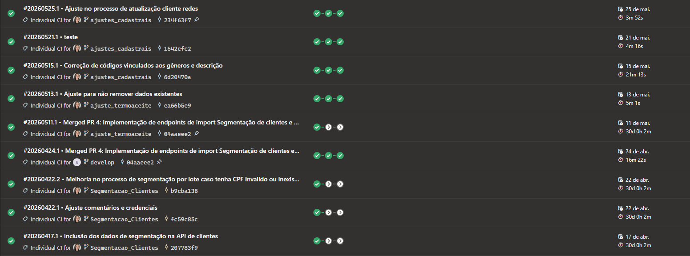
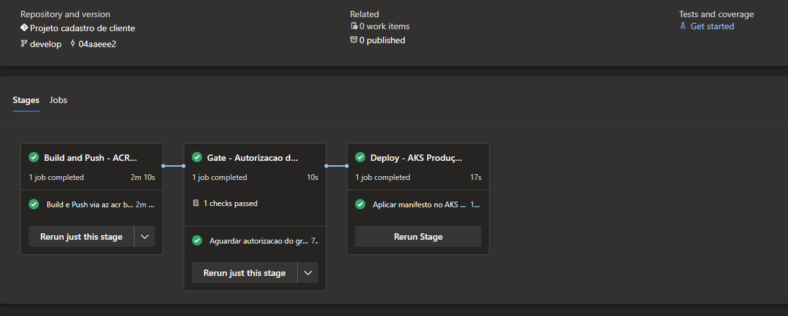
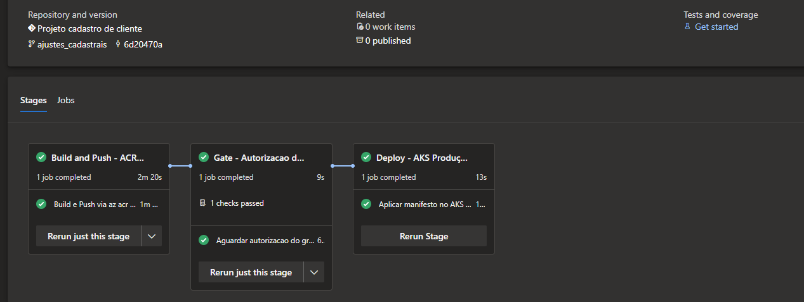

# Estratégia de Integração — Rede D1000 · Cadastro de Clientes

| Campo | Valor |
|---|---|
| **Documento** | ITP-PROFARMA01-001 |
| **Projeto** | Cadastro de Clientes — Rede D1000 |
| **Cliente** | Profarma S.A. / Rede D1000 |
| **Versão** | 1.1 |
| **Data** | 15/06/2026 |
| **Gerente de Projeto** | Abraão Oliveira |
| **Processo MPS-SW** | ITP (evidência de projeto) |

---

## 1. Objetivo

Descrever a estratégia de integração do produto, a ordem de integração dos componentes internos e externos, os critérios de prontidão, o ambiente de integração e os registros de entrega.

---

## 2. Visão geral da integração

O sistema é uma API RESTful central (.NET 8) que integra:

- **Sistemas legados internos:** ITEC (cadastro legado, via outbox pattern)
- **Canais de venda:** PDV, Balcão (frontend .NET), Call Center, OMNI/VTEX
- **Sistemas satélites:** Propz CRM (Azure Service Bus), PBM/Interplayers, BlueSoft, CloseUp

O tipo de integração adotado é **incremental por componente**, seguindo a ordem de prioridade de negócio. A abordagem incremental permitiu validar cada componente individualmente antes de prosseguir para o próximo, reduzindo o risco de regressão e facilitando a rastreabilidade de defeitos por interface.

---

## 3. Ordem de integração dos componentes

| Fase | Sprint(s) | Componente integrado | Interface | Critério de prontidão |
|---|---|---|---|---|
| 1 | Sprints 1–3 | CRUD base + pipeline CI | Endpoints REST internos | Build verde + 273 testes passando (parcial: testes da fase) |
| 1 | Sprint 3 | ITEC legado (outbox) | Worker outbox + tabela `outbox_eventos` | Testes T-ITEC-01 a T-ITEC-04 passando; retry/backoff validado |
| 2 | Sprint 5 | VTEX (canal OMNI) | POST /clientes/vtex + GET /clientes/vtex/{cpf} | Testes T-VTEX-01 a T-VTEX-03 passando; contrato CustomerProfile validado |
| 2 | Sprint 5 | Call Center | GET /clientes/{cpf}/call-center | SLA p95 ≤ 500 ms validado em carga; autenticação API Key |
| 2 | Sprint 7 | Propz CRM | Azure Service Bus + worker dedicado | Worker processando eventos de cadastro/atualização; testes de integração Propz |
| 3 | Sprint 8 | BlueSoft | GET /clientes/{cpf}/perfil-completo (parcial) | Campo `score_credito` retornado corretamente (CR-10); contrato de API validado |
| 3 | Sprint 9 | CloseUp | GET /clientes/{cpf}/perfil-completo (completo) | Histórico de compras retornado; ajuste de contrato VTEX (CR-09) |
| 3 | Sprint 9 | PBM / Interplayers | Endpoint PBM interno | Retorno de elegibilidade de convênio; testes de conveniados passando |
| 4 | Sprint 13 | Carga batch (7 M CPFs) | POST /clientes/lote | Worker batch concluído; zero perdas; T-PERF-03 |

---

## 4. Descrição das interfaces

### 4.1 Interfaces internas

| Componente | Tipo | Descrição | Protocolo | Autenticação |
|---|---|---|---|---|
| API Principal | REST | 16 endpoints documentados (cadastro, consulta, atualização, inativação, reativação, VTEX, Call Center, perfil completo, health, metrics) | HTTPS/REST | API Key + OAuth 2.0 |
| Worker Outbox ITEC | Background worker .NET | Processa eventos da tabela `outbox_eventos`; envia ao ITEC via HTTP REST; backoff exponencial (máx. 10 tentativas) | HTTP REST interno | Credencial de serviço |
| Worker Propz | Background worker .NET | Consome eventos do Azure Service Bus; chama REST Propz (`/api/Propz`, `/api/Propz/lote`) | Azure Service Bus + HTTP REST | Service Bus connection string (Key Vault) |
| Worker LGPD | Background worker .NET diário | Realiza expurgo de dados conforme regras LGPD (RF-17) | Interno (DB direto) | Sem autenticação externa |

### 4.2 Interfaces externas

| Sistema | Protocolo | Contratos / Endpoints | Canal de origem | Observação |
|---|---|---|---|---|
| ITEC (legado) | HTTP REST | `POST /clientes` (contrato ITEC interno D1000) | Worker outbox | Sem suporte a eventos; integração unidirecional via outbox |
| VTEX | HTTP REST | `POST /clientes/vtex`; `GET /clientes/vtex/{cpf}`; schema CustomerProfile (ajustado CR-09) | OMNI | Autenticação por API Key VTEX |
| Propz CRM | HTTP REST | `POST /api/Propz`; `GET /api/Propz/existe/{cpf}`; `POST /api/Propz/lote` (máx. 50); redes: 1 = Drogasmil, 2 = Farmalife, 3 = Tamoio, 4 = Rosário | Azure Service Bus | Documentação Propz tinha códigos 3 (Tamoio) e 4 (Rosário) invertidos — corrigido em PROPZ-B01 (10/12/2025) |
| PBM / Interplayers | HTTP REST | Endpoint interno de elegibilidade de convênio | API e PDV | Conveniados validados com 4/4 cenários |
| BlueSoft | HTTP REST | Score de crédito + endereço; campo `score_credito` adicionado (CR-10) | Perfil completo | Contrato ajustado em Sprint 11 |
| CloseUp | HTTP REST | Histórico de compras do cliente | Perfil completo | Integrado em Sprint 12 |

---

## 5. Ambiente de integração e homologação

| Item | Valor |
|---|---|
| **Ambiente** | d1000_homologacao |
| **Plataforma** | Azure Kubernetes Service (AKS D1000) |
| **Banco de dados** | Azure Database for PostgreSQL Flexible Server (instância de homologação, restaurada de produção) |
| **Disponibilidade** | Setembro/2025 (atrasado 2,5 meses — risco R-01 materializado) |
| **Acesso** | Via Azure DevOps pipeline; sem acesso direto ao ITEC produção |
| **Restauração crítica** | 14/10/2025 — DB de homologação restaurado após corrompimento de dados de teste (bloqueou testes por 2 dias) |

---

## 6. Avaliação de prontidão de componentes

### Fase 1 — CRUD base + ITEC outbox

| Componente | Critério de entrada | Critério de saída | Resultado |
|---|---|---|---|
| API Core | Código compilando; testes unitários Fase 1 passando | T-CAD-01 a T-CAD-12 passando; pipeline CI verde | OK — Junho/2025 |
| Worker ITEC | API Core entregue; tabela `outbox_eventos` criada | T-ITEC-01 a T-ITEC-04 passando; retry validado | OK — Junho/2025 (2 bugs S2 corrigidos antes do merge) |

### Fase 2 — Integrações principais

| Componente | Critério de entrada | Critério de saída | Resultado |
|---|---|---|---|
| VTEX | API Core; contrato CustomerProfile disponível (CR-09 pré-aprovado) | T-VTEX-01 a T-VTEX-03 passando | OK — Sprint 9 / Agosto 2025 |
| Call Center | API Core; SLA 500 ms definido (CR-12) | Testes de carga p95 ≤ 500 ms | OK — Sprint 9 / Agosto 2025 |
| Propz CRM | Azure Service Bus provisionado; contrato Propz disponível | Worker processando; integração validada em 10/12/2025 | OK — dentro do deadline 04/12/2025 |

### Fase 3 — Satélites

| Componente | Critério de entrada | Critério de saída | Resultado |
|---|---|---|---|
| BlueSoft | Contrato disponível após CR-04/CR-10 | `score_credito` retornado; 4 cenários passando | OK — Sprint 11 |
| CloseUp | Contrato disponível | Histórico de compras retornado | OK — Sprint 12 |
| PBM / Interplayers | Contrato disponível | 4 cenários conveniados passando (CONV-01 a CONV-04, 100%) | OK — Sprint 11 |

---

## 7. Registros de integração e releases

### 7.1 Pipeline CI/CD

O pipeline Azure DevOps executa a cada push no branch `develop` e a cada PR.

| Etapa | Descrição |
|---|---|
| Build | Compilação .NET 8; falha imediata em erro de compilação |
| Testes unitários | xUnit — 273 cenários; falha interrompe o pipeline |
| Análise estática | Verificação de qualidade de código |
| Publicação de artefato | Imagem Docker publicada no Azure Container Registry |

- **Localização dos logs:** Azure DevOps — `profarma.visualstudio.com/rede-d1000/` (acesso D1000 + Timeware)
- **Resultado consolidado:** 0 falhas de pipeline após Sprint 5; pipeline verde como gate obrigatório para merge em `main`

### 7.1.1 Evidências do pipeline CI/CD (Azure DevOps)

**Histórico de runs do pipeline — Abril/Maio 2026 (pós go-live):**

**Stages do pipeline — commit 04aaeee2 (branch develop):**

**Stages do pipeline — branch ajustes_cadastrais:**

### 7.2 Releases entregues

| Release | Data | Componentes | GMUD / PR | Observação |
|---|---|---|---|---|
| 25.12.1.1 | Dezembro/2025 | API + Frontend + k8s + Migrations | GMUD interno D1000 | Liberação para homologação final (Sprints 14–17) |
| 26.1.1.1 | 26/01/2026 | API + Frontend + k8s + Migrations | GMUD 2624117 + PR 10684 | Liberação para piloto loja 9; última correção S2 incluída |

### 7.3 Registro de entrega ao cliente

| Item | Valor |
|---|---|
| **Data de entrega** | 29/01/2026 |
| **Itens entregues** | Código-fonte nas tags acima, documentação técnica (18 artefatos), scripts de banco, manifests Kubernetes, configuração Datadog |
| **Destinatário** | Fagner Pereira (Operações D1000) e Humberto Erler (Gerente de TI D1000) |
| **Aceite formal** | Emitido por Humberto Erler em 29/01/2026 (ATA-PROFARMA01-002) |
| **Material de apoio** | Procedimentos de monitoramento Datadog entregues no pacote de encerramento |

---

## Histórico de revisões

| Versão | Data | Autor | Descrição |
|---|---|---|---|
| 1.0 | 05/06/2026 | Abraão Oliveira | Versão inicial — reconstituída consolidando a estratégia e registros de integração do projeto |
| 1.1 | 15/06/2026 | Abraão Oliveira | Adição de §7.1.1 com evidências visuais do pipeline CI/CD (Azure DevOps): histórico de runs e stages |
