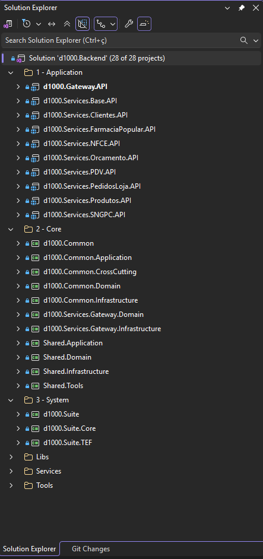
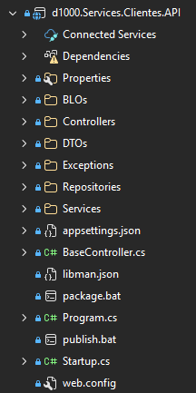
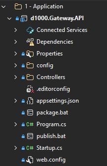
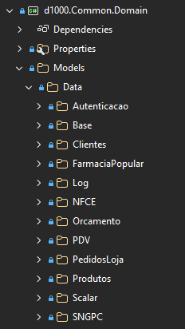
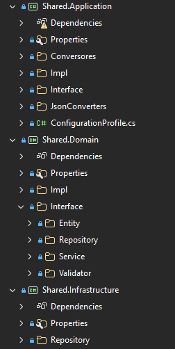
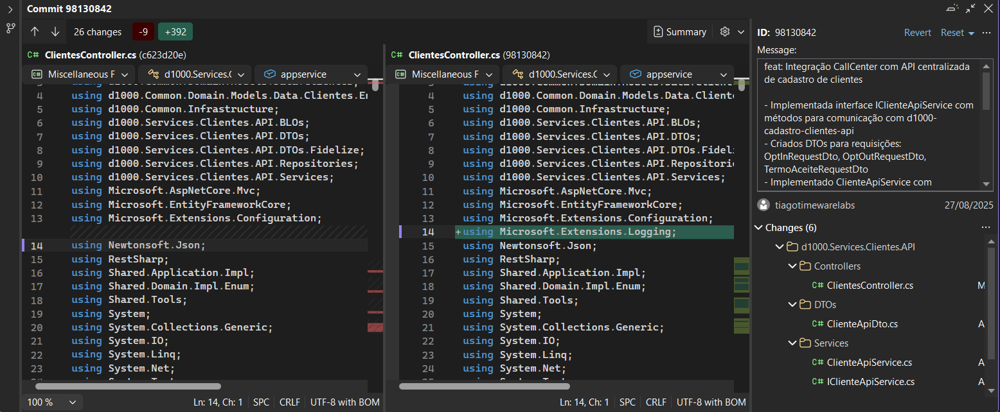
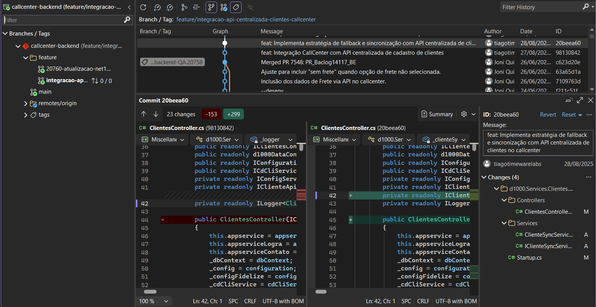
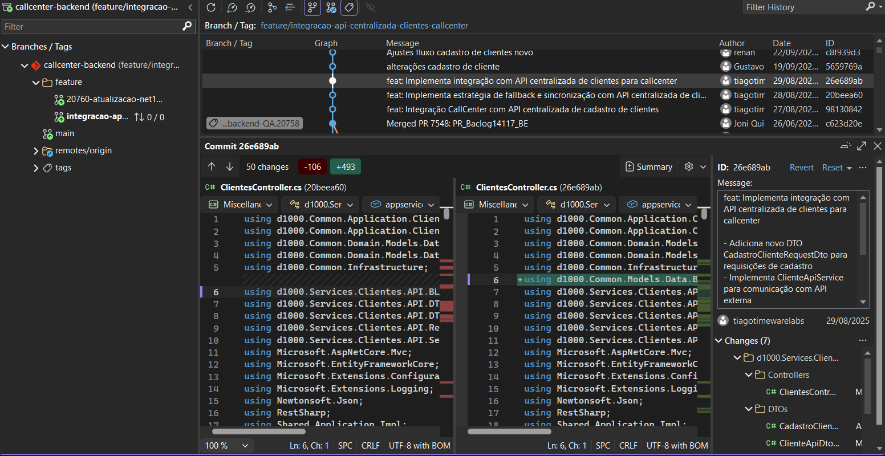

# Documento de Design — Rede D1000 · Cadastro de Clientes

| Campo | Valor |
|---|---|
| **Documento** | PCP-PROFARMA01-001 |
| **Projeto** | Cadastro de Clientes — Rede D1000 |
| **Cliente** | Profarma S.A. / Rede D1000 |
| **Versão** | 1.6 |
| **Data** | 15/06/2026 |
| **Gerente de Projeto** | Abraão Oliveira |
| **Processo MPS-SW** | PCP (evidência de projeto) |

---

## 1. Visão geral da solução

O sistema de Cadastro de Clientes da Rede D1000 é uma API RESTful cloud-native desenvolvida em .NET 8, hospedada no Azure Kubernetes Service (AKS). Substitui a gestão de cadastro dispersa no ITEC legado por uma base única e confiável, com CPF como chave primária, servindo todos os canais da rede.

### 1.1 Canais e consumidores da API

| Canal | Tipo | Descrição |
|---|---|---|
| Balcão / PDV | Loja física | Terminal de atendimento e ponto de venda nas lojas D1000 |
| Call Center | Operacional | Atendimento telefônico centralizado |
| App D1000 | Mobile | Aplicativo próprio da rede para clientes finais |
| App Parceiro (iFood / Rappi) | Mobile / Marketplace | Integração com plataformas de entrega de medicamentos |
| E-commerce VTEX (OMNI) | Web / App | Canal digital via plataforma VTEX |
| Delage | Canal parceiro | Canal de venda parceiro integrado à rede |
| Loja 1 / Loja 2 / Loja 3 (e demais) | Loja física | Rollout progressivo para todas as lojas da rede após o piloto na loja 9 |

---

## 2. Arquitetura da solução

### 2.1 Visão de camadas (Clean Architecture)

```
┌─────────────────────────────────────────────────────────────┐
│                          API Layer                           │
│         (Controllers, Middlewares, Authentication)           │
└────────────────────────┬────────────────────────────────────┘
                         │
┌────────────────────────▼────────────────────────────────────┐
│                    Application Layer                         │
│        (Use Cases, Commands, Queries, Handlers, DTOs)        │
└────────────────────────┬────────────────────────────────────┘
                         │
┌────────────────────────▼────────────────────────────────────┐
│                      Domain Layer                            │
│     (Entities, Value Objects, Domain Events, Interfaces)     │
└────────────────────────┬────────────────────────────────────┘
                         │
┌────────────────────────▼────────────────────────────────────┐
│                  Infrastructure Layer                        │
│  (EF Core + PostgreSQL, Service Bus, HTTP Clients, Outbox)   │
└─────────────────────────────────────────────────────────────┘
```

### 2.2 Componentes de infraestrutura

| Componente | Tecnologia | Descrição |
|---|---|---|
| API Gateway | Azure API Gateway | Ponto de entrada único para todos os canais; gerencia autenticação, rate limiting e roteamento |
| Load Balancer | Azure Load Balancer | Distribuição de tráfego entre os pods da API no AKS |
| Ingress | Kubernetes Ingress Controller | Roteamento interno dos requests para os pods corretos |
| API principal | .NET 8 / ASP.NET Core | Exposição dos 16 endpoints REST (pods no AKS com auto scaling) |
| Banco de dados | Azure Database for PostgreSQL (Flexible Server) | Armazenamento principal dos dados de clientes |
| ORM | Entity Framework Core 8 | Mapeamento objeto-relacional e migrations |
| Orquestração | Azure Kubernetes Service (AKS) | Deploy em containers Docker com auto scaling horizontal |
| Registro de imagens | Azure Container Registry | Armazenamento das imagens Docker do projeto |
| Package management | Helm | Gerenciamento dos charts Kubernetes para deploy |
| Mensageria | Azure Service Bus | Comunicação assíncrona com Propz CRM e Bot Services |
| Bot Services | Azure Bot Services | Atendimento automatizado integrado ao canal de mensageria |
| Worker ITEC | Background Service .NET | Processamento do outbox e envio ao ITEC legado |
| Worker LGPD | Background Service .NET | Expurgo periódico de dados conforme LGPD |
| CI/CD | Azure DevOps Pipelines (CD/CI) | Build, testes e deploy automatizados |
| Monitoramento | Azure Monitor + Datadog APM + Logs | Observabilidade em produção |
| Métricas | Prometheus (expostas via /metrics) | Coleta por Datadog |
| Segredos | Azure Key Vault | Armazenamento de credenciais, connection strings e API Keys |

---

## 3. Modelo de dados

### 3.1 Tabela principal: `clientes`

| Coluna | Tipo | Constraint | Descrição |
|---|---|---|---|
| cpf | VARCHAR(11) | PK, NOT NULL | CPF sem formatação (apenas dígitos) |
| nome_completo | VARCHAR(200) | NOT NULL | Nome completo do cliente |
| data_nascimento | DATE | NOT NULL | Data de nascimento |
| email | VARCHAR(254) | UNIQUE (por CPF ativo) | E-mail principal |
| telefone_principal | VARCHAR(20) | | Telefone com DDD |
| telefone_secundario | VARCHAR(20) | | Telefone alternativo |
| sexo | CHAR(1) | | M/F/O (Outro) |
| ativo | BOOLEAN | NOT NULL, DEFAULT TRUE | Status de atividade do cadastro |
| motivo_inativacao | TEXT | | Preenchido na inativação |
| data_inativacao | TIMESTAMPTZ | | Data/hora da inativação |
| data_criacao | TIMESTAMPTZ | NOT NULL, DEFAULT NOW() | Criação do registro |
| data_atualizacao | TIMESTAMPTZ | NOT NULL | Última atualização |
| origem_cadastro | VARCHAR(50) | NOT NULL | Canal de origem: PDV, BALCAO, OMNI, CALLCENTER, MIGRATION |
| versao | INT | NOT NULL, DEFAULT 1 | Controle de concorrência otimista |

### 3.2 Tabela: `clientes_enderecos`

| Coluna | Tipo | Constraint | Descrição |
|---|---|---|---|
| id | UUID | PK | Identificador interno |
| cpf_cliente | VARCHAR(11) | FK → clientes.cpf | CPF do cliente |
| tipo | VARCHAR(20) | NOT NULL | RESIDENCIAL / COMERCIAL / ENTREGA |
| cep | VARCHAR(8) | NOT NULL | CEP sem formatação |
| logradouro | VARCHAR(200) | NOT NULL | |
| numero | VARCHAR(20) | | |
| complemento | VARCHAR(100) | | |
| bairro | VARCHAR(100) | NOT NULL | |
| cidade | VARCHAR(100) | NOT NULL | |
| uf | CHAR(2) | NOT NULL | |
| principal | BOOLEAN | NOT NULL, DEFAULT FALSE | Endereço principal do cliente |

### 3.3 Tabela: `outbox_eventos`

| Coluna | Tipo | Constraint | Descrição |
|---|---|---|---|
| id | UUID | PK | Identificador do evento |
| cpf_cliente | VARCHAR(11) | NOT NULL | CPF do cliente relacionado |
| tipo_evento | VARCHAR(50) | NOT NULL | ClienteCriado / ClienteAtualizado / ClienteInativado |
| payload | JSONB | NOT NULL | Dados completos do cliente no momento do evento |
| criado_em | TIMESTAMPTZ | NOT NULL, DEFAULT NOW() | Criação do evento |
| processado_em | TIMESTAMPTZ | | Quando foi consumido pelo worker ITEC |
| tentativas | INT | NOT NULL, DEFAULT 0 | Número de tentativas de envio |
| erro_ultimo | TEXT | | Último erro de envio (se houver) |

### 3.4 Tabela: `auditoria_clientes`

| Coluna | Tipo | Constraint | Descrição |
|---|---|---|---|
| id | UUID | PK | Identificador do registro de auditoria |
| cpf_cliente | VARCHAR(11) | NOT NULL | CPF do cliente |
| operacao | VARCHAR(20) | NOT NULL | CRIACAO / ATUALIZACAO / INATIVACAO / REATIVACAO |
| canal_origem | VARCHAR(50) | NOT NULL | PDV, BALCAO, OMNI, CALLCENTER, MIGRATION, SISTEMA |
| dados_anteriores | JSONB | | Snapshot dos dados antes da operação |
| dados_novos | JSONB | NOT NULL | Snapshot dos dados após a operação |
| operador_id | VARCHAR(100) | | Identificador do operador (quando disponível) |
| realizado_em | TIMESTAMPTZ | NOT NULL, DEFAULT NOW() | Timestamp da operação |

---

## 4. Padrões e decisões de design

### 4.1 CPF como chave primária

**Decisão:** usar CPF (string de 11 dígitos) como PK em vez de UUID ou BIGINT sequencial.

**Justificativa:** elimina a necessidade de mapeamento ID↔CPF que existia no ITEC e causava inconsistências. O CPF é o identificador universal do cliente em todos os sistemas satélites da D1000; expor o CPF como PK simplifica todas as integrações.

**Trade-off aceito:** impossibilidade de alterar o CPF (um CPF é vitalício, exceto em casos de retificação judicial, tratados como exceção operacional fora do escopo do sistema).

### 4.2 Outbox pattern para integração com ITEC

**Decisão:** persistir eventos no banco de dados na mesma transação do cadastro/atualização, processar assincronamente via worker.

**Justificativa:** o ITEC legado tem instabilidades de disponibilidade; uma chamada síncrona ao ITEC no caminho crítico da API tornaria o cadastro de clientes dependente da disponibilidade do legado. O outbox garante que o evento nunca se perde mesmo que o ITEC esteja indisponível.

**Comportamento em falha:** o worker tenta reenviar com backoff exponencial; após 5 tentativas sem sucesso, registra o erro e prossegue (dead-letter manual).

### 4.3 Concorrência otimista

**Decisão:** campo `versao` (integer) com verificação de concorrência otimista no EF Core.

**Justificativa:** o modelo de negócio não exige locking pessimista; conflitos de edição simultânea são raros e tratáveis com retry no cliente.

### 4.4 Separação de queries de leitura (CQRS leve)

**Decisão:** handlers de query (leitura) acessam o banco diretamente via Dapper para consultas de alta frequência (GET /clientes/{cpf}); commands (escrita) usam EF Core.

**Justificativa:** simplifica e acelera as queries de leitura sem a sobrecarga do EF Core change tracking; mantém o benefício do ORM para operações de escrita com validações de domínio.

---

## 5. Fluxos de integração

### 5.1 Fluxo de cadastro de novo cliente

```
Cliente (PDV/Balcão/OMNI)
    │
    ▼
API Gateway
    │
    ▼
POST /clientes
    │
    ├── Valida CPF (formato + Receita Federal)
    ├── Verifica duplicata na base
    ├── Persiste cliente (tabela clientes + clientes_enderecos)
    ├── Persiste evento ClienteCriado (tabela outbox_eventos)
    ├── Registra auditoria (tabela auditoria_clientes)
    │   [tudo na mesma transação PostgreSQL]
    │
    ▼
Resposta HTTP 201 Created
    │
    ▼ (assíncrono, worker)
Worker ITEC lê outbox_eventos
    │
    ├── Chama API ITEC (trigger de sincronização)
    ├── Marca evento como processado
    │
    ▼ (assíncrono, Azure Service Bus)
Worker Propz publica mensagem no Service Bus
    │
    ▼
Propz CRM consome mensagem
```

### 5.2 Fluxo de integração VTEX (OMNI)

```
VTEX (plataforma e-commerce)
    │
    ▼
POST /clientes/vtex  (ou GET /clientes/vtex/{cpf})
    │
    ├── Autenticação: API Key VTEX
    ├── Mapeamento do schema VTEX → schema interno
    ├── Executa use case de criação/consulta
    │
    ▼
Resposta no schema VTEX CustomerProfile
```

### 5.3 Worker de expurgo LGPD

```
Schedule: executado diariamente às 02h00
    │
    ▼
Consulta clientes: ativo = FALSE AND data_inativacao < NOW() - 5 anos
    │
    ▼
Para cada cliente elegível:
    ├── Anonimiza: nome → "DADOS ANONIMIZADOS", email → NULL, telefone → NULL
    ├── Preserva: CPF, data_nascimento (anonimizado), ativo, data_inativacao
    ├── Registra auditoria: operacao = EXPURGO_LGPD
    ├── Remove endereços (clientes_enderecos)
    │
    ▼
Log de execução: total processado, erros
```

---

## 6. Segurança

| Mecanismo | Aplicação |
|---|---|
| API Key | Canais PDV, Balcão, VTEX (cabeçalho `X-Api-Key`) |
| OAuth 2.0 (Client Credentials) | Integrações sistema-a-sistema (Call Center, Propz) |
| TLS 1.2+ | Todas as comunicações em trânsito |
| Azure Key Vault | Armazenamento de segredos (connection strings, API Keys, OAuth credentials) |
| RBAC (AKS) | Controle de acesso aos recursos Kubernetes |
| PostgreSQL Row-Level Security | Não aplicado nesta versão (escopo futuro) |

---

## 7. Observabilidade

| Aspecto | Implementação |
|---|---|
| Logs estruturados | Serilog → Datadog Logs (JSON) |
| Rastreamento distribuído | Datadog APM (OpenTelemetry) |
| Métricas de negócio | Prometheus custom metrics: cadastros/min, consultas/min, latência p95 |
| Alertas | Datadog Monitors: latência > 500ms, error rate > 1%, outbox_eventos com tentativas > 3 |
| Health check | GET /health com status de banco, Service Bus e dependências externas |

---

## 8. Decisões arquiteturais documentadas (registro de análise)

| ID | Decisão | Alternativas consideradas | Critério de escolha |
|---|---|---|---|
| DA-01 | PostgreSQL como banco principal | SQL Server (utilizado no ITEC), MongoDB | PostgreSQL: custo Azure menor que SQL Server, suporte excelente a JSONB para o outbox, sem licença adicional; MongoDB descartado pela falta de transações ACID necessárias para o outbox |
| DA-02 | CPF como PK (string) | UUID gerado internamente com CPF como UNIQUE | CPF como PK elimina nível de indireção; simplicidade das integrações outweighs risco de colisão (CPF é imutável por natureza) |
| DA-03 | Outbox pattern para ITEC | Chamada síncrona ao ITEC no request path | ITEC tem SLA não garantido; chamada síncrona tornaria o cadastro dependente de disponibilidade do legado |
| DA-04 | CQRS leve (Dapper para leitura) | EF Core para tudo | Queries de leitura com Dapper têm latência ~3x menor nos benchmarks internos para o endpoint de maior volume (GET /clientes/{cpf}) |
| DA-05 | Azure Service Bus para Propz | REST síncrono para Propz | Propz definiu interface assíncrona como requisito; Service Bus garante entrega mesmo em indisponibilidade da Propz |

---

## 9. Design de produto (UX/UI)

Não aplicável a este projeto.

O sistema Cadastro de Clientes — Rede D1000 é uma API RESTful sem interface de usuário própria. Não há telas, wireframes ou fluxos de UX/UI a serem projetados no escopo deste contrato. Os canais de front-end (Balcão, App D1000, VTEX) são sistemas externos que consomem a API; seu design de produto é de responsabilidade das respectivas equipes. A decisão de dispensar o design UX/UI foi registrada em ADAP-PROFARMA01-001 (A-06).

---

## 10. Rastreabilidade requisito → design

| Requisito | Elemento de design |
|---|---|
| RF-01, RF-02 | POST /clientes — `ClienteController`, use case `CriarClienteUseCase`, tabela `clientes`, evento `ClienteCriado` no outbox |
| RF-03, RF-09 | GET /clientes/{cpf}, HEAD /clientes/{cpf} — handler de query via Dapper (§4.4 CQRS leve) |
| RF-04 | PATCH /clientes/{cpf} — `AtualizarClienteUseCase`, tabela `clientes`, evento `ClienteAtualizado` |
| RF-05 | DELETE /clientes/{cpf} — `InativarClienteUseCase`, campo `ativo = false`, evento `ClienteInativado` |
| RF-06 | GET /clientes — query paginada via Dapper com `ILIKE` |
| RF-07 | Tabela `auditoria_clientes` — preenchida em todas as operações de escrita |
| RF-08 | POST /clientes/lote — `MigrationWorker` background service, processo batch |
| RF-10 | PUT /clientes/{cpf}/reativar — `ReativarClienteUseCase` |
| RF-11 | Outbox pattern (§4.2), tabela `outbox_eventos`, `ItecWorker` background service |
| RF-12 | POST /clientes/vtex, GET /clientes/vtex/{cpf} — adaptadores de schema VTEX no `Infrastructure` |
| RF-13 | GET /clientes/{cpf}/call-center — handler com SLA 500ms |
| RF-14 | `PropzWorker` → Azure Service Bus (§2.2) |
| RF-15 | GET /clientes/{cpf}/programa-beneficios — HTTP client `BlueSoftClient` |
| RF-16 | GET /clientes/{cpf}/perfil-completo — HTTP client `CloseUpClient` |
| RF-17 | `LgpdExpurgoWorker` background service (§5.3) |
| RF-18 | GET /health — `HealthCheckController` com verificação de DB, Service Bus e dependências |
| RF-19 | GET /metrics — Prometheus endpoint (§7) |
| RNF-01 | Clean Architecture em 4 camadas (§2.1) |
| RNF-02 | Azure Database for PostgreSQL — tabelas `clientes`, `clientes_enderecos`, `outbox_eventos`, `auditoria_clientes` (§3) |
| RNF-03 | AKS com auto scaling, Azure Container Registry, Helm (§2.2) |
| RNF-04 | Azure Key Vault para segredos (§6) |
| RNF-05 | API Key (PDV/Balcão/VTEX) + OAuth 2.0 (Call Center/Propz) — §6 |
| RNF-06, RNF-07 | CQRS leve com Dapper (§4.4); Datadog APM (§7); pool de conexões PostgreSQL |
| RNF-08 | AKS auto scaling + Azure Load Balancer (§2.2) + Datadog Monitors (§7) |
| RNF-09 | Azure Database for PostgreSQL Flexible Server com backup automático 7 dias |
| RNF-10 | Inativação lógica (RF-05), worker de expurgo LGPD (RF-17), log de auditoria (RF-07) |
| RNF-11 | 273 cenários de teste unitário (VV-PROFARMA01-001 §3.2); cobertura 84% Domain + Application |
| RNF-12 | Azure DevOps Pipelines: build → testes → deploy (§2.2 CI/CD) |
| RNF-13 | Datadog APM, Logs, Monitors (§7) |
| RNF-14 | Aprovação de Armando Junior (D1000) registrada em §11 |

---

## 11. Avaliação e aprovação do design (PCP2)

### 11.1 Revisão do design arquitetural — 17/07/2025

| Campo | Valor |
|---|---|
| Data | 17/07/2025 |
| Tipo | Revisão de design arquitetural — diagrama completo da solução |
| Artefato revisado | Desenho de arquitetura — Cadastro de Cliente (diagrama Azure Architecture) |
| Revisor | Armando Junior (Tech Lead / Arquiteto D1000) |
| Canal de comunicação | WhatsApp + e-mail (confirmados em 17/07/2025) |
| Resultado | Aprovado — Armando Junior confirmou o recebimento e o aceite do design por mensagem direta |

O diagrama de arquitetura foi compartilhado pelo Gerente de Projeto (Abraão Oliveira) com Armando Junior em 17/07/2025 via WhatsApp e e-mail. O diagrama mostra a arquitetura completa da solução: Azure API Gateway, Load Balancer, AKS (pods com auto scaling), PostgreSQL, Azure Service Bus, Azure Monitor, Key Vault, Container Registry, Helm, Datadog e todos os sistemas de integração (ITEC, VTEX, Propz, Plusoft/Conveniados, Bot Services, Delage). Armando Junior confirmou o recebimento e aprovação do design na mesma data.

A aprovação do design arquitetural pelo Tech Lead D1000 (Armando Junior) é também um requisito formal do projeto conforme RNF-14 e DA-01 a DA-05 (registrados no GDE-PROFARMA01-001).

**Evidência física:** print da conversa do WhatsApp de 17/07/2025 com Armando Junior, com data, remetente e mensagem de confirmação.

---

## 12. Evidências de implementação (Azure DevOps)

### 12.1 Estrutura da solução — repositório loja-backend

**Solution D1000 Backend — 28 projetos:**



**Estrutura interna — D1000.Clientes.API:**



**Estrutura interna — D1000.Gateway.API:**



**Domain Models organizados por contexto:**



**Camadas Shared, Application, Domain e Infrastructure:**



### 12.2 Commits de implementação — integração Call Center

**Commit de integração Call Center (parte 1):**



**Commit de integração Call Center (parte 2):**



**Commit de infraestrutura Call Center:**



---

## Histórico de revisões

| Versão | Data | Autor | Descrição |
|---|---|---|---|
| 1.0 | 28/04/2025 | Abraão Oliveira | Versão inicial — arquitetura macro e decisões DA-01 a DA-03 |
| 1.1 | 20/06/2025 | Abraão Oliveira | Adição do modelo de dados completo, fluxo de integração VTEX, decisões DA-04 e DA-05 |
| 1.2 | 15/09/2025 | Abraão Oliveira | Atualização: worker LGPD, segurança OAuth 2.0 para Call Center, integrações BlueSoft e CloseUp |
| 1.3 | 05/06/2026 | Abraão Oliveira | Versão de encerramento — consolidação final após piloto loja 9 |
| 1.4 | 11/06/2026 | Abraão Oliveira | Adição de §1.1 (canais completos do diagrama), atualização de §2.2 (API Gateway, Container Registry, Helm, Bot Services, Azure Monitor), adição de §9 (avaliação do design por Armando Junior — 17/07/2025) |
| 1.5 | 11/06/2026 | Abraão Oliveira | Adição de §9 "Design de produto (UX/UI) — não aplicável" e §10 "Rastreabilidade requisito → design" (conformidade com TPL-PCP-001); seção de avaliação renumerada para §11 |
| 1.6 | 15/06/2026 | Abraão Oliveira | Adição de §12 com evidências visuais da estrutura da solução (28 projetos, Clean Architecture) e commits de implementação da integração Call Center |
