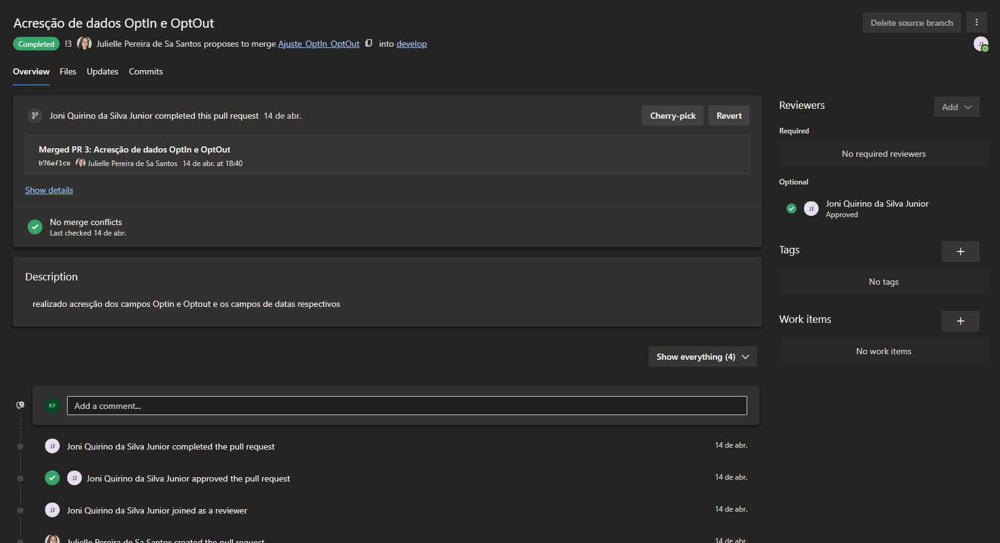
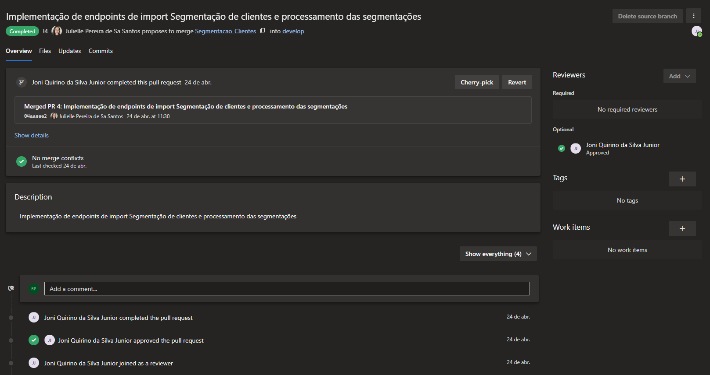
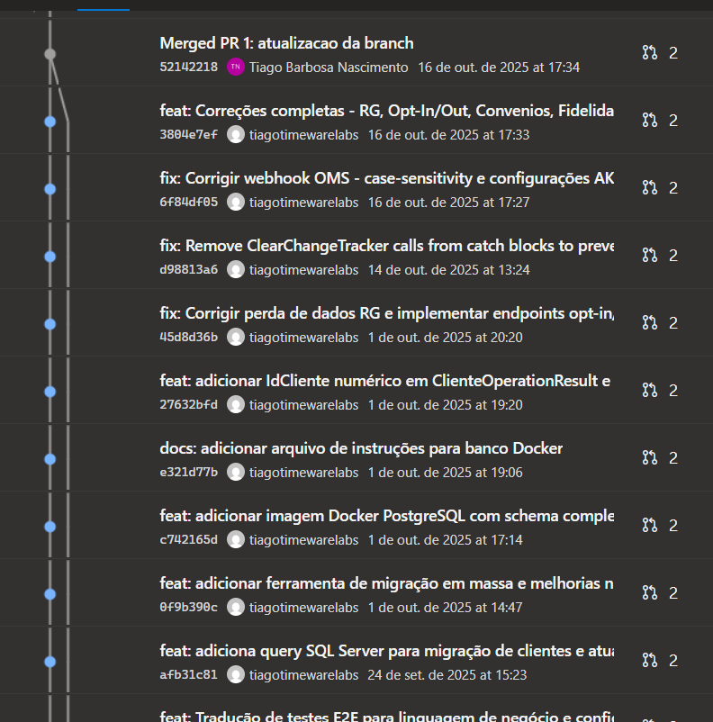

# REV-PROFARMA01-001 — Registro de Revisão Técnica

| Campo                | Valor                                         |
|----------------------|-----------------------------------------------|
| **Documento**        | REV-PROFARMA01-001                            |
| **Projeto**          | Cadastro de Clientes — Rede D1000             |
| **Cliente**          | Profarma S.A. / Rede D1000                    |
| **Versão**           | 1.1                                           |
| **Data**             | 15/06/2026                                    |
| **Gerente de Projeto** | Abraão Oliveira                             |
| **Processo MPS-SW**  | VV — Verificação e Validação (evidência de revisão por pares) |

---

## 1. Objetivo

Este documento registra as revisões técnicas formais (peer reviews) realizadas ao longo do projeto Cadastro de Clientes — Rede D1000, constituindo evidência do processo MPS-SW VV. Cada revisão cobriu artefatos específicos do ciclo de desenvolvimento, com o objetivo de identificar defeitos, inconsistências e riscos antes da integração ou entrega.

---

## 2. REV-001 — Revisão de Arquitetura (Sprint 1)

| Campo                   | Valor                                                      |
|-------------------------|------------------------------------------------------------|
| **Data**                | 09/05/2025                                                 |
| **Tipo**                | Revisão de design arquitetural                             |
| **Artefato revisado**   | PCP-PROFARMA01-001 (versão 0.1) — arquitetura Clean Architecture, modelo de dados, decisões DA-01 a DA-04 |
| **Revisor responsável** | Armando Junior (Tech Lead D1000)                          |
| **Participantes**       | Tiago Nascimento (Timeware), Abraão Oliveira (Timeware), Armando Junior (D1000) |
| **Resultado**           | Aprovado com ajustes                                       |

### 2.1 Achados

| ID         | Descrição                                                                                         | Severidade | Ação tomada                                                                                   |
|------------|---------------------------------------------------------------------------------------------------|------------|-----------------------------------------------------------------------------------------------|
| RV-001-01  | Nomenclatura das camadas no diagrama inconsistente com convenção C4                               | Baixo      | Ajustado no mesmo dia                                                                         |
| RV-001-02  | Campo `canal_origem` ausente na tabela `auditoria_clientes`                                       | Médio      | Adicionado ao schema; gerou CR-01 formalizado em 15/05/2025                                   |
| RV-001-03  | Estratégia de índice para busca por nome parcial não definida                                     | Médio      | Adicionado índice GIN no campo `nome_completo` para suporte a ILIKE                           |

**Total de achados:** 3 — Baixo: 1 | Médio: 2 | Alto: 0

---

## 3. REV-002 — Revisão de Integração ITEC (Sprint 3)

| Campo                   | Valor                                                               |
|-------------------------|---------------------------------------------------------------------|
| **Data**                | 06/06/2025                                                          |
| **Tipo**                | Revisão de implementação e testes de integração                     |
| **Artefato revisado**   | Worker outbox + tabela `outbox_eventos` em funcionamento no ambiente local |
| **Revisor responsável** | Tiago Nascimento (Tech Lead Timeware)                              |
| **Participantes**       | Lucas Batista (QA Timeware), desenvolvedor responsável pelo worker  |
| **Resultado**           | Aprovado com correções obrigatórias (corrigidas antes do merge)     |

### 3.1 Achados

| ID         | Descrição                                                                                                       | Severidade | Ação tomada                                                                                      |
|------------|-----------------------------------------------------------------------------------------------------------------|------------|--------------------------------------------------------------------------------------------------|
| RV-002-01  | Worker sem circuit breaker — em caso de ITEC indisponível, loop sem limite de tentativas                        | Alto       | Implementado backoff exponencial com limite de 10 tentativas + alerta Datadog                   |
| RV-002-02  | Campo `processado_em` não indexado — consulta de polling fazia full scan na tabela `outbox_eventos`             | Médio      | Adicionado índice parcial `WHERE processado_em IS NULL`                                         |

**Total de achados:** 2 — Baixo: 0 | Médio: 1 | Alto: 1

---

## 4. REV-003 — Revisão de Segurança e Contratos de API (Sprint 5)

| Campo                   | Valor                                                                                         |
|-------------------------|-----------------------------------------------------------------------------------------------|
| **Data**                | 20/06/2025                                                                                    |
| **Tipo**                | Revisão de segurança e conformidade de contratos                                              |
| **Artefato revisado**   | Middlewares de autenticação (API Key + OAuth 2.0), contratos OpenAPI dos 10 endpoints do Sprint 1–5 |
| **Revisor responsável** | Armando Junior (D1000) + Tiago Nascimento (Timeware)                                         |
| **Participantes**       | Abraão Oliveira (Timeware), Julielle Santos (QA D1000)                                       |
| **Resultado**           | Aprovado com correções obrigatórias                                                           |

### 4.1 Achados

| ID         | Descrição                                                                                       | Severidade | Ação tomada                                                                                  |
|------------|-------------------------------------------------------------------------------------------------|------------|----------------------------------------------------------------------------------------------|
| RV-003-01  | Endpoint `GET /clientes` retornava lista completa sem paginação obrigatória                     | Alto       | Paginação obrigatória implementada; gerou RF-06 formalizado                                  |
| RV-003-02  | Header `X-Canal-Origem` não validado nos endpoints de escrita                                   | Médio      | Validação adicionada ao middleware de entrada                                                |
| RV-003-03  | Resposta de erro 500 expunha stack trace em ambiente de homologação                             | Baixo      | Stack trace suprimido; substituído por `correlation-id` na resposta ao cliente               |

**Total de achados:** 3 — Baixo: 1 | Médio: 1 | Alto: 1

---

## 5. REV-004 — Revisão de código por Pull Request (code review contínuo)

| Campo | Valor |
|---|---|
| **Período** | Abril/2026 (manutenção pós go-live) |
| **Tipo** | Code review via Pull Request (Azure DevOps) |
| **Repositório** | Profarma Cadastro de Clientes — Azure DevOps |
| **Revisor responsável** | Joni Quirino da Silva Junior |
| **Resultado** | Aprovado em todos os PRs |

### 5.1 Pull Requests revisados e aprovados

**PR 3 — Acresção de dados OptIn e OptOut**

Autora: Julielle Pereira de Sa Santos | Branch: Ajuste_OptIn_OptOut → develop | Aprovado por: Joni Quirino da Silva Junior | Merge: 14/abr. às 18:40 | Commit: b76af1ce

**PR 4 — Implementação de endpoints de import Segmentação de clientes e processamento das segmentações**

Autora: Julielle Pereira de Sa Santos | Branch: Segmentacao_Clientes → develop | Aprovado por: Joni Quirino da Silva Junior | Merge: 24/abr. às 11:30 | Commit: 04aaeee2

### 5.2 Histórico de commits — rastreabilidade

---

## 6. Resumo Consolidado de Achados

| ID         | Revisão   | Severidade | Status     |
|------------|-----------|------------|------------|
| RV-001-01  | REV-001   | Baixo      | Resolvido  |
| RV-001-02  | REV-001   | Médio      | Resolvido  |
| RV-001-03  | REV-001   | Médio      | Resolvido  |
| RV-002-01  | REV-002   | Alto       | Resolvido  |
| RV-002-02  | REV-002   | Médio      | Resolvido  |
| RV-003-01  | REV-003   | Alto       | Resolvido  |
| RV-003-02  | REV-003   | Médio      | Resolvido  |
| RV-003-03  | REV-003   | Baixo      | Resolvido  |

**Total geral:** 8 achados — Alto: 2 | Médio: 4 | Baixo: 2 | Em aberto: 0

---

## 6. Histórico de Revisões do Documento

| Versão | Data       | Autor                        | Descrição                          |
|--------|------------|------------------------------|------------------------------------|
| 1.0    | 05/06/2026 | Time de Melhoria Contínua    | Versão inicial — registro oficial  |
| 1.1    | 15/06/2026 | Time de Melhoria Contínua    | Adição de §5 REV-004 com evidências de code review via Pull Request (PR 3, PR 4) e histórico de commits Azure DevOps |
